# Clase 1 - Intro / Fundamentos

23/03/21

Martes: teorica 19 a 22
Miercoles: practica 19 a 22

Agenda

- Intro: Telegrafia y red telefonica
- Paradigmas: Conmutacion de **circuitos** y de **paquetes**
- Arquitectura de redes: Modelo de referencia OSI-ISO y TCP/IP
- Dominios del **tiempo** y **frecuencia**: Forma de manejar la informacion
- Teoria de la informacion: Teoremas de shannon para lidiar de manera formal y
  matematica con lo que es un canal de transmision.

## Origenes

Se implementa un alfabeto de simbolos para transmitir un mensaje compuesto por
una sucesion de ellos.

Telegrafo: codigo morse.

Hoy en dia hay tecnologias (como lifi) que transmiten informacion usando
principios del codigo morse, a traves de ondas de luz. Es una idea que
prevalece.

Eventualmente se llega a la patente de Graham Bell para el telefono, que queria
hacer un aparato que transmita sonido de manera *telegrafica*, porque parte de
que ya existe el telegrafo.

1870 - 1970: Siglo central de la **conmutacion de circuitos**. Requerian que
cierre un circuito a mano, y por eso se conoce como tal paradigma. Tiene
problemas

- Velociadad
- La necesidad de tener personas conmutando circuitos a mano, no escala a la
  larga.
- El mantenimiento de los cableados era problematico. Era un punto unico de
  falla.

> La idea de conmutar circuitos sigue presente incluso en el contexto de
> conmutacion de paquetes, lo vamos a ver con algunos protocolos mas adelante.

A partir de eso se empezaron a estudiar otras posibilidades, como la
**conmutacion de paquetes**: idea semilla de lo que hoy en dia es internet.

Evoluciona hasta que existe la ARPANET, que es de las primeras redes que
implementa la suite de protocolos TCP/IP. Es una red *descentralizada* con
multiples caminos entre dos puntos. Y una idea revolucionaria fue **dividir los
mensajes en pedacitos** (hoy en dia *paquete de red*), estos viajan como autitos
en autopistas.

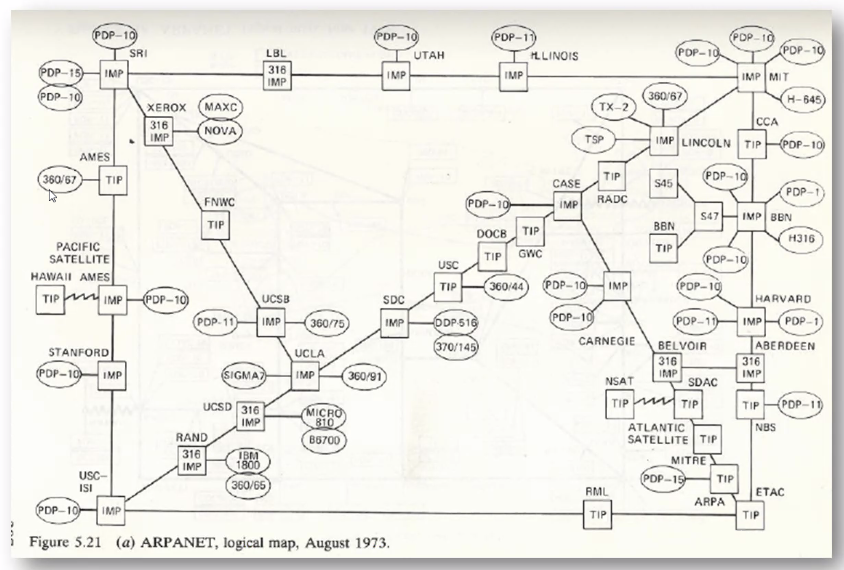

### Trabajos fundacionales

> Recomendacion de pelicula: LO and BEHOLD.

Paper: Models for comuputers networks

La tecnologia de las comunicaciones no podia ser redefinida cada vez, sino que
deberia poder ser generalizable para uso por cualquier proposito, y ahi provee
la idea generica de paquetizar piezas de informacion.

**Escalar**: Palabra que vamos a usar mucho durante la materia: Todas las
tecnologias que se ubican en todas las capas en las que se subdivide la arq de
las redes tienen que satisfacer *requerimientos*, y uno de ellos es la
escalabilidad. Solo con eso se puede generalizar lo suficiente para que escale.

### IOT

Se viene la internet of things.

> Recomendacion de libro: Enabling things to talk. Muestra la gran variedad de
> elementos conectados.

Fog layers (red o capa de fog): redes que aparecen y desaparecen de manera
instantanea, cuando vamos moviendonos por la ciudad tal vez nuestros
dispositivos estan tomando parte en alguna red y tomando decisiones.
Eventualmente desaparece y se van formando mas redes. Tambien pueden conectarse
a una "core network" o red central y permanente, y le puede pedir alguna
estadistica o cosas asi, que es provista por servers no-esporadicos,
establecidos. Y todo esto puede estar conectado a un *cloud*, una organizacion
logica de servers a la que uno se conecta.

## Arquitectura de redes

Es todo muy lindo pero hay que ponerle algo de *orden*, definir, seguir
estandares, etc.

La arquitectura de redes es un concepto que nos acompaña a lo largo de toda la
cursada.

### Modelo OSI

En mayo 1983 la ISO publica el modelo OSI (o ISO).

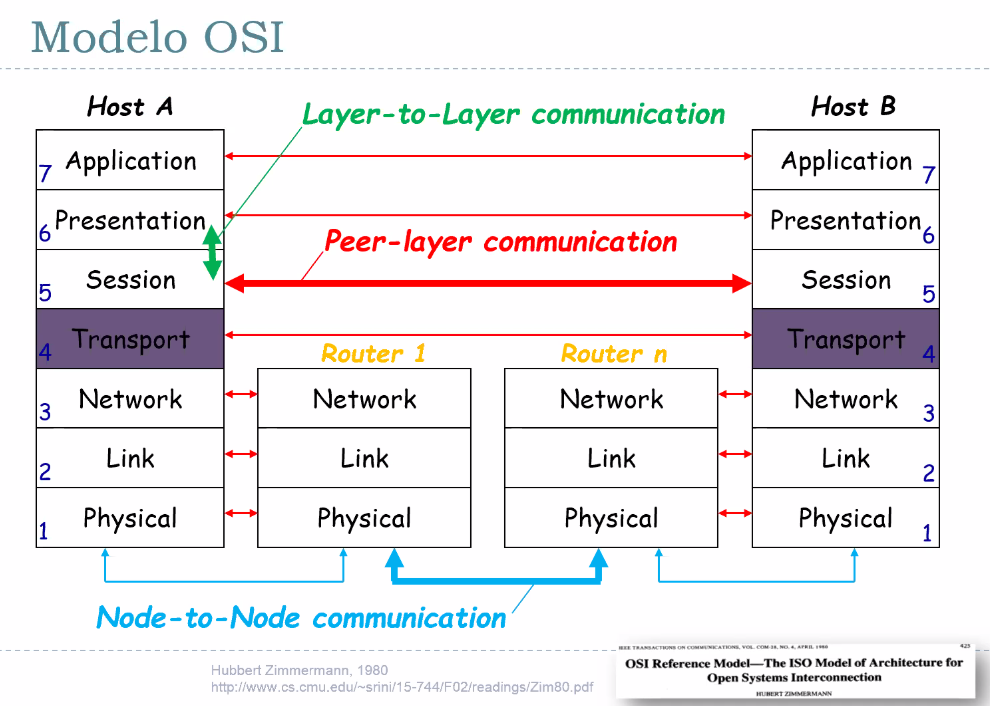

Idea fundamental: Conectar un host A con un host B.

> Usualmente nos referimos a host como computadora, pero puede ser un celular,
> arduino, etc. Cualquier cosa que tenga una direccion de red y participe de una
> red.

Las capas subdividen responsabilidades. En cada una hay un conjunto de
protocolos tipico de esa capa.

1. Fisica: Maneja las propiedades fisicas para que puedan transportar
   informacion, para mandar un mensaje que tiene la **aplicacion**.

   > Por ej. Zoom es la app, y tenes cables y un router, que hay en el medio?
   > Todas las capas.

   Finalmente se va de la computadora y busca el proximo nodo al cual quiero
   llegar.

2. Link (enlace): Se encarga de lidiar con las estrucutras logicas que usan la
   capa fisica.
3. Red: Tiene la identificacion unica de los usuarios en la red. Como el
   domicilio pero codificado de otra manera. Tipicamente una IP
4. Transport: Busca garantizar que los paquetes no se pierdan en el camino 
5. Session: Identificar al usuario por cuestiones de seguridad
6. Presentacion: Casi no se usa

El paquete pasa por un monton de nodos de red intermedios (tipicamente routers o
enrutadores) y finalmente llega al host B. Este va de la capa 1 a la 7 y le
entrega el mensaje a la aplicacion.

Las comunicaciones dentro de un mismo nodo se dan capa a capa (dispositivo)
tanto en sentido ascendente como descendente. Hay capas que solo le hablan al
nodo de abajo, pero el mensaje esta destinado por la capa "socia", homologa, al
mismo nivel, en el host destino. Esto se conoce como **Peer layer
communication**. Pero para llegar hasta alla tuvo que bajar por la jerarquia y
atravesar los nodos intermedios de la red.

Y la comunicacion de host a host se llama **end to end**.

Los routers son hosts particulares, no suben hasta la ultima capa, solo hacen un
*pasamanos* de informacion. La capa de transporte es la ultima que su contenido
es leido unicamente por el host destino. A partir de ahi las otras 3 capas le
hablan al nodo inmediato siguiente en un grafo de routers que conectan el camino
del host A al host B.

No se usa hoy en dia, sino que se usa TCP/IP que es una simplificacion del
modelo.

Otra forma de verlo:

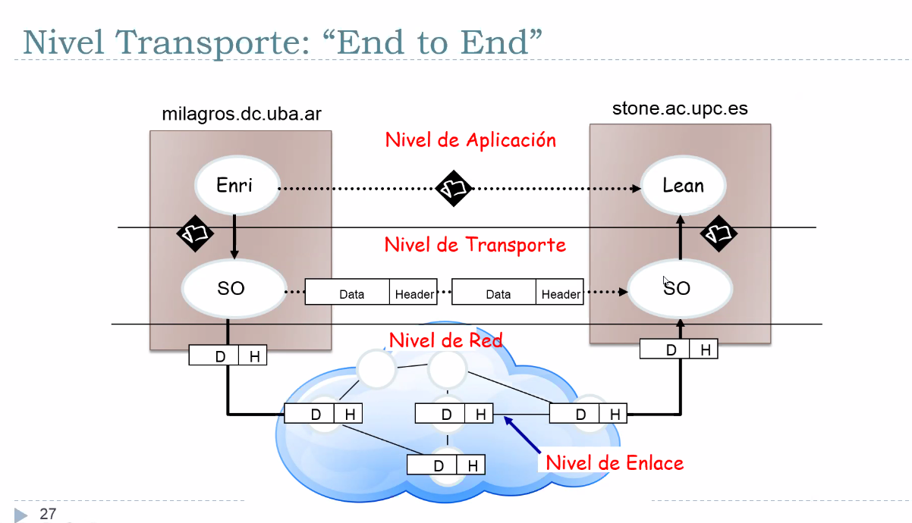

Los headers son como metadatos (info acerca de los datos), de que es lo que yo
espero que se haga con ese pedacito de informacion. El proximo protocolo que
toma la unidad de informacion toma el header y sabe que hacer, si lo esta
recuperando o si tiene que encapsularlo en un paquete aun mas complicado. Una
estructura **elemental**

### TCP/IP

El modelo OSI es una idea muy prolija pero no se impuso tal cual, se implementa
el modelo TCP/IP

El protocolo de transporte mas utilizado es TCP (hay otros, como UDP), y el de
internet es IP (y hay otros). Como el combo TCP-IP fue tan exitoso, el modelo
entero pasa a ser llamado TCP/IP.

> **Tipica pregunta de teoria**: Diferencias de responsabilidades en TCP/IP,
> aclarar cuales son las diferencias entre una comunicacion entre capas, nodos,
> etc.

La arquitectura ya lo vamos a ir viendo mas en detalle.

## Sistemas de Comunicaciones

Fourier aporto herramientas matematicas fundamentales para entender la
transmision de señales, la serie infinita de fourier y la transformada de
fourier.

Nos ponemos **abstractos**

Conceptualizacion elemental de Shanon (en 1 solo paper desarrolla todas las
bases de la teoria de la comunicacion, lo cual pasa en muy pocos casos):

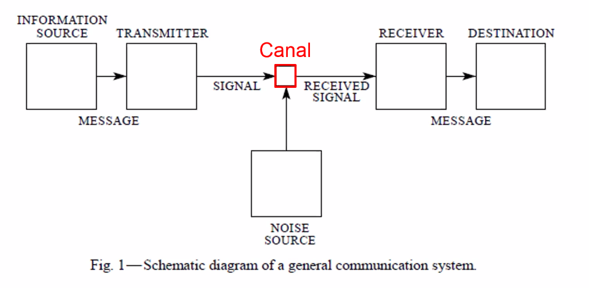

- Fuente de informacion produce un mensaje, que es entregado a un transmisor que
  produce señales (que tienen que ver con el mensaje). Esta se ve enfrentada a
  un **canal**, que es una reduccion conceptual de todo lo que hay entre un
  transmisor y un receptor. Del otro lado lo opuesto, señal recibida y el
  mensaje (que entendió el receptor) para el destinatario.

Algo inevitable es el ruido, puedo tratar de combatirlo de muchas maneras muy
inteligentes pero **jamas** eliminarlo, por cuestiones termodinámicas de la
física, no se pueden hacer transmisiones carenters de ruidos.

Complicandola un poco con observadores que pueden tomar, deducir informacion y
que puedan potencialmente enviar correcciones a un dispoisitivo nuevo.

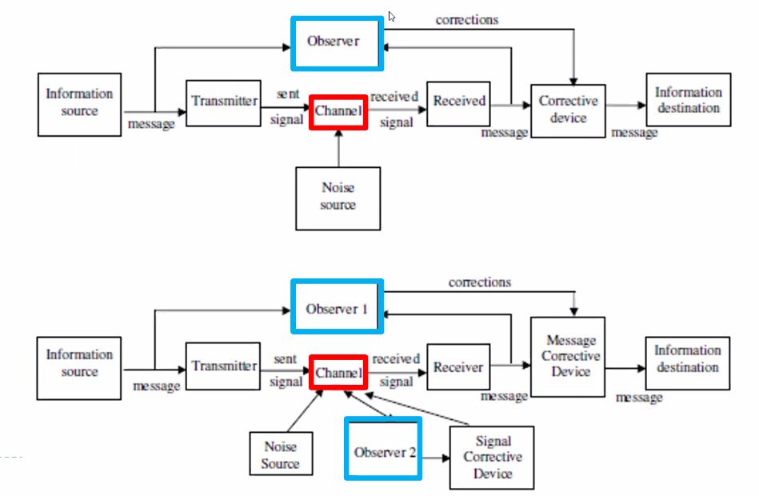

Y complicandola mas puede haber dos observadores, uno a nivel mensaje y otra a
caracteristicas del canal (mal y pronto: un cable, antenas que se estan
comincando entre si)

Si bien el modelo es simple, se puede sofisticar con mas capas de *actores* que
se usan para contrarrestar los efectos del ruido.

### Señales

Las señales evolucionan en el tiempo. Categorizacion:

- Analogicas: Pueden tomar valores infintos
- Digitales: Los valores pueden ser 2, 0 o 1. Se supone que su frecuencia es
  limitada, no puede haber infinita cantidad de cambios de 0 a 1 o de 1 a 0 si
  tomo un intervalo finito. (Una suposicion implicita)

Fundamentos:

- Se transportan como ondas electromagneticas: son dos campos ortogonales, uno
  electrico y otro magnetico (por ej la luz, o la antena de un router, o un
  celular)
- Se propagan con una velocidad finita como un auto a una velocidad v.
  Tipicamente se expresa como una parte de la velocidad de la luz.

> Los cables UTP tipicos son de un medio fisico de cobre, donde el **frente de
> onda** es practicamente el 70% de la velocidad de la luz.

### Ondas

Las ondas electromagneticas vibran con un comportamiento periodico. Este periodo
(o lapso de repeticion) es lo que se denomina *longitud de onda*. Es algo que se
mide en metros. Formula:

$$ \lambda = c / f$$

Tiene una medida y se desplaza a una velocidad, pero no las podemos ver.

La vida es una porqueria para una onda

### Funciones periodicas

Como todo se transmite por ondas, tenemos que estudiar sus conceptos basicos
para ver como lidiar cuando pasan estas cosas

Una funcion periodica cumple que para todo t vale f(t) = f(t + T). Donde T es el
**periodo fundamental** (o periodo) de la funcion.

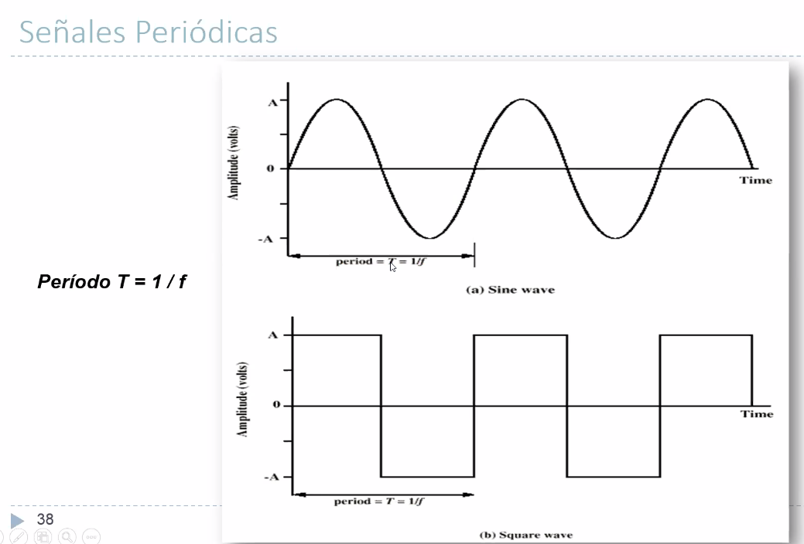

Oscilaciones lentas: periodo alto. Oscilaciones rapidas: periodo bajo.
Frecuaencia y periodo son conceptos complementarios.

Hz = 1/s, veces por segundo.

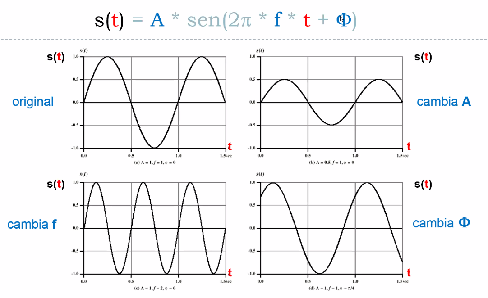

> El ancho de banda es en frecuencia, entonces nos tenemos que imaginar estas
ondas.

{aca mas de la diapo 40}

- A: Amplitud
- w: Frecuencia angular, w = 2 * pi * f
- f: frecuencia temporal
- T = periodo (s)

> Drift: Los relojes empiezan a desfazarse lentamente porque en realidad la
> frecuencia en realidad no es exacta. Uno le pide a su circuito para que tenga
> 500MHz la onda elemental con la cual voy a modular informacion pero se empieza
> a desfazar, con lo que deja de ser estable.
>
> Hay circuitos que ante drifts
> corrigen el error y etc. Si uno no lo controla, hay inestabilidades esperables
> en estas propiedades de las ondas que uno genera.

Para transmitir 1s y 0s con una onda senoidal:

- Radio AM (amplitud modulada): Elijo que un valor de A=1 representa 0, y 0.5 1.
  Siempre y cuando el receptor del otro lado sepa, va a ver periodos en donde
  transmito con A alto o bajo y con un timing acordado.

- Radio FM (frecuencia modulada): Se modifica de manera continua. Frecuencia
  rapida 1s, frecuencia baja 0s.

- Existen esquemas de modulacion usando la fase tambien, y hay modelos que usan
  los 3 (los vemos la clase que viene)

- Para cambiar la amplitud o frecuencia de una onda se cambia la electronica que
  la genera.

Shanon: Nunca voy a poder superar cierta velocidad para el transporte de la
informacion en cualquier canal.

{{propiedades de onda}}

## Dominio transformado

Nos permite entender el fenomeno de *filtrado*, le afecta las componentes a la
frecuencia. Para entender que quiere decir esto recurrimos a Fourier

### Serie trigonometrica de fourier

Agarramos un papel, hacemos cualquier dibujito y lo repetimos varias veces
convirtiendolo en una señal periodica. **Cualquier** funcion (con algunos
requisitos matematicos) puede ser expresada como una serie infinita que es una
suma de senos y cosenos, cambiando las amplitudes

Esto se puede usar para por ejemplo llegar a la onda cuadrada

{{diapo 45}}

> Ver links para las aplicaciones online y componer / entender la transformada.

Una señal se puede pensar como una combinacion lineal de senos y cosenos
oscilantes. Eso es util

### Ancho de banda

El canal atenua distinto a la distintas frecuencias que componen la señal.

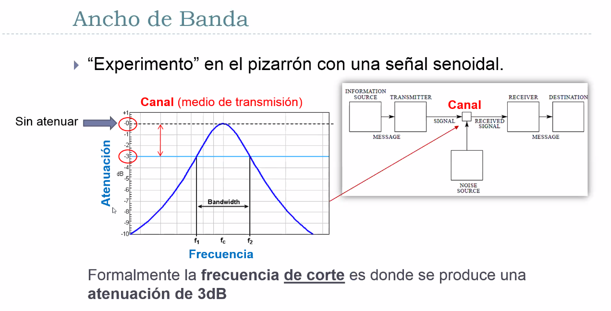

> La señal que se muestra es la caracteristica del canal.

Hay una frecuencia tipica (o central) del canal que tiene atenuacion 0. Si pongo
una senoide de esa, entra y sale intacta. Pero eso pasa tipicamente para una
frecuencia determinada del canal fisico, y por fuera de ella las empieza a
atenuar. Cuanto y con que forma? Eso hace a la caracterististica fisica del
canal, pero seguro las atenua.

Se usa dB porque es independiente de la magnitud de la señal.

A partir de ciertas frecuencias (altas y bajas) las deja pasar con cada vez más
atenuación. Esto se denomina **ancho de banda** (bandwidth): el ancho de una
banda de frecuencia. Es una diferencia entre dos frecuencias denominadas **de
corte**. Entre f1 y f2 mi señal (que no se si en la descomposicion caen ahi
adentro o afuera, todas afuera, etc.)

> Por ej. 500 abajo y 500 arriba, 1KHz de ancho de banda

Cuando quiero mandar una señal por un canal, tengo que hacerla apta para ese
canal (equalizarla). Yo diseño mi señal para que toda la informacion que yo
codifico caiga dentro del ancho de banda del canal

Transmitir una onda cuadrada en un canal real es meterse en un lio tremendo
porque es violentamente deformada por el canal, por el filtrado. Ya que está
compuesto por muchas frecuencias, entonces al estar atenuadas algunas se deforma
todo. Tiene mucha **riqueza frecuencial**

Esto da una intuicion de por que transmitir ondas cuadradas no es una buena
idea, excepto para distancias muy cortitas donde hay atenuaciones muy bajas. En
telecomuniaciones, la mayor parte es mediante manipulación de ondas senoidales.

### Teoría de la información

Como usar los conceptos que aprendimos para transmitir bits. Estamos ubicados en
la capa fisica, ya que estamos lidiando con las propiedades fisicas de las ondas
y los medios fisicos (canales). Lo bueno es que aplica para cualquier canal y
medio de onda.

> Recomendacion: leer "A Mathematical Theory of Communication" de Shannon.

{{diapo 53}}

La clave para evitar el ruido es estudiar la **informacion** contenida en el
mensaje. El significado semantico es irrelevante, sino que lo tenemos que
concebir como una secuencia de propiedades estadisticas que pueden ser
estudiadas y codificadas de forma tal de permitir una transmision *efectiva*
(menor cantidad de usos del canal para transmitir la info, eliminar redundancia)

Mientras mayor es la **entropia**, mayor es el esfuerzo necesario para
transmitirlo.

> Mensaje -> generador -> meto la señal al canal

Ahora estamos hablando del mensaje original

Teoria clasica de la información, también está la teoría algoritmica. Para más,
la optativa de Vero Betcher.

La teoría de shannon no dice como se deben hacer las codificaciones, pero si
brinda un maximo absoluto.

La informacion que da ver un evento E es

$$I(E) = log\frac{1}{P(E)}$$

Intuitivamente,

- Si la proba es 0, algo muy poco probable, la info que trae es enorme
- Si la proba es 1, ya se que va a suceder, no me trae informacion.

1 bit a partir de ahora la informacion de observar que sale cara o seca en una
moneda. Observar un 0 o un 1 en una fuente generadora de mensajes donde ambos
simbolos son equiprobables.

Una fuente de memoria nula emite simbolos (1s y 0s por ej) sucesivamente y cada
uno tiene una probabilidad. La proba de observar el proximo simbolo no tiene
relacion con el pasado de la historia de los simbolos que emitio, por eso se
llama de *memoria nula*.

#### Entropia

{{diapo 61}}: suma de probabilidades, definicion de la *esperanza*. Toda la
fuente la puedo caracterizar por la cantidad promedio de informacion, su
esperanza. Esta suma se conoce como la **entropia** (H(S)) de la fuente S. La
entropia es de la fuente, compuesta por un alfabeto de simbolos cada uno con su
probabilida de aparicion. Interpretaciones intuitivas de entropia:

- El valor medio ponderado (promedio) de la cantidad de informacion del conjunto
  de mensajes posibles.

- Medida de incertidumbre (grado de incerteza) acerca de una variable aleatoria.
  Una entropia alta habla de que en promedio voy a tener mucha informacion, cada
  vez que observo el evento voy a ganar mucho, porque era inesperado lo que
  observe.

- Cantidad de informacion obtenida al observar la aparicion de cada nuevo
  simbolo. No puedo observar uno solo, tengo un alfabeto. COn una fuente con una
  entropia mas alta dice cosas mas "sorprendentes" y "novedosas".

Ejemplo: Entropia de una fuente binaria

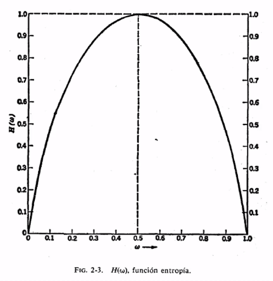

Solo hay dos simbolos, se hace maxima en el centro cuando ambos simbolos tienen
la misma probabilidad.

Propiedades

{{mas en diapo 64}}

- Es no negativa y se anula sii un estado de la variable es 1 y el resto 0. No
  trae informacion (porque es log(1) = 0)
- La entropia es maxima (mayor incertidumbre del mensaje)
- Una mas

#### Codificacion

Como puedo transformar los simbolos que me vienen en secuencias de bits
(palabras o codigo), por ej. una a con un 0, e 010, f 100 y asi. Que puedo hacer
para que ese codigo sea lo mas eficiente posible? Todo ese mundo es el de la
**codificacion**.

{{queda para la clase que viene}}

### Medios de transmision reales

Tengo una fuente que emite simbolos, el asigno bits. Cada simbolo tiene una
proba asociada y asi la fuente una entropia. Quiero poner esos bits en un canal,
vamos a ver ahora la conexion entre esos mundos segun la teoria de shannon.

Modelo de un sistema de comunicaciones:

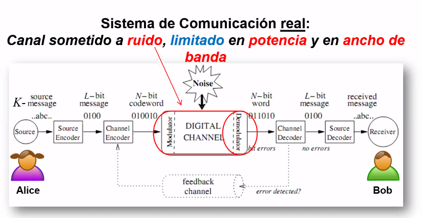

Limitado en potencia para no darle al mango y saltear la atenuacion

La señal puede ser perturbada de muchas maneras: todas las clases de ruido que
puede haber.

{{sacar de las diapos, lo salteo}}

Todos esos posibles ruidos combinados terminan en lo siguiente

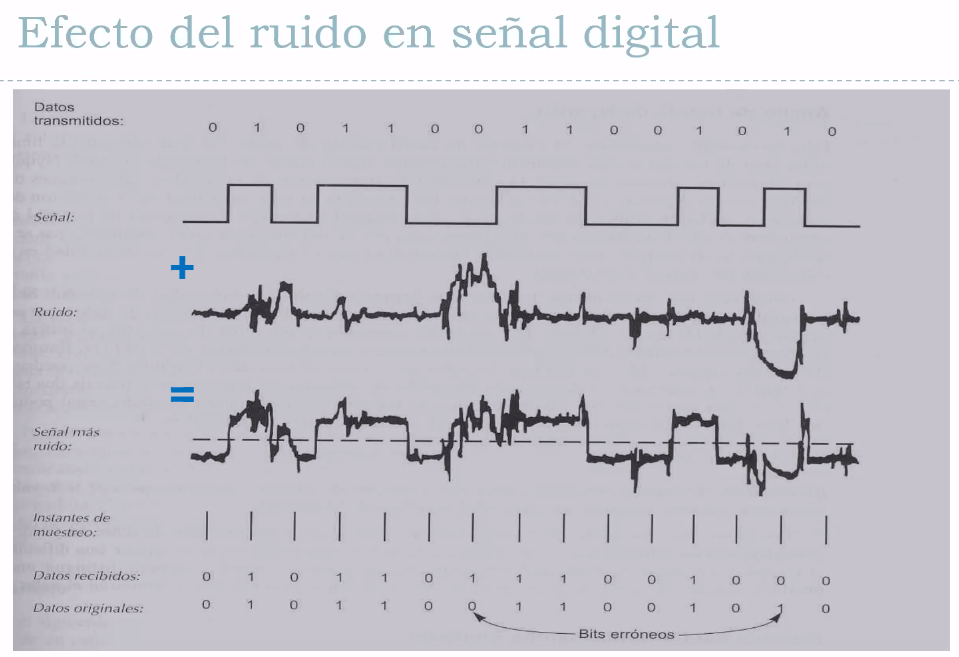

Tipicamente se muestrean las señales cada periodos regulares de tiempo, y hay
que definir que es un 1 y que es un 0, por arriba y abajo de que. Viendo eso en
cada instante da un muestreo.

Esto genera una taza de ruido, el **bit error rate** (BER), cuantos de estos
errores hay por unidad de tiempo.

- Velocidad de transmision de datos C en bits por segundo
- Ancho de banda B (bandwidth) en ciclos por segundo (hertz). Limitados por el
  transmisor y el medio
- Ruido (N) por Noise

Observaciones de shannon: (capacidad de shannon)

- Para un cierto nivel de ruido, a mayor velocidad C

  - Menor periodo de un bit: En un mismo tiempo hay mas bits
  - Mayor error rate: con el mismo ruido se corrompen las bits porque hay mas
    bits en un mismo tiempo.

- Es importante estudiar la relacion señal a ruido (Signal-Noise ratio, SNR)

  {{formula diapo 86}}

- Si aumento B (en principio beneficioso porque pueden pasar mas señales), la
  potencide la señal S (se ve menos afectada por la atenuacion), aumenta la
  velocidad binaria. Todo esto parece positivo, pero

  - Un aumento en B aumenta el ruido. El ruido está en todas las frecuencias, se
    mete en todas las frecuencias. Aumentar el ancho de banda del canal para que
    pasen mas frecuencias por la descomp. de fourier sin atenuarse, tambien le
    estoy abriendo la puerta para que entre mas ruido. Es una relacion de
    compromiso, no es lineal aumentar el ancho de banda y sos gardel.

  - Si aumento la potencia de la señal, aumentan otros tipos de ruidos y no
    linealidades dentro de los medios fisicos que generaen distorsiones en la
    señal. Aumentar la potencia aumenta la SNR pero general otros ruidos.

    La potencia es la amplitud.

- Metiendo todo esto en un mismo problema, la **velocidad binaria teorica
  maxima** para un canal cualquiera es (EL teorema de shannon para la capacidad
  de un canal)

  $$C_{max}(bps) = B(Hz) \times log_2(1+ SNR)$$

  Si me paso, no voy a poder recuperar los errores causados por el ruido. El
  ruido va a ser inmanejable.

  Con mecanismos de redundancia y otros trucos se puede reducir la probabilidad
  de que un bit de distinto tanto como yo quiera, excepto que me pase del limite
  teorico de shannon.

{Aca hay un resumen final que falta copiar}