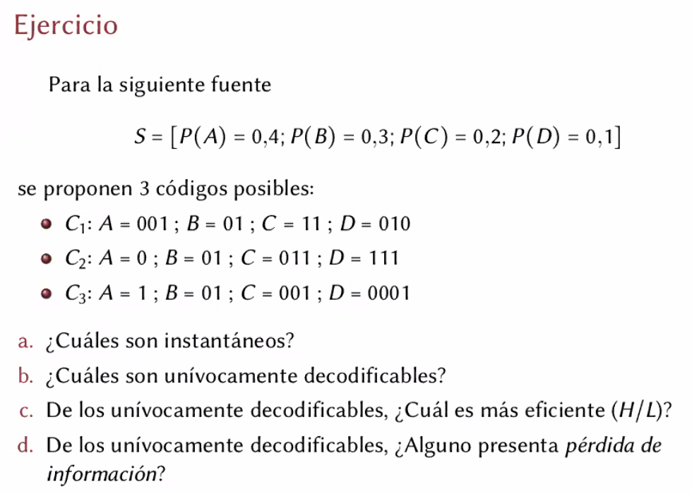
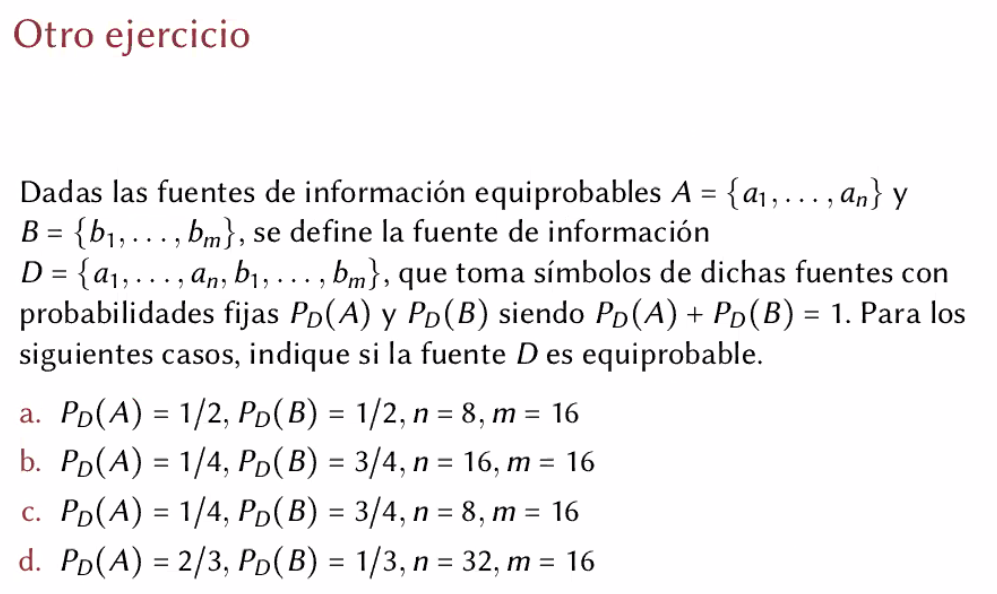
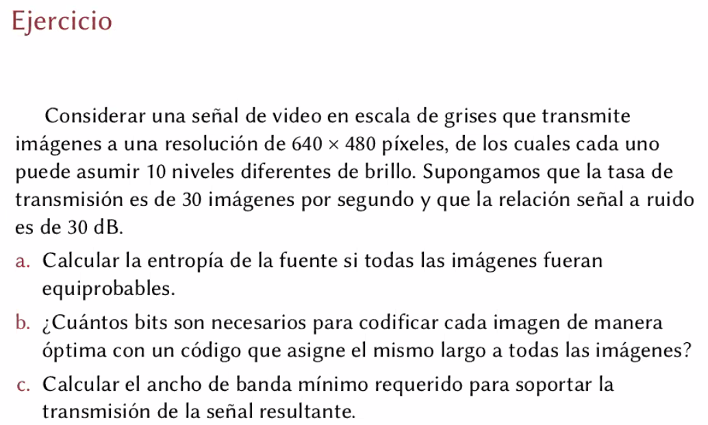
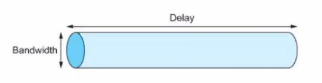
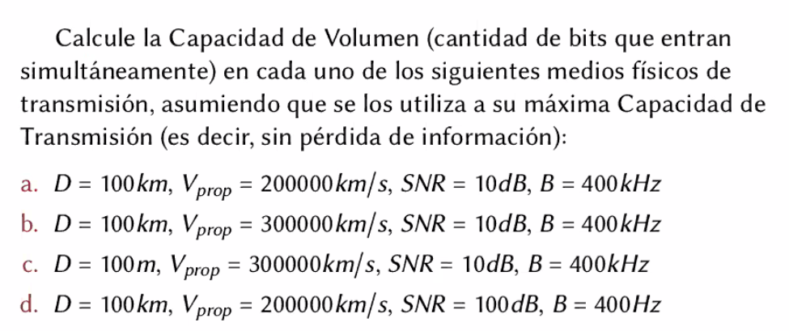
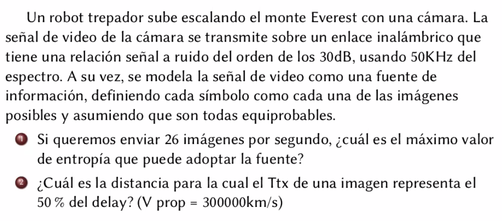

# Practica 1 - Transmision de informacion

Sobre TPs: La consigna opcional se puede entregar por separado, y tiene como
deadline el mismo dia pero en realidad se puede entregar hasta la fecha de
recuperatorio (al final del cuatrimestre)

## Fuentes de informacion

Como formalismo matematico, son una manera de modelar como un fenomeno empieza
a producir eventos.

Por ejemplo, puedo tirar un dado y hay un evento que es que salga un 2. Ese 2 va
a tener una determinada *cantidad de informacion*. Si empiezo a tirarlo 

Los eventos tienen una determinada probabilidad. En un dado balanceado por ej
1/6

A cada evento le puedo calcular la **informacion**

$$I(e) = -log_2 P(e) \text{ bits}$$

Por que con un logaritmo?

- Si sumo logaritmos de probabilidades, ese espacio puedo convertirlo en el
  logaritmo de una multiplicacion. Y multiplicando probas puedo transformar (si
  los eventos son independientes) en la proba de dos eventos al mismo tiempo.

  Hace que sea facil jugar con como se mueven las proba, y esta bueno que la
  info es un *espacio aditivo*.

- Cuanta info ocupa un numero? Eso es el techo del log_2 del numero.

  Lo que busca hacer la formula entonces es optimizar el espacio con los eventos
  mas probables.

  Si un evento tiene mucha probabilidad (1), va a ocupar pocos bits. Si tengo
  otro evento que tiene muy poca probabilidad, va a ocupar muchos bits.

Un **bit** entonces es la cantidad de información obtenida al especificar una de
dos posibles alternativas igualmente probables. Es la información que da una
tirada de una moneda.

**Fuente de memoria nula**: Fuente en la que cada emision es estadisticamente
independiente

- **Entropia de una fuente S**

    $$H(S) = -\sum_{s \in S} P(s) \times log_2 P_s(s)$$

  Es un promedio ponderado de la probabilidad. Como una esperanza de la
  informacion (no es exactamente eso porque no es una var aleatoria)

- **Entropia bajo equiprobabilidad**: $H(S) = log_2 \mid S\mid$

## Codigos

Un codigo es una forma de relacionar elementos de un conjunto con elementos de
otro, de manera tal que al primero le correspondan elementos del otro que sean
combinaciones de simbolos.

> Por ej. tengo 256 simbolos que codificar (alfabeto de entrada o *dominio*),
> pero los quiero codificar con un *alfabeto de salida*, que tenga poquitos
> simbolos (por ej 2, 3, etc.) pero que esos simbolos esten concatenados. Puedo
> hacer representaciones como `0000111001010` o cosas asi.

Es una correspondencia entre todas las secuencias posibles de simbolos del
alfabeto fuente $\Sigma$ a secuencias de simbolos de otro alfabeto X (alfabeto
codigo). Muchas veces son usados para lograr una repr. mas eficiente de la
informacion (eliminar redundancia).

- **Codigo bloque**

  Un codigo bloque es aquel que asigna cada simbolo de sigma a una secuencia
  fija de simbolos de X: $C: \Sigma \to X^*$.

  Ejemplo: {copiar}

- **Codigo no singular**

  Se dice asi si todas sus palabras son distintas (i.e C es una func inyectiva)

  C1 es no singular.

- **Codigo instantaneo**

  Tiene que ver con una cuestion mas temporal.

  > Tengo un string de largo 4mb, la empiezo a leer, un codigo es instantaneo si
  > yo a cada instante que leo se que si ya termine de leer un simbolo, o si
  > tengo que seguir leyendo para terminar de leerlo.

  Condicion necesaria y suficiente: Ser libre de prefijos, no codificar ningun
  simbolo como prefijo de otro. Ninguno de los elementos del conjunto tiene como
  prefijo a otro.

  Un codigo es instantaneo cuando es posible decodificar las palabras sin
  necesidad de conocer los simbolos que la suceden.

  En general siempre vamos a querer que se envien simbolos instantaneos en las
  transmisiones de computadoras. Hace que las cosas sean mas fluidas.

- **Codigo univocamente decodificable**

  Cualquier secuencia de simbolos del alfabeto de salida (imagen) tiene que ser
  separada en una y solo una de simbolos del alfabeto del dominio.

  > Por ej. si digo que el sim1 = 0, sim2 = 1, sim3 = 01, si veo la tira 01 no
  > voy a saber si es el 3 o una concat del 12. Tengo que poder decodificar
  > cualquier simbolo en una tira de simbolos

Los *protocolos* se envian paquetes de datos que se pueden ver como simbolos, a
los que se les pide estas propiedades (en un sentido matematico formal, no se
ve en la especificacion de los protocolos)

**Teorema**: Codigo instantaneo => codigo univocamente decodificable.

La **longitud de un codigo** o longitud media de un codigo es el promedio
ponderado (por la proba) de los largos con los que se codifican los simbolos.

$$L(C) = \sum_{s \in S} \mid C(S)\mid \cdot P_S(s)$$

Un codigo se dice **optimo** si *no* existe un codigo para la misma fuente con
menor longitud media. Utiliza en promedio el menor numero posible de bits para
codificar un mensaje. Ademas tiene que tener todas las propiedades y vamos a
querer codificar todos los simbolos con el mismo largo (cuando son
equiprobables). Y con esto nos aseguramos todas las propiedades anteriores.

Y es *localmente optimo* a una fuente.

- **Teorema**: Codificacion sin perdida de informacion

  $$H(S) \leq L(C)$$

  Todo codigo que satisface esto codifica *sin perdida de informacion*

  Si conseguimos una codificacion mas baja que la entropia, alguna propiedad no
  cumple y vamos a perder informacion.

  Intuitivamente, la cantidad de bits con la que estas codificando en promedio,
  es menor a la informacion que tienen, entonces no te va a alcanzar.

  Es ademas una cota inferior de todos los algoritmos de compresion sin perdida
  (como winzip o winrar), no pueden ir mas abajo de la entropia, y muchas veces
  comprimen bastante mal. Son heuristicas que en promedio rara vez llegan a la
  entropia.

### Ejercicio 1

a.

- C1 no porque B es prefijo de D
- C2 no porque A es prefijo de B
- C3 si porque es libre de prefijos

b.

- C1 no, 01001 = DB = BA
- C2 si, aunque no hay forma de asegurarlo
- C3 seguro porque es libre de prefijos

c. (eficiencia es H/L)

  C2 mas eficiente

d. {copiar}

### Ejercicio 2

a. No, pues la proba de un simbolo de a es 1/2 * 1/8 y la de un simbolo de b es
1/2 * 1/16

## Capacidad de canal

Las computadoras transmiten por **canales de informacion**, que son muy
variados, desde guiados (coaxil, cobre, fibra optica) y no guiados. Cada uno
modula una señal electromagnetica (la amplitud, frecuencia, fase. Varias props
fisicas). Y esas alteraciones que se producen sobre esas señales permiten
codificar informacion.

> Por ej tengo un rayo infrarojo que van a determinada longitud de onda. Yo
> puedo cambiarla y en funcion a como cambia, puedo decir que si esta muy arriba
> es un 1 y muy abajo es un 0, y cosas asi. Tambien puedo cambiar la potencia de
> la señal. Y con todas las combinaciones de esas cosas yo genero combinaciones,
> como alta amp alta frecuencia, baja baja, etc. Y ahi las voy combinando para
> codificar mis simbolos, tal vez puedo mandar mas de un bit (por ej. si tengo 4
> estados posibles puedo codificar 2 bits)

Luego de una cierta distancia empiezan a atenuarse, tener ruido, y se empiezan a
modificar las codificaciones. Y ahi es donde se empiezan a producir los errores,
que hay que ver como solucionar.

La **capacidad** es cuanto puedo cambiar la onda electromagnetica lo
suficientemente rapido si pretendo que el otro lado se entienda algo. Es la vel
teorica maxima de transmision, viene dada por el **teorema de shanon**

$$C = B \cdot log_2(1 + SNR)$$

(C: capacidad, B: bandwidth, SNR: signal-to-noise-ratio)

**SNR**: signal to noise ratio

> Tengo por ej un cable, le doy 5 volts. SI alguien prende una moladora que
> interfiere electromagneticamente y genera un ruido con mas potencia de lo que
> esta mandando, pierdo en funcion de esta formula.`

Es una cota teorica pero es raro que se alcance en la practica. (Es tambien un
desafio.)

### Ejercicio

> La señal de video es como una fte de info que emite una det cantidad de
> imagenes por segundo. Los simbolos de la fuente son esas imagenes.

a. Entropia si todas son equiprobables

  Hay 10^{640 x 480} simbolos posibles (porque por cada pixel hay 10 niveles de
  brillo), entonces la entropia es

  H(S) =~ 640 * 480 * log_2(10)

b. Es de manera optima si L = H, 

  Cuando es equiprobable, el largo es el largo de una imagen porque todas tienen
  el mismo largo.

  |imagen| = L(C_optima(D))

  {copiar}

c. Ancho de banda maximo

  - Si transmito mas lento que eso, o bien me queda alguna imagen cortada o no
  puedo transmitir todas las que necesito. No se deduce de nada, sino que es
  algo que se te tiene que ocurrir.

  - Planteo la cota de la capacidad de shanon

  - Unir las dos inecuaciones

## Deleay

Lo vamos a definir de una manera ahora pero nos vamos a dar cuenta a lo largo de
la materia de que es algo mas complicado y desafiante

El **delay** el tiempo que representa el envio de la informacion, cuanto
tardamos en enviarla. Es el tiempo de transmision (que es una funcion de la
cantidad de informacion) + el tiempo de propagacion.

$$\text{Delay} = T_{tx}(n) + T_{prop}$$

($+ T_{queue}$ cuando no es punto a punto)

Es importante notar que se suman y no se multiplican, no es un tiempo de
propagacion por bit, sino que transmito todos los bits que quiero, y todos se
propagan en cadena en el cable. Entonces el tiempo de propagacion se cuenta una
sola vez.

- T_tx(n) = n/V_tx (velocidad de transmision) es el tiempo de transmision de n
  bits. n son bits y V_tx son bits/seg, entonces termina quedando segundos.

- T_prop = D/V_prop tiempo de propagacion, que no depende de la velocidad de
  transmision (no tiene que ver con la capacidad de canal). Depende del tiempo
  que tarda la señal en transmitirse, si es inalambrico, guiado, etc.

- T_queue: Tiempo de encolamiento. No aplica en punto a punto pero si va a
  aplicar mas adelante.

Cuestion de terminologia: si transmitimos 1 bit en vez de un paquete de n bits,
puede pasar que el tiempo de transmision sea despreciable frente a la
propagacion. En este caso el delay muchas veces se define como el tiempo de
propagacion, y en la literatura probablemente se encuentre como *latencia*.

### Capacidad de volumen

La de antes era en terminos de velocidad de transmision. Aca consiste en la
cantidad de bits que entran en el medio (cuantos puedo ir transmitiendo) desde
que pongo el primer bit hasta que ese bit llega a la unidad receptora. El canal
se llena hasta un punto, determinada capacidad.

Esa capacidad es delay * velocidad de transmision.

$$C_{vol} = \text{Delay} \times V_{tx}$$

(imagen del peterson, se refiere a bandwidth como velocidad de transmision, es
porque hay una relacion lineal, entonces se suele utilizar intercambiablemente)

### Ejercicio 4

{copiar}

Permite 

### Ejercico de parcial

a. maximo valor de entropia: hay que optar por el teorema H < L.

  No se puede obtener la cantidad de imagenes segun los datos del enunciado.

  Al igual que el otro ej. tenemos que poder transmitir las 26 imagenes por
  segundo.

### Practica

Hasta el 8, 9 se puede hacer.