# 10 - Congestion

## Timeline

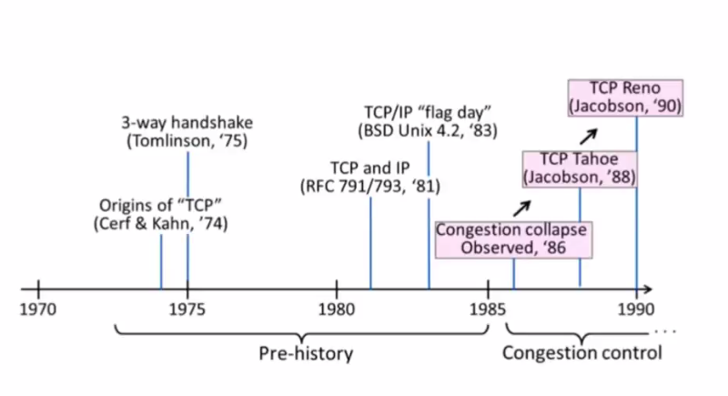

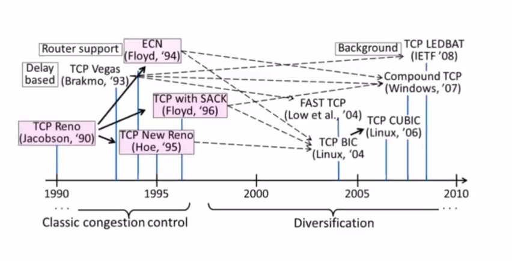

Lo que vemos en la etapa de diversificacion es lo que aparece en los algoritmos
implementados en nuestras maquinas.

## Conceptos principales de TCP

- ACK Clocking
- Timeout adaptativo
- Slow start
- Congestion avoidance
- Fast retransmission
- Fast recovery

## AIMD

AIMD: Additive Increase / Multiplicative Decrease

es "justo" y "eficiente" en la asignación de ancho de banda. TCP lo implementa
solo mirando *packet loss* como seal de realimentación (tahoe 88 y reno 90)

Es una medida drástica para disminuir la congestión en la red. Es un dibujo como
de serrucho

## Definiciones

- Segment: "paquete" TCP/IP

  Lo que veniamos denominando paquete ahora se denomina segmento.

- SMSS: Sender Maximum segment size. Max. payload que puede tener cada segmento.

- RMSS: Receiver maximum segment size. Maximo que va a recibir el receptor.
- Ventanas
  - Receiver window (RWND): Ultima advertised window recibida. Es la ventana del
    que recibe los segmentos
  
  - Congestion window (CWND): estimacion de la congestion. Es la variable
    implicita, es lo que conoce cada host que está enviando datos sobre su
    percepción de la congestión en la red.

    - Initial window (IW): Valor de CWND despues de handshake
    - Loss Window (LW): Valor de CWND despues de un timeout
    - Restart Window (RW): Valor de CWND despues de un periodo idle

      Tenia una conn tcp establecida, paso 1s sin enviar (idle), y cuando vuelve
      no arranco con una initial window sino una restart window. Hay umbrales
      para determinar cuando esta y no idle.
  
## Ventana del emisor

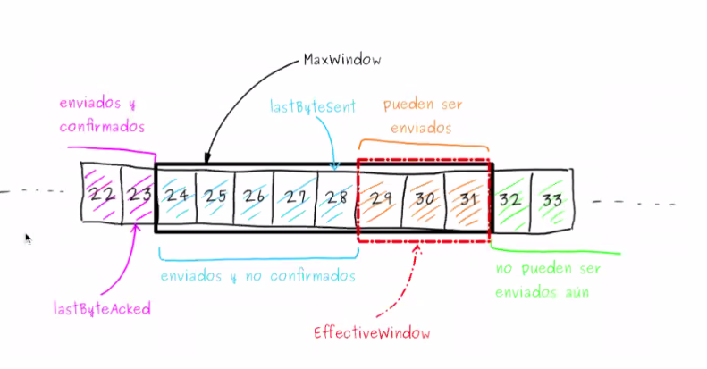

El emisor tiene una ref. `lastByteSent` que dice el ultimo que mando. La ventana
negra es lo maximo que puedo mandar.

Esto es parecido a sliding window

## Ventana de congestion

CNWN = Estimacion de la cant de info que puedo meter en la red sin que se vea
afectada su performance.

MaxWindow = Min(RWND, CWND)

= Cuanto se banca el receiver y cuanto se banca la red. Tengo que mandar el min
entre ambas, porque sino estoy excediendo a alguno.

EffectiveWindow = maxwindow - (lastByteSent - lastByteAcked)

= "cuantos bytes puedo despachar"

## Clock de ACKs

La emision de nuevos segmentos se ve regulada por la tasa de legada de los ACKs.

Por eso se dice que es "self clocking", tiene un clock de acks. Lo unico que te
habilita a seguir mandando datos es un ack.

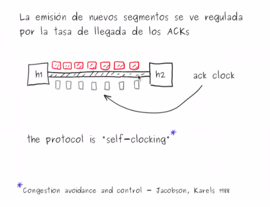

Beneficios

- Ayuda a la red a tener bajos niveles de perdida y de delay.
  - Las rafagas son *suavizadas*: no hay picos en el envio de paquetes
  - Este suavizado es transmitido al emisor
  - Subsecuentes paquetes son enviados con este clock
  - Baja el queueing: como tengo feedback del host receptor y lared, nunca hay
    un momento en el cual el host h2 solo pueda recibir uno solo
  
- Tasa obtenida se acerca mejor a la capacidad de la red. Rate = CWND/RTT

## RFC 5681: TCP Congestion control

Define 4 algoritmos o protoclos que intervienen en el control de congestion

- Slow start
- Congestion avoidance
- Fast recovery
- Fast retransmitr

Ademas especifica como una conexion debe comportarse luego de un periodo idle

### Slow Start

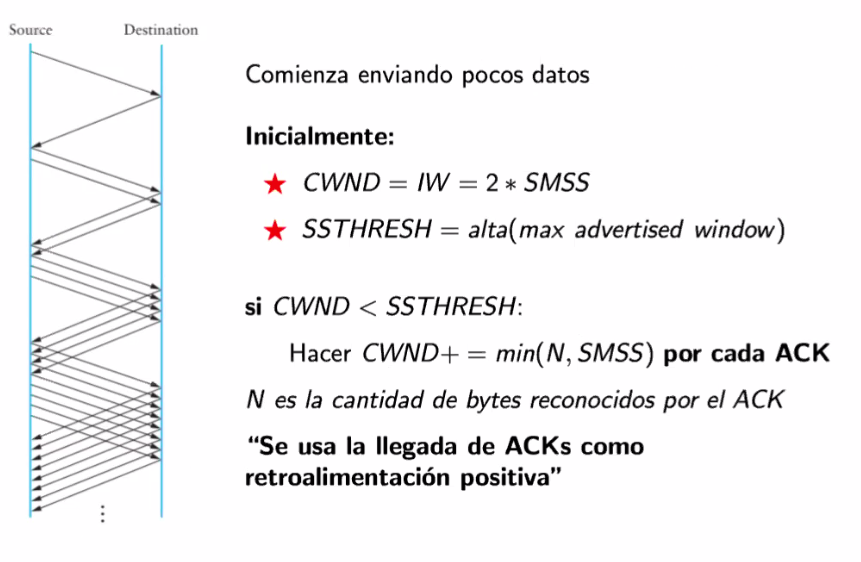

Es la implementación de additive increase

SSTHRESH: Slow Start Threshold

Estar en slow start significa que cada vez que recibimos un ack la congestion
window crece, como el minimo entre N y SMSS por cada ack. Usamos la cant de ACKs
como retroalimentacion positiva.

- Flight Size: LastByteSent - LastByteACKed
  - La cantidad de datos que hay en vuelo, que yo mande pero que no se donde
    estan (puede que no los haya recibido el receptor, o que no nos haya llegado
    el ack)

- Slow Start Threshold (SSTHRESH): Umbral que define si se usa SS o CA

## Ejercicio 1

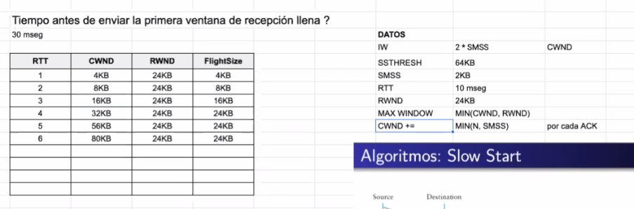

## Congestion Avoidance

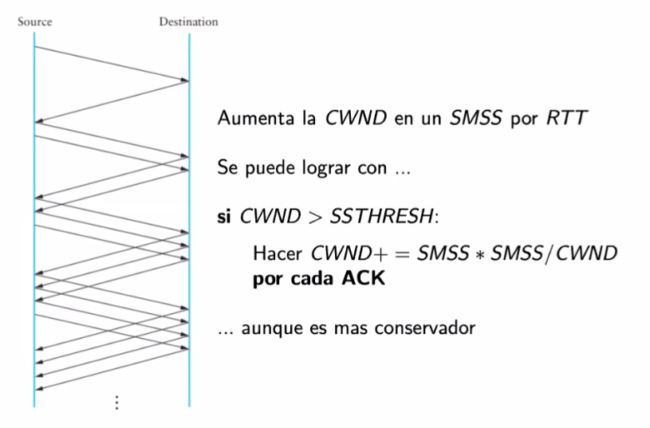

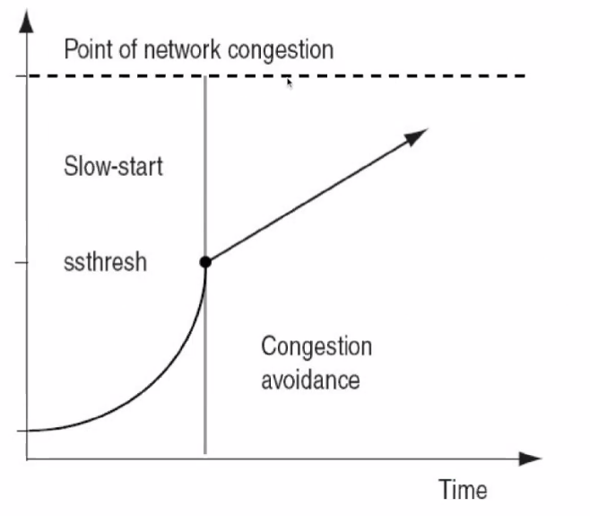

## Timeout

El timoeut surge cuando la flecha llega al punto de congestion de la red

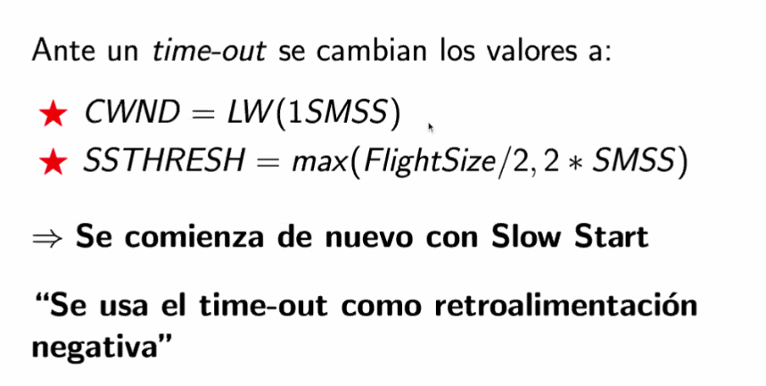

## TCP Tahoe

Tcp con slow start, congestion avoidance y timeout.

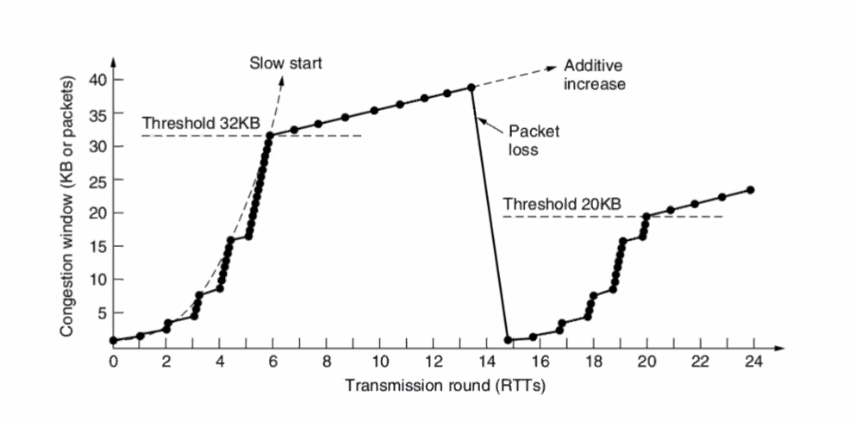

## problemas

{leer}

## Fast recovery / fast retransmit

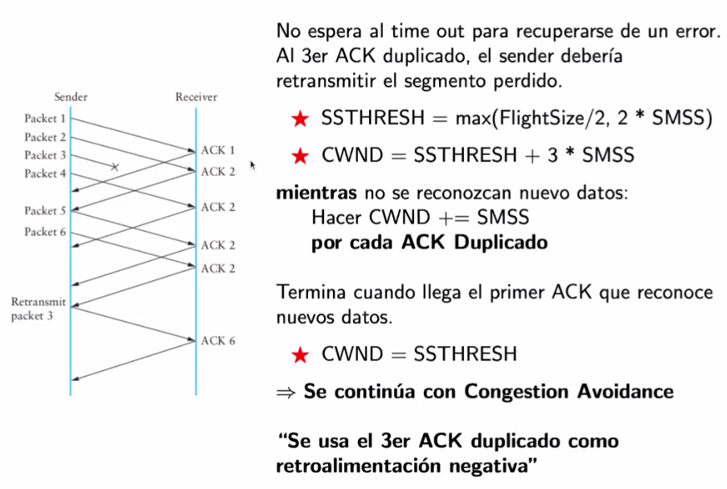

### TCP Reno

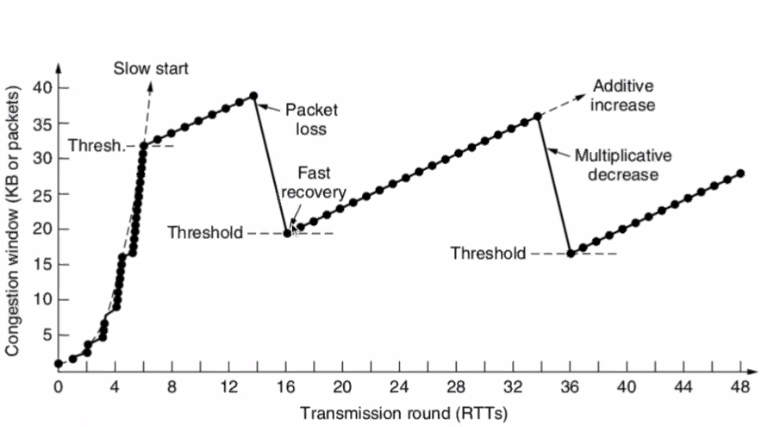

### Consideraciones adicionales

- **Reiniciando conexiones idle** Una conexion idle no tiene
  retroalimentaciones, no sabes que paso en la red porque dejaste de enviar
  datos, entonces nunca te llegaron acks.

  Cuando una conexion es idle, la CWND pasa a ser RW (Restart Window) = min (IW,
  CWND). Si no hay actividad por más de un RTO

- Una cosa mas {leer}

## Ejercicio 2

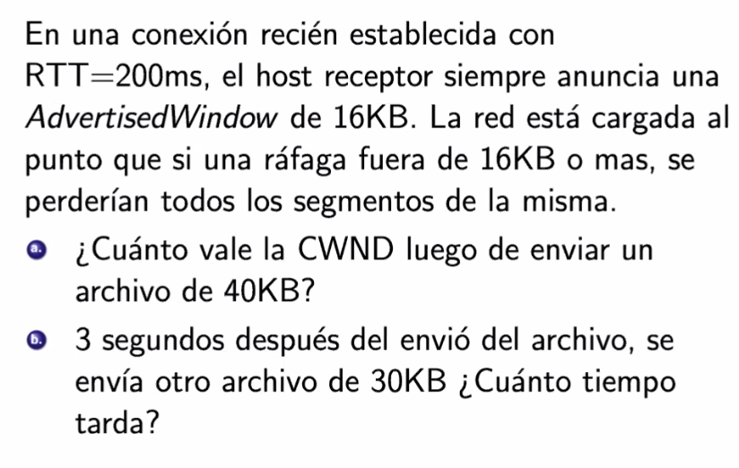

SMSS = 2KB lo asume.

LBS = last byte sent

RTO = 2 * RTT = 2 * 200ms

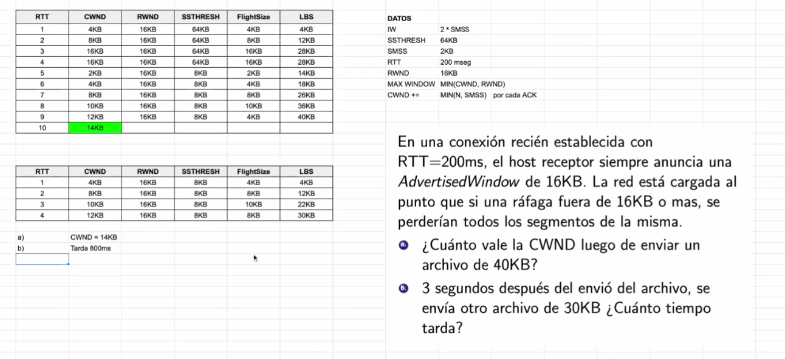

Asumimos que los ACKs se aplican en el mismo RTT, pero la CWND se impacta en el
siguiente.

Abuso: tomamos como que un RTT llegan todos los ACKs de la rafaga de segmentos. 

> Hay que leer si o si el RFC para resolver los ejercicios - Esteban.