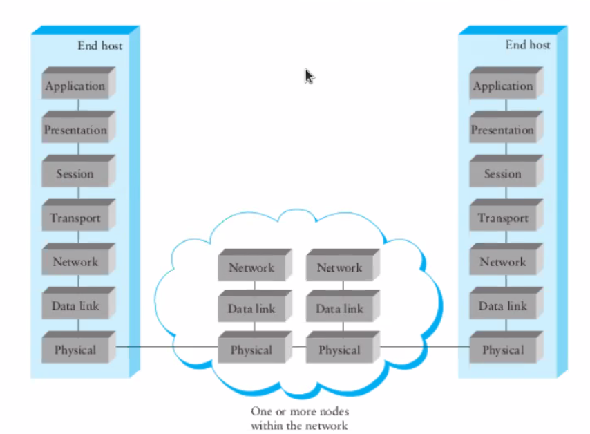
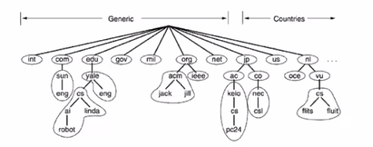
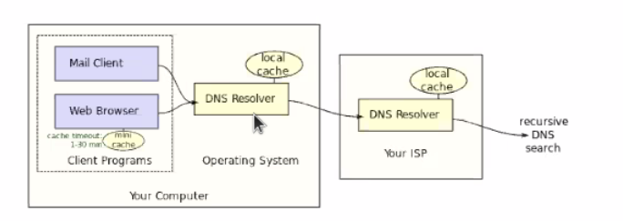
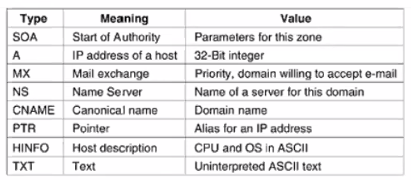
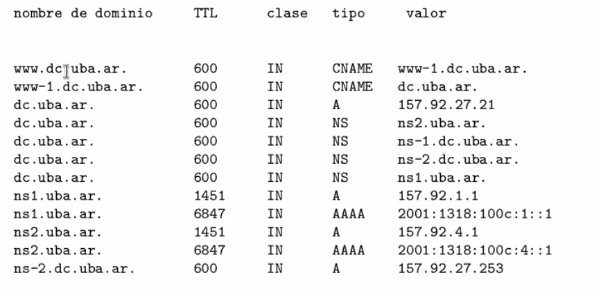
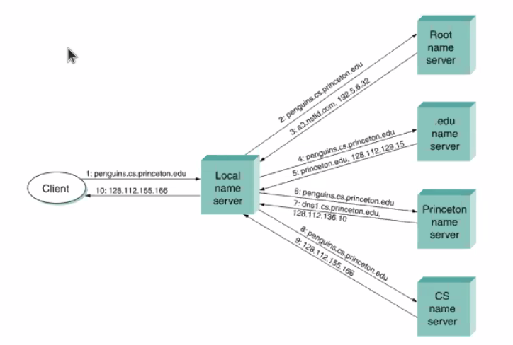
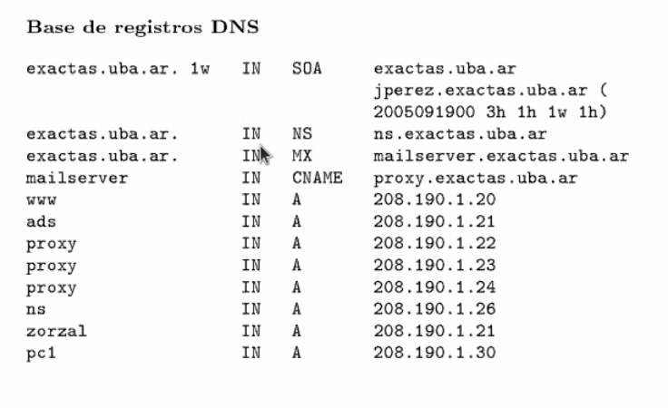
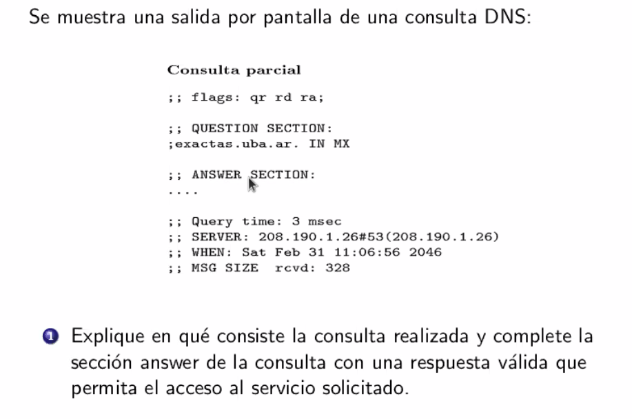

# Clase 11 - DNS

## Capas

Hay un problema parecido a la capa de ARP, con la diferencia de que se podia
resolver solo con una pregunta y una respuesta. En cambio en DNS no alcanza solo
con eso, además hay que pensar como guardar todas las direcciones de un sistema
grande de forma escalable.

Podemos pensar a DNS como un sistema que resuelve un problema que ya habíamos
visto antes y le agrega estas complejidades.

Es parecido a la guía telefónica, de hecho se puede implementar con DNS

## Soluciones

hosts.txt

- Network Info Center (NIC)
- Se actualiza periodicamente
- No escala

Ideas:

- Necesitamos un codigo postal de la internet pero mas potente
- Necesitamos un naming system, mappear user friendly names a router friendly
  names.
- Necesitamos descentralizar la información

## DNS

Domain Name Service (o system)

- Objetivo: separar el nombre del host de su direccion
- Baja escalabilidad
- Namespace: Esquema de nombres jerarquico basado en dominios
- Jerarquia de autoridad: Estructura jerarquica que complementa la jerarquia de
  namespaces.
- Name servers: los que se encargan de la resolución y registro de nombres
- Puerto 53 (UDP)
- RFC 1034 - Concepts and Facilities: define el sistema de dns
- RFC 1035 - Implementation and Specification.

### Nombres de dominios absolutos y relativos

FQDN: Fully qualified domain name. Termina con un punto al final, es una ruta
absoluta desde la raiz de los dominios

- Hostname + domain
- Ejemplo: `mail.dc.fcen.uba.ar`
- PQDN
  - Hostname
  - Se usa para redes locales
  - Para saber el FQDN del dominio, le concatenamos el PQDN del padre
  - Ejemplo: `mail`

### Jerarquía de autoridad: Zonas

Es una estructura complementaria al namespace, que se divide por zonas de
autoridad. Cada una corresponde a una *autoridad administrativa*. El nodo root
es Null ( ICANN)

Una autoridad administrativa hace el registro de subdominios. Mantiene la
unicidad de nombres y descentraliza la información.

### Servidores

El sistema opeativo tiene un *resolver*: un servidor DNS (en realidad un
programa) que responde consultas DNS y las cachea

No es autoritativo, solamente la responde. Abstrae el saber a *quien*
preguntarle.

### Componentes

- **Name servers**
  - Tienen los registros de la DB de DNS (lineas en un archivo de texto)
  - La *zona* es el conjunto de registros DNs que tienen que ver con esa zona, y
    se la pasan entre si con los autoritativos generando redundancia.
  - Por eso hay servidores primarios y secundarios, hay algunos que tienen que
    estar prendidos todo el tiempo (primarios) y secundarios que responden las
    respuestas autoritativas.
  - Entre todos forman la base de datos DNS

- Resolvers: Servidores no autoritativos

### Registros

Esta formado por

- Nombre de dominio (es como la clave del diccionario)
- TTL (segundos)
- Clase (En general IN de internet)
- Tipo
- Valor

#### Registro Start Of Authority (SOA)

Indica el comienzo de una zona de autoridad. Cada una debe tener exactamente un
registro SOA.

- Serial: Para versionar los registros de la zona
- Refresh: Cada cuanto se actualiza la zona desde el server master
- Retry: Cuanto tiempo espera para reintentar el refresh
- Expire: Cuanto tarda en expirar la zona
- Uno ma

### Comando dig

En windows es nslookup

Flag -x es una consulta dns al reves

### Tipos de consultas

### Ejercicio

Devuelve la línea con MX, y como optimización devuelve mailserver, proxy y la ip
final.

Con el CNAME seguro iba a estar ahi, pero mailserver podria estar tercerizado.

En algun ejercicio también podemos decir que itera.
