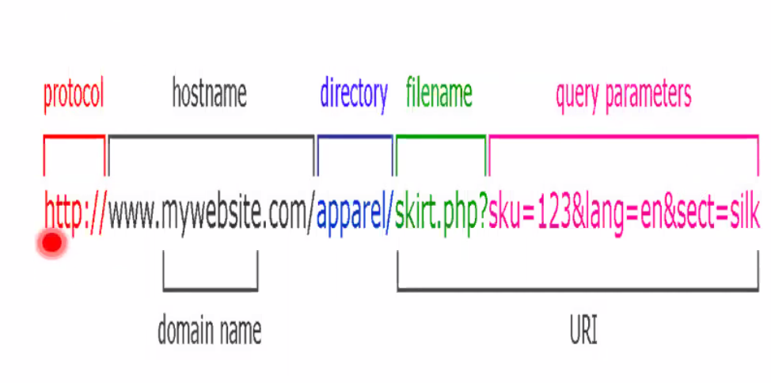

# Clase 12 - Capa de app 2

Los entries de tipo MX son mail servers

## SMTP

SMTP port 25

Mensajes

- HELO
- MAIL
- RECPT
- QUIT
- DATA

Servidor

- 2xx OK
- 5xx Error
- etc.

Debilidades del protocolo base

- Podes mandar un mail conectandose asi nomas
  - Se agrega autenticacion a los pasos? SMTP
- Correo viaja en texto plano
  - SMTP seguro
  - Encriptar en el cliente de correo

## Leer mail

El destinatario quiere leer los mails, tiene dos protocolos. POP3 e IMAP.

POP es mas simple pero IMAP es mas complicado.

La diferencia conceptual es que POP el mail reside en el cliente, los traes y
los procesas en el cliente.

> cuando se invento los servidores tenian poca capacidad de disco, entonces los
> administradores de la red querian que el procesamiento y almacenamiento de los
> mails residieran en la pc del usuario final. POP esta pensado para eso, leer
> los mails y borrarlos (se pueden dejar igual ahi).
> No tiene capacidad de leerlos del servidor.

### POP3

POP responde con OK

Comandos orientados a traer mail, y borrarlo del servidor. Borrarlo es raro
porque hace que no tengas

### IMAP

Filosofia opuesta: el servidor almacena los mails y los procesa, y el cliente
manda tipo instrucciones a un robot.

- LOGIN
- SELECT
- FETCH
- DELETE

Servidor

- OK
- NO
- BAD

> Asi funcionan los webmail, cuando moves algo lo moves en el servidor.

En un cliente IMAP tenes carpetas en el servidor, y carpetas en local

## Mail

### Formato de mensaje

HEADER (comandos separados por CRLF)

- From:.
- To:.
- CC:.
- etc.

### MIME

Para poder mandar cosas que no son ascii (imagen, attachments) se inventa un
protocolo auxiliar que se llama MIME (RFC 2045). Es un parche que permite
indicar en un mail que parte es texto, que parte imagen, que parte pdf, etc.

Permite que un mail tenga varias partes, cada una con un tipo asociado.

### Resumen

Correo:

- Para mandar smtp todo ascii
  - TCP puerto 25
- para leer
  - POP port 110
  - IMAP port 143
  - Tambien son TCP, cliente servidor y ascii
  - Los mails tienen formato header y body
  - El cuerpo hoy en dia por lo general es MIME
  - permite dividir el mail en partes para poder mandarlo en ASCII

DNS: chequear los registros MX para ver los servidores del dominio del mail.

## HTTP (Hypertext Transfer Protocol)

Usa TCP puerto 80.

El cliente y el servidor se intercambian HTML. Es un lenguaje de hypertexto, un
texto que tiene referencia a otros textos. Surgio en el CERN para compartir
documentos, leo el paper y quiero leer otro entonces sigo la referencia
clickeando.

Algunas referencias son directas y se tienen que cargar inmediatamente (eg una
imagen embebida) y otras pueden ser elegibles, como un enlace a un video que
decido si quiero ver o no referenciando ese enlace. Solo cuando le hago click
recien ahi el cliente va y lo busca.

Cada objeto se referencia por un identificador unico (URL - Localizador de
recursos uniforme). URL es la forma de direccionar en capa 7. Asi como el mail
era usuario@dominio, se puede escribir como URL poniendo `mailto:`. Tiene un
formato que vamos a ver despues. La idea es referenciar en capa 7 cualqueir cosa
en internet.

**HTTP no mantiene estado**: Cada operación http es independiente de la que
sigue. Pido la página

Cookies: Es un truco para agregarle estado a HTTP. Es informacion enviada por un
sitio web almacenada en el navegador del usuario, de forma talque blabalba
{habia mas}

### URL

Hay varios protocolos, pero los que mas se ven http y https.

## Ejercicios

Definicion: Flujo de datos

Si nos paramos en una interfaz de un router, todo lo que pasa por ahi a nivel
transporte tien euna IP de origen, puerto origen y IP destino y puerto destino
(tanto para TCP como UDP). Entonces puedo clasificar los paquetes por *flujo*,
todo lo que va de tal socket a tal otro socket.

Esto permite aplicar politicas en las colas de los routers basadadas en el
flujo.

Se inventan los flujos UDP para eso porque no tiene conexion.

### Ej 1

Resolver: estamos en nustra pc y configuramos IP, maquina y resolver dns. Es el
primer equipo que va a resolver las consultas DNS. Si el resolver tiene la rta
respuesta directo con lo que tiene cacheado, y sino la conoce hace el
procedimiento de busqueda.

- El navegador le pide al resolver que le diga en donde esta www.jmail.com, pide
  el registro A.

- El resolver lo tiene en cache,

  El SOA está parado en jmail.com

  Si termina con . ya está, sino hay que completarlo con el dominio del SOA.

  www se completa con jmail.com. Es la 5ta entrada que tiene www.

- Una vez que tengo la IP, inicio una conexión TCP al puerto 80 de la IP desde
  la máquina de juancho con un puerto aleatorio y hago un GET a esa IP.

- A nivel HTTP, hay un GET a la IP pidiendo el index.html. Hace GET a / que
  segun como este configurado puede devolver index.html, index.htm

  Esto con el parámetro host virtual pongo el dominio.

  El cliente hace un GET / (pidiendo la pagina origen) HTTP 1.1 y abajo le pone
  host:www.jmail.com. Eso porque el URL que esta pidiendo es www.jmail.com

- El servidor responde un http response 200 OK que en el body tiene el html de
  la pagina.

- Trae la imagen de esa URL, pero antes necesita saber la IP de ese servidor, y
  no sabe la IP de cdn.akamai.com.

  Para resolverla, le preguntas al resolver y le pedis el A

  cnd.akamai.com. tiene que terminar con punto, sino esta mal, porque habria que
  completarlo con jmail.com.

  CNAME a recursos.jmail.com, que lo tenemos en la ultima.

- Hace GET /el-logo-de-jmail.png con Host:cdn.akamai.com
- iframe: Una pagina html adentro de otra, entonces tambien hay que hacerle GET.
  La misma historia, tiene que ir al resolver y preguntar. Como no la tiene el
  resolver, la consigue.

virtual host: puedo tener varios sitios webs alojados en el mismo servidor

> The concept of virtual hosts allows more than one Web site on one system or
> Web server. The servers are differentiated by their host name. Visitors to the
> Web site are routed by host name or IP address to the correct virtual host.
> Virtual hosting allows companies sharing one server to each have their own
> domain names.

b. Hubo 3 flujos tcp, una para cada GET.

  Si hubiera alguna imagen que se va a buscar al mismo servidor, hubiera habido
  una conexion menos. Pero como eran todos servers distintos hubo 3 diferentes.
  SI es http 1.1 y todo al mismo server es una sola conexion

---

CNAME: alias. Un registro CNAME dice que un hostname tiene a otro como alias,
tambien se llama de otra forma. Es una forma practica tambien de poner en el DNS
20 hosts virtuales para el mismo server con la misma IP. De esa forma cambias en
un solo lugar. Es un sinonimo entre un nombre y otro