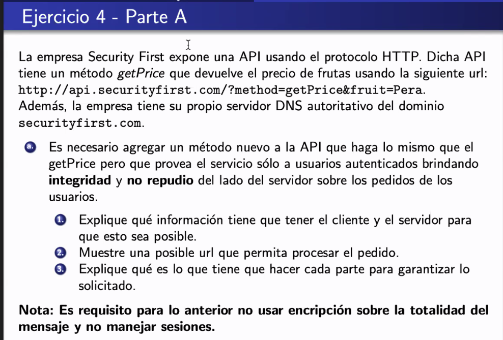

# Clase 13 - Seguridad

## Definición

Implica ausencia de riesgo, que puede depender de nociones abstractas y sociales
como la confianza.

Problema: (en el dominio de las redes, y en la mas grande que es internet)

Es dificil estar excento de vulns, pero lo que si podemos hacer es identificar
riesgos, y ahi podemos tomar medidas para prevenirlos. Siempre termina siendo
una relación costo beneficio.

> Ejemplos: Sacamos un sitio web, hacemos una lista de las vulns y vemos el
> costo de arreglarlas. Nosotros en el día a día estamos constantemente lidiando
> con infinitos ataques, y probablemente no voy a poder cubrir todos. Entonces
> cubro los mas importantes, trato de cubrir el risgo, y pienso como mitigarlo.

En general la seguridad termina impactando el diseño, entonces lo tiene que
pensar durante el desarrollo y no al final.

## Aspectos que atañan la seguridad

- **Confidencialidad**: Que nadie en el medio del viaje del mensaje pueda
  leerlo.

- **Integridad**: Que cuando mandes un mensaje llegue sin modificarse. Y también
  en
  el tiempo indicado.

- **Autenticacion**:

  > Cuando uno quiere entrar a gmail, te pide poner tu mail y tu pw. En el
  > momento en el que estas poniendo tu pw, te estás autenticando.

- **No repudio**: Es autenticación pero un poco más pesado en el lenguaje
  formal.
  Implica autenticación pero no al revés. Nadie puede negar que la persona que
  está haciendo esto fuiste vos.

  El hecho de que la cuenta de tincho se autenticó en gmail no quiere decir que
  haya sido él el que haya entrado a gmail, le podría haber dado la pw a
  alguien.

  Hay no repudio en el momento en el que yo puedo asegurar al 100% que fuí yo
  quien entró con mi cuenta. Hay una prueba de que es el.

- Disponibilidad: 

## Definicion

La **criptografia** consiste en construir y analizar protocolos para prevenir
que terceros no deseados tengan acceso a mensajes privados, lo que permite
garantizar una o varias de las props anteriores.

Un **sistema criptografico** es una tupla (E, D, M, K, C) tq

- M conjunto de textos validos
- K conjunto de claves
- C conjunto de textos cifrados
- E (encripta): M x K -> C
- D (desencripta): C x K -> M

> un texto plano y un algoritmo o protocolo que permite convertirlo en texto
> cifrado. Y para que este funcione se necesitan unas claves.

## Criptografia simetrica

Existe una unica clave K que se utiliza para encriptar el texto plano y
desencriptar el texto encriptado (sii fue encriptado con K).

La clave es el secreto que comparten ambos extremos de la comunicación. Y el
hecho que se tenga que conocer por ambos extremos es el punto débil de este
algoritmo comparado a clave pública.

Ejemplos: DES, 3DES (3 veces el factor de trabajo), **AES** (estandar que se usa
hoy en día)

Lo que tiene es que es rápida, entonces cuando queres transmitir mucho se suele
usar simétrica.

## Criptografía asimetrica

Diferentes claves para cifrar y descifrar

A diferencia de los metodos clasicos no se deben compartir una clave secreta.
Una de las claves es **publica** y la otra **secreta** (privada). Pero se puede
vulnerar la relación entre las entidades y sus claves.

Ejemplo: RSA

## Funciones de hash

**Definición**: h: A -> B

- dado x in A, h(x) es fácil y rápido de computar (hashear x)
- Para todo y in B, es inviable la vuelta, encontrar x in A tq h(x) = y
- Es inviable computacionalmente encontrar x y x' en A tq x != x' y h(x) = h(x')

  Cuando encuentro dos que coinciden, se llama *colisión*, y desde ese momento
  se asume que las funciones de hash están rotas.

Ejemplos: ~~HAVAL~~, ~~MD5~~, ~~SHA-1~~, SHA-256, SHA-3, BLAKE2

(las tachadas estan rotas) Hay rainbow tables para los rotos.

> Agarra info de cualquier tamaño y la define en un trail de bits de tamaño
> fijo, y tiene algunas bondades.

En general se combinan con salt para que el hash no sea solo producto de un
input, sino un input y algo random que se guarda en otro lado.

## Ejercicio 1


a. Como hace?

- Message digest = una sumarización el documento de alguna forma, y lo que
  usamos nosotros es el hash.

- Firma digital: Usas tu clave privada para encriptar y el otro puede usar tu
  publica para desencriptar y asegurar que fuiste vos el que envió este
  documento.

  Privada y publica se puede usar para los dos lados,

  - Si encripto con mi privada pueden desencriptar con la publica
  - Si encriptan con la publica, yo puedo desencriptar con mi privada.

No se firma el documento entero, se firma el digest (porque es más eficiente)

Con esta firma digital, estamos garantizando

- El no repudio (se asume que la clave privada de alice la conoce solo alice)
- Integridad (porque se puede verificar a la vuelta), porque firma digital se
  hace sobre el digest, que es un hash del documento.

Para dar confidencialidad, podemos encriptar con la pública de B para que solo
lo pueda desencriptar el (+: publico y -: privado)

Todo lo que se ve lo hace alice, nada bob.


b. Para validarlo, tiene que

- Hashear el documento
- Usar la publica de A para desencriptar la firma digital, obteniendo el hash
  original (message digest)
- Comparar el digest con el hash.

Conceptos vistos hasta ahora

- Claves sim y asim
- Funciones de hash, Message digest
- Firma digital

## Certificados digitales

> Todo bueno, podemos generar publicas y privadas y usarlas y todo. Pero esto no
> escala, como hacemos para confiar en que la publica de alguien es de esa
> persona y no de otra. Empiezan a surgir problemas cuando trabajamos en inet
> que no estan en alice y bob

Los **certificados digitales** (X.509) son relaciones validas entre claves
publicas y cierta entidad (por ej. alice/bob). Una entidad certificante firma
que la clave publica es de Alice.

> Por lo general Alice envia una prueba o se acerca personalmente a la autoridad
> certificante, y le da la publica (por ej.) alice genera de antes su par
> privada publica.

La autoridad certificante es un tercero de confianza. Hay de todo tipo, cada una
con rangos de precios diferentes. Y también hay cadenas de confianza, de
autoridades certificantes. Parecido al arbol de DNS, pero de autoridades
certificantes.

Hay un estandar y un rfc (638?)


- La clave publica
- Mas datos
- Abajo de todo hay un sellito (la firma digital de la autoridad certificante).
  Para validar la firma digital esta, hay que buscar otro certificado que tenga
  la publica que tenga la de la autoridad certificante, y asi hasta llegar a la
  autoridad de arriba de todo, a menos que sea una root certificate authority.

  La firma digital es un hash del resto del certificado.

  > TODO: Entender cadena de confianza.

## TLS/SSL: Capa segura

> Es super importante porque es dentro de los sistemas criptograficos que vemos
> el mas seguro y el mas complicado.

Donde estamos ahora en las capas? Hasta ahora tenemos TCP IP, que nos da

- Reliability, control de flujo y congestion

Pero le falta seguridad, que viene dada por estos dos protoclos. Esto suele
estar entre TCP IP y los protocolos de app (como HTTP)

HTTP puede correr sobre TCP IP asi nomas, pero tambien esta HTTPS que no corre
sobre TCP IP, sino que corre sobre SSL que corre sobre tcp ip.

A los fines de la materia usamos intercambiablemente TLS y SSL pero el original
era SSL y el nuevo TLS. Le cambiaron el nombre por todo lo que rompieron. Dato
de color: Historias interesantes en wikipedia de SSL.

Caracteristicas:

- Autenticacion

  - Del servidor frente al cliente
  - Opcionalmente, del cliente frente al servidor
  - Mediante certificados de clave publica

- Integridad a traves de MAC

- Confidencialidad: Opcional, mediante cifrado con algoritmo simetrico.

> Cada vez que entramos a una pagina y vemos el candado, por atras pasa esto que
> vemos ahora.

### Handshake SSL


- Se **negocian** los algoritmos
- {mas texto}

1. Se genera un numero aleatorio y se envia en texto plano
2. Se manda junto con la cripto information, una serie de algoritmos y
   protocolos que el cliente le envia al servidor porque el los conoce y los
   maneja.

   > Por ej. "yo conozco RSA, AES y 3DES". Se le pasa opciones de algoritmos y
   > el servidor te dice cuales otros conoce, y se ponen de acuerdo, que puede
   > ser mas de un ida y vuelta.

Fase 2

1. El certificado le manda el cert de clave publica,
2. 

> A nosotros nos interesa que el banco es el banco, porque sino te hacen
> phishing y sonaste, pero al banco le da igual que vos seas vos, solo que tenga
> tu clave pw y documento. Pero aca lo hacemos completo

En un momento se genera la pre master secret, que es como la seed del master
secret, que es la que después se usa para generar todas las claves. Se genera de
ambos lados, se valida y despues se genera el MS.

de ambos lados tienen las claves de los certs, y tienen que derivar las claves
para usar los algoritmos para los que acordaron. (Por ej. si quieren usar AES
necesitan una simetrica de ambos)

El master secret se usa después como clave de encripción directo o para derivar
las claves de los algoritmos que se usan en tls.

Recién cuando intercambiamos el MS se puede asumir que tenemos la información
segura, hasta que el handshake no está terminado no es una comunicación segura.

## Ejercicio 2


a. 
Cada cliente debe generar sus pares publicas y privadas y hacerle llegar al
server su publica para que la asocie de alguna manera.

En una red mas chica, el admin lo asocia a la IP por ejemplo.

Le manda un numero random, vuelve encriptado, y lo tiene que poder desencriptar
con su publica.

b. El servidor tiene que tener publica y privada y los clientes tienen que
conocer la publica del servidor.

El serivdor genera el par publico privado y distribuye su publica. Se hace un
challenge response invertido.

c. Los clientes se pueden autenticar con una publica que tenga un certificado
firmado por

La compania tiene un certificado digital. Con ese, podemos generar certificados
digitales que usando las claves publicas que todos tenian generadas por a y b
las asocien a una autoridad certificante, en este caso la misma compañia.

La compañia tiene un sello que le permite generar otros certificados digitales.
Para resolver a. y b. con TLS es que los clientes tengan asociada su clave
publica a un certificado, y lo mismo para el servidor (porque se usan certs para
TLS)

Para generarlos, los firmas como certificate authority.

## Firewall


> Como tiene conexion a 3 redes es de 3 patas. Tambien se podria modelar con 2
> firewalls, uno para cada red de cara a internet. Y es parte de la practica
> elegir cual es la mejor topologia.

Controla el acceso de los paquetes entre distintas redes.

Uno le define reglas y cada paquete que viene las cumple o no, y en base a eso
pasa o se queda afuera (descartado, rebotado, etc.). Eso es lo que hace un
firewall. Alguien que intercepta todo el trafico que pasa y decide cual si y
cual no.

- DMZ: Zona demilitarizada. Es una zona que se asume que se puede acceder desde
  internet sin ningún problema, y que es más riesgosa que la LAN. La LAN suele
  ser un lugar en donde los empleados están conectados, navegan con inet, pero
  no está pensado para que de inet se conecten a la máquina de un empleado.

  Por eso las págins web de la empresa suelen vivir en la DMZ. Porque si se
  escalan los privilegios del servidor y la DMZ entera, hacen que no puedan
  robarle los datos sensibles a los empleados.

  Por eso se suele usar una topologia con una DMZ, que si bien hay reglas,
  asumimos que hay más tráfico de afuera y que los riesgos son altos.

  > Router: que host/segmento de red queres que sea dmz.

A los fines de los ejercicios es a nivel capa IP y TCP/UDP

### Tipos de firewall

- **Stateful**: Mantiene estado de las conexiones entrantes y salientes y puede
  permitir o denegar teniendo en cuenta a la sesion a la que pertenece.

  Mantiene estado. Quiere decir que es capaz de identificar cuanod una conn es
  abierta por un cliente hacia un servidor, y no necesita reglas explicitas para
  que las rtas a ese cliente atraviesen el firewall.

  > ejemplo: tincho se conecta por IP a su homebanking. Si tengo una regla que
  > me permite salir de mi maquina hacia esa dir, no hace falta que genere otra
  > regla para que me lleguen las rtas con la pagina del homebanking.

- **Stateless**: Es como stateful pero mas bobo. Hay que generar las reglas de
  entrada y de salida. Las reglas son sencillas del tipo:

  ```
  <dir origen, puerto origen, dir destino, puerto destino, protocolo (tcp/udp)>
  ```

  Son los primeros tipos de firewall que se generaron.

- **Gateways de aplicacion**: Proxy inteligentes. Entienden ciertos protocolos y
  pueden filtrar cosas a nivel capa de aplicación. Por ej. protocolos de tipo
  torrent, hay gateways de aplicacion que permiten filtrar torrents.

  Pero hay muchos trabajos donde hay cosas muy restrigindas, como paginas o
  descargas que no se pueden hacer.

  Pueden detectar los tipos de protocolo, etc. y dropear paquetes.

## Ejercicio 3


Estos ejercicios suelen tener interpretación, y de a poco vamos a ir haciendo
una tabla.

Los firewalls pueden ser hechos de dos maneras,

- Poniendo las reglas de lo que queremos dejar pasar y el resto de los paquetes
  bloquearlos
- Al reves, dejar pasar todo y bloquear lo que especifiquemos.

Es mas practico aca definir que queremos dejar pasar y droppear el resto del
tráfico.

| /           | Red interna | servidor                                 | internet        |
| ----------- | ----------- | ---------------------------------------- | --------------- |
| Red interna | ok          | proxy, correo (SMTP, POP3 y/o IMAP), DNS | drop            |
| Servidor    | drop        | ok                                       | http, dns, SMTP |
| Internet    | DROP        | SMTP, DNS                                | ok              |

- red -> servidor: (no uso de DNS) Se puede hardcodear la IP del proxy pero mejor
  usar DNS.

- Red interna -> internet: No es webmail, y el acceso a inet va via proxy
  - DROP la politica por defecto porque lo que no matchea lo dropeamos.

- server -> red interna: Como es stateful, todas las conexiones de vuelta son aprobadas automáticamente
  porque el firewall es stateful

- server -> internet: tiene que salir http (por el proxy) y entrar http (por el
  webserver). Tambie dns por el resolver

  aca pondriamos pop3 si uno asume que los empleados acceden de afuera de la
  empresa al mail

- internet -> server: Como sos el autoritativo del dominio, sos el unico que
  tiene de primera mano los valores dns para esas ips, sino el mundo no se va a
  poder enterar nunca

  seria valido agregar http por si el sitio web se accede de afuera.

> los enunciados suelen ser abiertos, y nosotros tenemos que presentar las
> politicas de seguridad y ahora vamos a ver el enforcement.
> Los ejs de firewall son basicamente esto.

En el parcial tenemos que hacer esto que define las politicas, que permiten que
el trafico va para aca y para alla. Digerimos lo que estaba en leng natural en
una tabla. El proximo paso es hacer que se cumpla, para lo cual usamos un
firewall, que tiene ciertas reglas.

Las reglas son la tupla que vimos antes, asumimos que el server tiene la dir
192.168.1.1

<192.168.1.1, *, internet, 80 (http), tcp> https seria 443
asi hay que escribir todas las reglas

<192.168.1.1, *, internet, 53 (dns), udp>

## Ejercicio de Parcial



- a. Con la firma digital nos garantizamos integridad (por el digest) y no
  repudio (por las claves).

  1. Se tienen que poner de acuerdo para firma digital con que algoritmos usar,
     que se pongan de acuerdo con SHA 256 (digest) y RSA (encripcion).

     - cliente: publica/privada.
     - servidor: publica del cliente (K^+_C) de cada uno de los clientes.

  2. `http://api.securityfirst.com/?method=getPriceSecure&fruit=pera&signature=<firma>&client_id=1234`

    Bruno dijo de hacer lo de timestamping

    El servidor tiene que conocer la publica de los clientes, entonces lo tiene
    que tener.

  3. seria un agujero de seguridad no poner la fruta o nombre del metodo como
     parte del digest.

     El digest se hace con el precio, metodo, fruta y el client id (con lo cuál
     garantizamos integridad). Con el se usa el algoritmo RSA con la privada de
     cada uno de los clientes y generar una firma digital (que da no repudio
     sobre los pedidos de cada uno de los clientes y usuarios)

     Ponemos la firma y enviamos, hacemos un GET de esto y listo.

    Agregamos un parametro client_id para asociarlo a la publica.

    Ahora viene la parte de la verificación. El server recibe esto, lo
    desencripta y valida los hashes. Y si los hashes dan bien respondo y ya.

    Y ahi validamos integridad y no repudio

    De yapa, al haber no repudio también autenticación, es una forma de que los
    clientes se autentiquen. Si bien no hay usr y password y eso o sesiones.

La parte B está en el handout y es de firewall, lo que tiene de diferente es que
la topología no está en un dibujito sino que la tenemos que plantear nosotros.