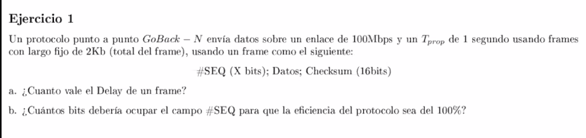

# Resolucion parcial 1c2020

https://www.cubawiki.com.ar/images/6/61/Redes_1parcial_25-11-2020_resuelto.pdf

## Ejercicio 1

a. Delay es el tiempo de transmision + propagacion

b.

Hay que tener en cuenta tanto la ventana de emisión como la de recepción, si
secuenciamos la suma de esas dos ventanas ya tenemos suficientes números para no
caer en un problema de ambiguedades.

Paula: Pasa nada si hay errores en las cuentitas, es importantae que esta
conceptualmente bien. Es importante desarrollar de donde salió ese número