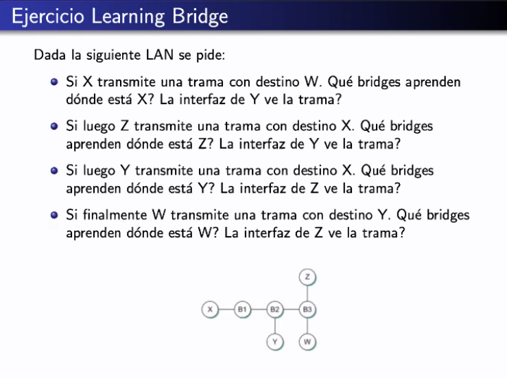

# Practica 3 - Medios compartidos

Capa de red.

## Conceptos

- Acceso compartido: medio fisico para varios hosts

  mas de una maquina conectada al mismo cable. Como hablan para no colisionar?

- Para eso, protocolo ethernet
  - ieee 802.3
  - formato de frame
  - CSMA/CD: deteccion de colisiones
  - Exponential backoff: esperar random para evitar colisiones

- Learning Bridge y Spanning Tree Protocol (STP): para tener mas maquinas
  - Formato BPDU
  - Algoritmos

## Ejercicio ETH


Se escucha el cable, si no hay nadie escribiendo se manda info.

Definicion de colision: cuando sensa el medio despues de haber enviado, sensa
que le llega una señal alterada (porque se mergeo con otra cuando colisiona).

H2 cuando empezó a emitir (y cuando sensó el medio) pensó que no había nada,
pero es porque había algo en transito. Pero cuando manda se encuentra que
colisiona con la trama que generaba H1.

Después de colisionar, la señal cambia.

A H1 le va a venir ruido, y ahí se va a dar cuenta de que le llegó una colisión.


a. El peor caso es cuando colisiona con H4.

> 2500m es el maximo teorico de ETH.

Si sabemos el peor caso, como sabemos el periodo de tiempo? Es el doble del
tiempo de propagacion de h1 a h4. (porque va de h1 a h4 y vuelve de h4 a h1)

El tiempo de propagacion

delay = 25.6us (como abuso descarta el tiempo de propagacion)

respuesta: 51.2us (micro segundos)

b. tamano minimo

> llenamos el canio en 2xdelay forzando que los mensajes tengan un tamaño tal
> que se envien con 2 x delay. Para que se enteren del ruido.

en
1seg = 10^6 us transferimos 10Mbits = 10^7 bits
2 * delay = 51.2us ____ x = 512 bits (64 bytes)

ese es el minimo de la norma

> ETH es un protocolo con frames de largo fijo

otra forma de verlo: capacidad de canal (Vtx * delay * 2)

c. se rellena con basura.

Libro: Computer Networks: A Systems Approach - Peterson

--

d. Emite por ms que es mucho mas rapido que los us (microsegundos) de delay de
h1 a h4. Entonces seguro cuando quieran emitir ambos (5ms y 7ms despues), cuando
sensen.

Respuesta: no emitirian porque el canal está ocupado

e. Ahi si hay colision porque habia 20pico de delay hasta h4

2500m, delay 25.6us

## LAN

Local area network

- conectar enlaces
- Por razones de:
  - heterogeneidad (redes con dispositivos diferentes en donde no
    todos son hosts), distancia, aislamiento, redundancia,
  seguridad, eficiencia,
  - escalabilidad: serie limitada de hosts en una red de 2500m y ahora muchos en una rea local
- Distintos tipos de multiplexores: como hacemos para enchufar distintos tipos
  de aparatos. Caracteristica por capas o nivel
  - fisico: repetidores (lo que su nombre indica, le llega una señal y emite la
    misma por otro cable) y hubs (es como los viejos triples de energia, donde
    enchufas los cables y sale otro por otro lado y asi)
  - Enlace: bridges y switches (un bridge con mas power). Son un poco mas
    inteligentes, tienen interfaces, saben que reciben paquetes por un lado y
    los sacan por otro. Pueden aprender por donde vienen los paquetes, hacer
    broadcast, y eso.
  - red: routers, gateways?


Comparten **dominio de broadcast**, lo que quiere decir.

> Broadcast: mandar un paquete a todos en la red, con el destinatario lleno de
> 1s

El dominio de broadcast es a quien podes alcanzar mandando paquetes de ese
tipo.

El dominio de colision es lo que vimos en ethernet, cuando compartis un mismo
cable (como con el Hub). Si A le manda un mensaje a H y D a E, colisionan,
porque todos los cables estan compartidos.

En cambio, si A le manda a D y E a F, no colisionan porque estan segmentados.

Y en el switch es aun mejor, nadie comparte nada con nadie.

### Learning Bridge

Los switches aprenden, relacionan direcciones (MAC) con interfaz en funcion del
trafico en la LAN.


Va llenando cuando le *llega* un mensaje.
Cuando X le manda un mensaje a A, le llega el bridge y ve que el que envio el
paquete es X. Ahi agrega a la tabla que X le llego por ese puerto.

#### Ejercicio



1. b1 se lo manda a todas las demas (flooding). B2 hace flooding, b3 hace
   flooding, y asi.

   broadcast != flooding

   `Y` ve la tabla porque b2 hace flooding

  ```
      x   w   y   z
  B1  I
  B2  I
  B3  I
  ```

2. Aprenden todos pero `Y` no ve la trama, porque B2 ya sabia en donde estaba
   `X` entonces no hace flooding.

  ```
      x   w   y   z
  B1  I           D
  B2  I           D
  B3  I           A
  ```

3. Solo B2 y B1, no B3. Z no ve la trama porque ni va a b3

  ```
      x   w   y   z
  B1  I       D   D
  B2  I       AB  D
  B3  I           AR
  ```

4. B3 y b2 aprenden donde esta Y, b1 no. Z ve la trama porque b3 hace flooding.

  ```
      x   w   y   z
  B1  I       D   D
  B2  I   D   AB  D
  B3  I   AB      AR
  ```

### Topologias con ciclos


Los paquetes quedan loopeando infinitamente dentro de la red

Una opcion es no tener mas de un bridge en una LAN, o la otra es cortar los
ciclos.

### STP

De esto surge la necesidad del spanning tree protocol, que saca ciclos.


BPDU: (id, root del arbol, distancia del root)

Con esto, se puede hacer una tabla para determinar en que momento converge el
algoritmo.

Rounds:

1. Flooding de BPDU por todas las interfaces
2. Hay info nueva, recibio los BPDUs de sus vecinos. Toma como root al menor id.
   entonces el 1 sigue queriendo ser el root.


En el round 4, todos mandan el mismo BPDU que en el round 3, entonces se
considera que el algoritmo convergio.

Los root ports son los que te llevan al root. Sin embargo, 

Puerto designado: interfaz que tiene que quedar abierta para recibir info. Los
designados son todos quellos que estan en frente de los root ports (interfaz
opuesta al root)

Puerto bloqueado: es como que el enlace no existiera

Si no tuvieramos designados

Designa las interfaces que van hacia el root por el camino mas corto, y bloquea
las demas. Criterio de desempate para caminos iguales: menor id.


primero se designa el root y despues se ven cuales bloquear y cuales designar.

beneficio: hay redundancia, los bpdus se mandan siempre, entonces se detecta y
reconfigura automaticamente.

como dato por mi pregunta de antes, para STP los bridges tienen una prioridad
configurable (que por default es igual para todos) y se rompen empates para la
comparacion de IDs con la MAC

https://en.wikipedia.org/wiki/Spanning_Tree_Protocol "Root bridge and the bridge
ID"

No hace falta hacer la tabla porque el de minimo id es el root

## Ejercicio de parcial


hay que poner los numeros tal que el paquete vaya por ahi, que se cierren los
del medio y que en el desempate elija ir por arriba.


c. 

STP elimina los ciclos pero no va en contra del grafo conexo. Por mas que corra
STP, sigue siendo conexo.

Con esto podemos hacer toda la practica 2.

para el taller

ARP
Scrapy
Wireshark
