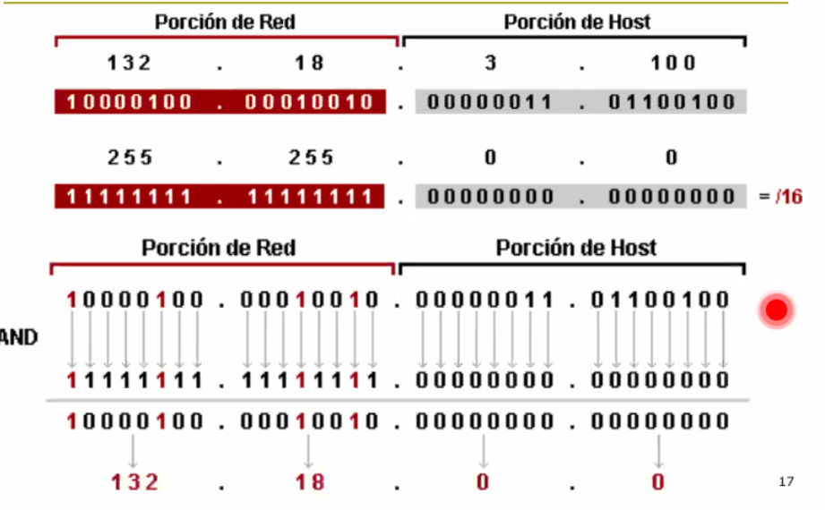

# 4 - IP 1

- Revision de conceptos
- Internetworking IP
- Direcciones IP
- Forwarding (ruteo) de datagramas

Siguiente clase:

Subredes IP

## Conceptos

### Capas

### Internetworking

Problemas a tratar que guian el diseño de ip

- Heterogeneidad
  - que permita conectar usuarios de distintos tipos de redes.
    - 802.3
    - punto a punto
    - ATMs x25
- Escalabilidad
  - Ruteo: Encontrar un camino eficiente a traves de una red con millones o
    billones de nodos
  - Direccionamiento: Proveer identificadores adecuados para todos los nodos.

### Modelo de servicio IP

- Sin conexion (datagramas)
- Best effort delivery (no confiable)
  - Los paquetes se pierden
  - Pueden ser entregados fuera de orden
  - Los paquetes se pueden retrasar por un tiempo largo
- Define un esquema de direccionamiento global (direcciones IP globalmente
  unicas en la red.)

Similar al envio de SMS.

### Situacion de protocolos

IP une las capas de arriba con las de abajo.

Redes: libros academicos y jerga comercial

ADSL y CATV se llama ultima milla o last mile.

### Direccion IP

Las direcciones se asignan a interfaces.

Tienen una long de 4 bytes (32 bits) y se suelen repr como 4 numeros decimales
separados por puntos (notacion dot) ej. 147.156.135.22

En principio cualquier numero es valido, pero algunas estan reservadas. Esto lo
dice un RFC.

- Version puede decir IPv4, IPv6, etc. Lo primero que mira el que recibe el
  paquete.
- SourceAddr
- DestAddr
- Protocol: Que protocolo hay en los datos. TCP, UDP, etc.

Es *classful* hasta el 92, despues no sirvio y colapso.

> Fallo porque las redes no se ajustaban bien a esto, habia muchas que eran mas
> que una C pero mucho menos que una clase B.

Pasaron a un esquema *classless*. A cada ip se le asigna una mascara, una tira
de de 32 bits con 1s y 0s. 1s indican que parte es red y 0s que parte es host.
Podrian estar salteados, pero por lo general son seguidos.

Es un bitmask que indica que parte va a que.

No se puede usar ni el 0 (identificador generico de la red) ni el 255 (broadcast
de la red) como host. Entonces el rango asignable (el que le puedo poner a la
interfaz de un equipo) va de la 1 a la 254, pero depende de la mascara.

La mascara tambien se nota `/n` donde n es la cantidad de 1s que tiene. Notacion
CIDR.

### Asignacion de IPs

La asignacion puede ser

- Manual
- Automaticamente: mediante un protocolo de direcciones desde un servidor,
  tipicamente DHCP.

Normalmente le asignamos ademas al host un router por defecto (default gateway).
No es obligatorio. Cuando no se que hacer con el paquete porque no es para mi, a
donde lo mando.

### ARP (Address Resolution Protocol)

Necesitas mapear las direcciones IP a las MAC para poder enviar los paquetes.

- Cuando arranca esta vacia la tabla
- Primero busca en la tabla, sino manda un paquete que tiene un ARP request que
  es un broadcast (lo reciben todos dentro de la red local)
  - ARP arma un paquete especial que dice que necesitas saber la MAC que se
    corresponde con la IP a la que se lo queres mandar.
- Si hay una maquina que tiene esa IP, le devuelve su MAC a traves de otro
  paquete ARP. En el ARP request viajaba la ip y mac addr origen, entonces
  tambien la aprende el que lo recibe.

- Responde punto a punto

### Enrutamiento en la red

EL paquete va saltando de router en router hasta el destino.

En el camino, el destino y el origen IP no cambia, pero si cambian las MAC por
las cuales se transmite el paquete a nivel enlace.

A mi lo que me interesa es la red, no el host destino. Cada maquina dice si esta
en mi red lo mando directo y sino lo mando al default gateway.

Un router de inet lo que tiene adentro es una tabla que para cada red que
conoces dice cual es el prox. router para llegar a esa red, no tengo una entrada
para cada ip posible, sino las redes.

Estas tablas de forwarding tienen dos columnas

- Red destino
- Next hop: Dir ip del siguiente router en el camino al destino.

Esas tablas se llenan

- Manual por el admin de la red (enrutamiento estatico)
- O de manera automatica mediante algoritmos de ruteo (enrutamiento dinamico)

> sacado del peterson

Tabla de ruteo = tabla de forwarding (libro) comercialmente/industrialmente
hablando. En un router se llama show ip route.

## Ejercicio

a. En r2 porque ninguna entry coincide
b. 

Hay que agregar en la tabla de R2

172.16.5.0/24 | 10.4.2.1

Ahora sabe llegar a R1.