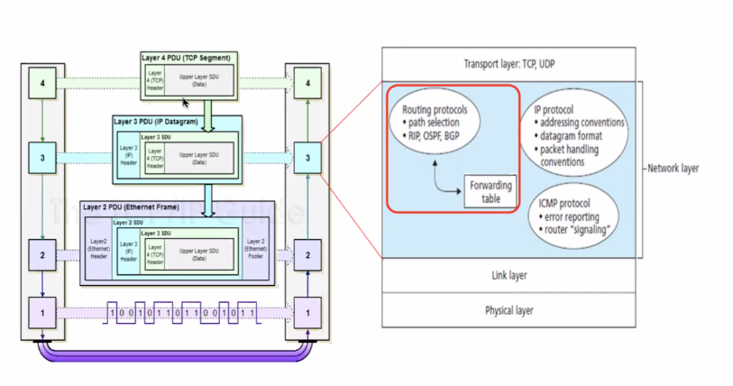
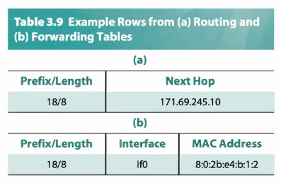
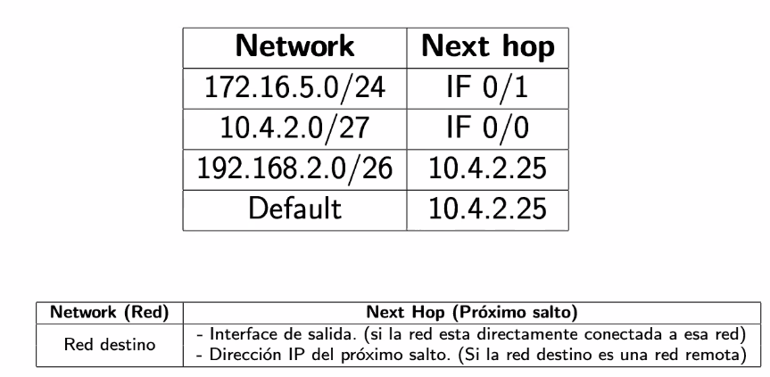

# Clase 6 - ruteo

Los routers entienden el protocolo de la capa de transporte, y dejan el MAC
Address para las capas inferiores.

Los algoritmos de ruteo pertenecen a la capa de red, IP ruteo e ICMP.

## Modelo OSI

## Forwarding vs routing

No es interchangable.

- Forwarding: Es un algoritmo local dentro del router que sirve para seleccionar
  el proximo puerto de salido dada la red a la que se quiere dirigir

- El algoritmo de ruteo es el proceso por el cual se construyen las tablas de
  ruteo que luego sirven para las tablas de forwarding. A diferencia de los
  locales, este algoritmo es distribuido y corre en varios routers a la vez.

  No se corren en *todo* internet, sino que escala hasta una *zona de routers*
  administradas bajo la misma entidad. Ej: todos los routers con IP publica bajo
  un ISP.

## Forwarding table vs routing table

- Forwarding table: Se tiene network - next hop. Puede llegar a tener mas info
  como la mac (capa eth)
- Routing: {completar}

### Notacion

En tablas de forwarding:

Ojo con:

- En vez de una interfaz poner la siguiente red

## Pre enunciado

Los problemas de ruteo son esencialmente **problemas de grafos**

- Nodos: Representan redes o routers
- Ejes: Enlaces entre redes o routers
- Peso de ejes: El costo de usar el enlace, puede repr. trafico.
- Problema: Camino minimo de un nodo a otro.

## Formas de enrutamiento

(de armar la tabla de forwarding)

{completar}

- Estatico: A manopla
  - Genera carga y tiempo de administracion de red en redes grandes, debe
    configurarse manualmente. No es tolenrate a fallas de forma automatica.
  - Los routers
- Dinamico: Algoritmos distribuidos de ruteo
  - No genera mucha carga administrativa porque los routers **aprenden** a
    enrutarse de los demas routers de la red.
  - Los routers

## Algoritmos de enrutamiento

### Distance vector - RIP

Resumen: Cada router le manda a los vecinos la info que tienen de todos los
nodos

- Cada nodo tiene un array que dice la distancia al resto.
- Asumimos como estado inicial que cada nodo sabe la distancia a sus vecinos, y
  sino infinita

Bellman ford

#### Ejercicio

En la practica, se rompen empates por orden lexicografico.

#### Conteo a infinito

{copiar}

- Problema
- Soluciones

### Link state

Dijkstra