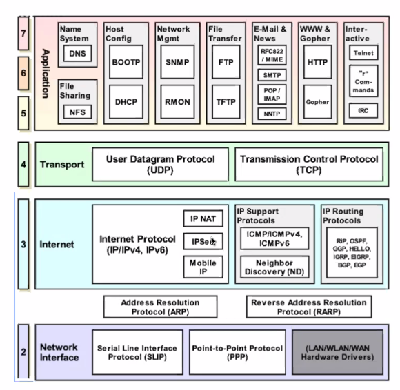

# Taller 8 - ICMP

## Bibliografia

{copiar}

## ICMP

ICMP: Internet control message protocol

Reportar errores, dar feedback y testear la red. No intercambia datos como con
IP, ETH o capas superiores, solo testeo.

### Por que?

IP es best effort

ICMP esta encapsulado en la capa de red

### Como y donde se usa

Es un protocolo simple, solo intercambia informacion

Debe ser implementado por cada modulo IP.

Los paquetes pueden ser generados por dispositivos IP, hosts (computadoras,
celulares) y routers.

Estos se generan

- Errores en los datagramas IP (por ej. mal codificado, le faltan bytes)
- Para comunicar info de diagnóstico
- Para comunicar info de ruteo

Siempre se envian a la direccion source del datagrama IP que motivo el mensaje

- Y si hay un error?

    r1 -> r2 -> r3 -> r4

    R1 conocería los problemas de r2 si el paquete lo generó él.

### Formato de paquetes ICMP

Constan de un header de 8 bytes y una seccion de datos variable.

De dos clases

- Mensajes de error: Feedback al emisor del datagrama
- Informacion: Permite a los disp intercambiar info entre si (por ej para
  testing). SOn generados por una aplicacion o para proveer info de otros
  dispositivos.

Hay muchos tipos

- 0: echo reply, corresponde al echo request (8)
- 3: destination unreachable: es una respuesta para el paquete IP.
- 13: timestamp: da el tiempo en milis
- 15 y 16: mas historicos, cuando un host se conectaba a una red le mandaba a un
  nodo con que ip se podia conectar. Hoy en dia se usa DHCP en vez de esto.

### Echo request / reply (ping)

Le manda un mensaje dummy a otro router para que responda,

ping se implementa con icmp, con los paquetes de tipo request y reply. Ping le
manda el paquete icmp al nodo, el cual responde. Con eso se puede ver si
responde y en cuanto tiempo.

## Traceroute

Es lo que hicimos al final de taller

Hay dos implementaciones de traceroute,

- Con Echo request
- Con datagramas IP