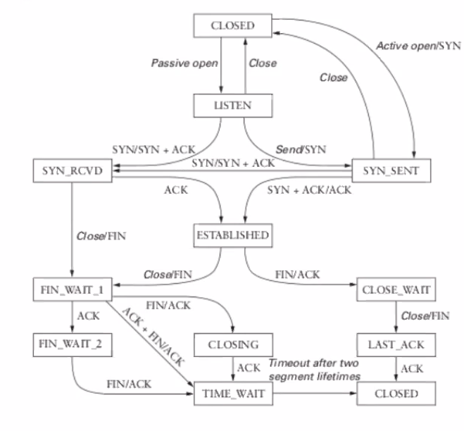
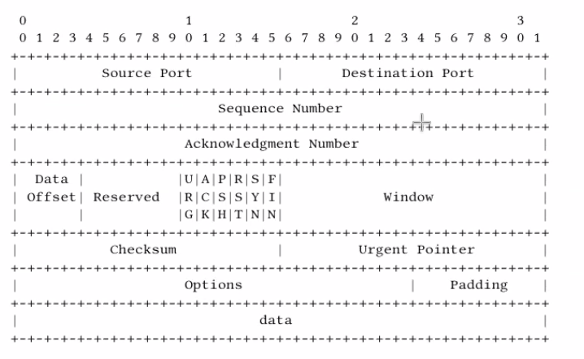

# Clase 9 - TCP

## Caracteristicas

Nivel de red es best effort

- Puede descartar mensajes
- Reordenar mensajes
- Duplicar
- Limitar tamaños a un valor fijo
- Entregar mensajes con demoras arbitrarias

Nivel de transporte debe ofrecer, para satisfacer a las aplicaciones

- Entrega garantizada
- Que respeten el orden
- No entregar duplicados
- Soportar tamaños arbitrarios
- Control de flujo de emisor a receptor
- Multiples procesos en cada hosts

Objetivo: desarrollar algoritmos para cumplir con esto

Control de flujo es similar a nivel de enlace (sliding window y eso). pero el
nivel de enlace se monta sobre un canal fisico y transporte sobre una red

## Identificar los procesos

Se usan sockets que son una tupla (ip, port)

Los procesos se asocian a puertos, que están listos para recibir mensajes.

Y como sabemos a que puerto mandarlo?

- Puertos conocidos
- Port mapping

## Clasificación

Se clasifican los protocolos de transporte a traves de

- Orientado o no a conexion
- Confiabilidad

En TCP/IP se distinguen fundamentalmente dos

- TCP: con conexion y confiable
- UDP: sin conexion y no confiable

Hay otros (RUDP, UDP extendido para hacerlo confiable y al mismo tiempo evitar
el overhead de TCP por las conexiones)

## UDP

User Datagram Protocol. No confiable ni orientado a conexion

RFC 768

Agrega demultiplexacion a IP.

- Establece una comunicacion poco costosa entre procesos
- Evita la sobrecarga y las demoras propias de la entrega ordenada y confiable
  de mensajes
- Multiples procesos de nivel app en cada maquina
- Trafico egoista: Puede congestionar las colas de entrada y salida de los
  routers
- Sin control de flujo: El destinatario puede verse saturado y perder info en
  consecuencia.

- Esencialmente IP + puerto.

### Puertos como colas

- Cuando un pkg llega a destino, se dirige al puerto correspondiente y encola
- Si no hay espacio se descarta
- La app remueve el primer paquete encolado al momento de recibir
- Si la cola está vacía bloquea

## TCP

Confiable y orientado a conexion a los protocolos de app que corren sobre el.
Abstrae a la red subyacente exponiendo un *stream* de bytes ordenado y libre de
errores.

Estandarizado originalmente en RFC 793, pero continuó evolucionando

### Diferencias basicas con udp

- Transferencia de datos ordenada
  - Efectuado por el receptor a traves de los numeros de secuencia de los
    segmentos
- Garantia de transmision de datos libre de errores
- Control de flujo
  - Determina un limite al vol de datos que el emisor envia
  - El receptor informa cuantos bytes esta dispuseto a aceptar a traves de un
    capo en el header
- Retransmision de segmentos
  - Todo byte no reconocido es eventualmente retransmitido
- Control de congestión
  - Lo vemo la semana que viene

### Segmento tcp

### Esquema de reconocimiento

El numero de secuencia sirve para identificar **cada byte** enviado, se
incrementa por cada byte que se envia. Se usan acks **acomulativos**

Si me llegaron n-1 bytes, mando ack n. Es el proximo que espero recibir.

### Modo de operación

El protocolo distingue 3 fases

- Establecimiento de la conexion
- Transferencia de datos
- Cierre de la conexion

#### Establecimiento de conexion

El objetivo es que ambas partes puedan hacer sync de los nros de secuencia
iniciales. Es un **three way handshake**.

Es un canal full duplex, pero usualmente hay un actor pasivo y uno activo.

El flag SYN es secuenciable. Un paquete syn consume un número de secuencia.

#### Cierre de conexion

Al cerrar la conexion TCP admite asimetria, un extremo puede decidir cerrar su
stream de escritura pero continuar recibiendo datos al mismo tiempo.

4 way handshake

- Pkg FIN indica que el emisor no envia mas datos
- El receptor econoce este fIN conun ACK
- Eventualmente, el receptor envia su FIN y este es reconocido con otro ACK

Por lo general es simultáneo

El flag de FIN también es secuenciable