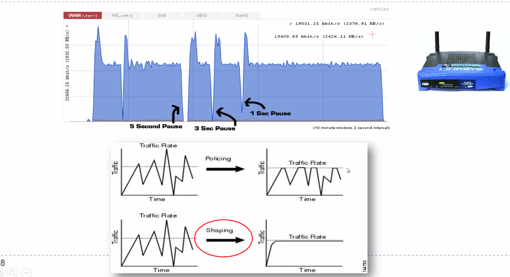

# Clase 10 - Protocolos inalámbricos y performance

## Tecnologías inalámbricas (wireless)

No confundir wireless con wifi, wireless es cualquier cosa que no vaya por
cable.

Particularidades que las distinguen:

- La intencidad de la señal disminuye con la distancia
- Fuentes de ruido mas impredecibles. El medio fisico (el aire por ej) son
  accesibles por cuzalquier otro competidor o fuente de ruido.

  > tipico caso, una de las gamas de red de wifi trabaja en 2.4GHz, donde
  > tambien esta el microondas y otros aparatos hogareneos.

- Los dispositivos deberian ahorrar energia

  Tengo que ahorrar potencia, no deberia transmitir con toda la potencia.

  Pero por mala SNR tal vez tengo que retransmnitir devuelta, entonces lo que me
  quise ahorrar al ppio lo termine gastando deuvelta

- Acceso compartido (multiacceso)

  Mismo ancho de banda en el espectro de radiofrecuencia. Si en ese canal de
  frecuencias quieren dos dispositivos transmitir, voy a tener el problema del
  acceso al medio, que en ethernete era CSNACD. Pero aca no puedo detectar las
  colisiones midiendo la potencia, todos escuchan todo todo el tiempo (no
  siempre, con un *: no puedo distinguir si viene de un dispositivo u otro,
  simplemente detecto una señal no reconocible)

- Quien regula la potencia con la que puedo transmitir? alguien tiene que
  regular la potencia, las bandas. Para eso hay entidades que dictaminan que
  eso. Argneinta: ENACOM, USA: FCC

- Existen bandas de un espectro donde puedo transmitir libremente (no
  licenciadas) y otras donde no, donde necesito una licencia (AM, FM, TV,
  Celulares)

- El medio naturalmente permite pinchar una comunicación (eavesdropping)
  - Es parcialmente inevitable
  - Debo encriptar cosas.

### Bandas no licenciadas

ISM - Industrial, scientific, medical

- Grafico izq: ~5.8GHz
- Grafico abajo: ~2.4GHz

En la amplia banda se definen canales mas angostos (en terminos de ancho de
banda) que son asignables o usables por distintos dispositivos. Es la B del
teorema de shannon.

WiFi va slatando y eligiendo diferentes canales si ve que la performance es muy
mala.

#### Wireless en bandas no licenciadas

Estan sujetas a limitaciones de potencia en la transmision, y por eso se limita
la distancia para tener una buena comunicación. Cuando me alejo tengo más
atenuación y entran mas ruidos para afectar el SNR

Cuando es compartido por muchas apps y dispostivos, surge la idea del espectro
expandido (o speread spectrum) {nota: no se ve en detalle}

> Idea: la asignacion de energia que uso en estos canales la subdivido en una
> cantidad finita, pero no voy a transmitir siempre en el mismo canal, sino que
> voy eligiendo en el tiempo diferentes slots de frecuencia para transmitir. Y
> si solo lo conozco yo, puedo evitar el eavesdropping.
> Se hace frequency hopping, transmito a través de un espectro mas amplio
>
> 

#### WiFi

Hedy Lamarr. Propuso una versión temprana de frequency hopping usando las tiras
de los pianos

### Medios compartidos en wireless

Problemas

- Problema de la estación oculta

  Consideramos la situación del gráfico. A le transmite a B, y C no está en el
  radio de alcance de A (A no lo escucha si transmite)

  

  A y C van a deducir que pueden transmitir cuando tal vez están transmitiendo
  los dos al mismo tiempo.

- Estación expuesta

  Si C detecta el medio, escucha la de B a A, que no tiene nada que ver con C y
  D. Y C quiere transmitir a D, pero escucha que en el medio hay una transmisión
  en curso, entonces no transmite.

  

  Ninguno de los receptores pretendidos estan en la zona.

Y como lo resolvemos?

### CSMA/CA (Collision Avoidance)

Carrier Sense Multiple Access Protocolos. Es el viejo conocido

en ethernet era CD: collision detection.

La idea es genérica y abstracta, dependiendo de la tecnología puede tener
diferentes nombres.

- Antes de transmitir, una estación tiene que escuchar el estado del medio.
- Si el canal no está ocupado, hacemos una espera adicional llamada espaciado
  entre tramas (IFS)

  > Damos tiempo para algunos ACK

- Si se encuentra ocupado, espero hasta que termine la transacción actual.
- Cuando termina la transacción actual se ejecuta el algoritmo de backoff.
  Porque si todos hacen lo mismo y ni bien termian intertaran de transmitir,
  tendría colisiones.
  - Determina una espera adicional y aleatoria elegida unfiromeente en un
    intervalo llamado *ventana de contención* (CW)
  - Se mide en slots temporales (contention timer)

- Si durante la espera el medio no permanece libre por un tiempo >= IFS, queda
  suspendida hasta que no se cumpla.

- Si se transmite una trama se espera a recibir un ACK.
- Si no se recibe, se asume que se perdió en una colisión y se lo intenta
  retransmitir

Esto es genérico. la puedo implementar en muchas tecnologías.

### Wi-Fi (IEEE 802.11)

En donde lo inserto?

MAC: medium access control.

Por qué no podemos usar CD en wireless?

- Necesito que sea full duplex. Si quiero enterarme como en ethernet que cuando
  dos ondas chocan se suman, y viajan hasta los receptores y los receptores
  escuchaban las dos ondas, no sucede porque es un medio no guiado.

  Requeriría tener canales full duplex, un canal en el que recibo y otro en el
  que aviso sobre problemas de colisión. Duplicando la cant. de ancho de banda
  para transmitir la misma cantidad, y el 2do estaría subitilizado. (half
  duplex: un sentido, full duplex: un sentido)
  
- No todas las estaciones pueden escucharse entre sí en wireless, por nodos
  ocultos y distancias. En un ambiente cableado todos escuchan, lo cual es una
  premisa de CD.

DFC: Distributed Coordination Function es la implementación de CSMA/CA.

> PCF es una opcion muy poco (o nada) usada en donde el access point o uno de los
> miembros de un grupo de nodos le delegan a un punto de coordinación que diga
> ahora tal, ahora tal, que actúe de coordinador. Funciona en un lugar super
> controlado (ambientes industriales por ej. donde tengo máquinas de
> herramientas). Es como ethernet sin calbes.
> (esto es un comentario a parte, no tan importante)

#### DCF MAC

Esta basado en CSMA/CA con rotacion de backoff window.

> Solo lo comenta, no se ve en profundidad.

- Escucha el canal
  - Si esta libre TX (trasmite)
  - si esta ocupado, espera a que finalice la TX mas un periodo de contencion
    que es un tiemp oaleatorio que asegura un acceso al medio equitativo
    (fairness)

  La proba de que dos nodos elijan el mismo factor de backoff es despreciable.

- {algo mas p21}

#### Evolucion

> toda la inversion de timepo y protocolo de ponerse de acuerdo hasta que me doy
> cuenta que estoy en condiciones de transmitir. Todo eso es tiempo, overhead.
> Tenog mis datosy velocidad de mi placa de red.

Para entender las codificaciones, no solo usan tecnicas diferentes sino que
tambien tienen propiedades de alcance

## Performance

### Contexto hogaréneo

La conexión de HGW a DSLAM es cable coaxil. No es ethernet.

La ethernet aggregation network junta gente que llega por DSLAM.

Access network es como last mile (ultimo tramo hasta el domicilio), algunos
paises tienen la ultima milla con fibra. Llegan a tu casa con fibra optica.

El HGW es el router pero en realidad es más. Router, modem, etc.

VoIP: Voice over IP

Si anda lento netflix, a dónde está el problema de performance?

- Anda lento la PC?
- Anda lento la placa?
- Hay mucha gente en el DSLAM?
- Hay congestión en TCP?
- Está andando lento el server por la carga?

> Lo importante es la complejidad del problema

#### Análisis de performance

- Tenemos una notebook que accede al servicio de banda ancha ADSL hogareño
  (asymmetric digital sbuscriber line) mediante un AP 802.11ac (hasta 50m y
  trabaja en 5.8GHz, hasta 7Gbps)

  > Si contrato un servicio de ADSL y me dicen que me dan 1Gbps. Y tengo un AP
  > que cuando llega tiene una capacidad de 7Gbps.

- El access point se conecta al Home Gateway (HGW)

- El proveedor lo llama "1 giga" con un maximo de 1Gbit/s
- Queremos realizar una transferencia de una rchivo de 10GB desde un servidor en
  USA a mi notebook.

- Cuanto tarda?

  80s, pero en realidad no, porque en el medio tenes los overheads
  que imponen todos los protocolos de transporte, acceso al medio, limitantes
  propios de ADSL

  Por ej. wifi no voy a poder estar usando el Gbps todo el tiempo para
  transmitir el archivo, voy a estar una buena cantidad de tiempo lidiando con
  interferencias. Por mas que me este siendo provisto a mi hogar, voy a invertir
  tiempo extra en lidiar con colisiones, retransmisiones, etc.

  Si tengo arribaa TCP, voy a tener el overhead del protocolo por los mecanismos
  de control. Si tengo congestion en la red voy a tener retransmisiones por acks
  duplicados, timeouts, etc.

  80s es una cota mínima de tiempo a la cuál nunca voy a acceder. Por eso los
  links que proveen los proveedores de internet para medir la velocidad para
  hcer el autotest, generalmente nunca marcan una velocidad de transferencia que
  llegue al límite teórico por lo cual está denominada la conexión.

#### IEEE 802.11n vs 802.11ac

Performance 

{habia mas}

#### Que debemos mirar?

El servicio ADSL 1 giga, que significa? es simetrico?

Por lo general hay relación 10 a 1 de downstream a upstream. Upstream suele ser
chiquita. Si tengo 1 giga tengo 900 para downstream y 100 para upstream

Puedo vivir con eso, pero si estoy usando una app que requiere mucho upstream,
como una de torrent y me quiero bajar un archivo grande con una app p2p, que usa
mucho upstream. P2p es mas del 50% de upstream de ltrafico mundial.

Estoy saturando un canal de upstream (diseñado por mi proveedor) como chico.

El problema con saturar el upstream, no hay problema, porque de ultima se joden
los peers que se estan llevando los pedacitos de archivo que acumulo en mi
maquina, pero la conexi[on ADSL no esta diseñanada para una app u otra, todas
van al mismo upstream. Las cosas que hago mientras me bajo ese torrent y le
devuelvo a la red p2p

Si en tcp quiero mandar acks a alguien que me hizo una conexión, tengo que usar
el upstream. Tienen que competir con el archivo de torrent que estoy enviando.
Voy a perder acks, que es síntoma de red congestionada, no usuario que usa p2p.
Entonces tcp va a querer retransmitir. Estoy molestando apps basadas en tcp por
estar saturando el canal de upstream con una app que consume mucho upstream.

Es wifi el cuello de botella? No necesariamente, puede ser

### Anomalias de wifi

Todo el tiempo los nodos de baja velociadad degradan el throughput de los nodos
de alta velocidad. Los nodos reducen su data rate cuando la potencia de señal es
baja (WiFi auto rate). Monopoliza el canal half duplex durante más tiempo.

Wifi aribtra las transmisiones paquete a paquete. Los nodos de alta velocidad
reciben menos tiempo de aire.

### Stop & wait

Queremos minimizar la cantidad de tiempo en la que no hago nada, vs en la que
estoy cumpliendo mi objetivo de enviar informacion. Esto aplica a cualquier
protocol ode sliding window, ya sea en capa 2 o en capa 4 como tcp.

#### Sliding window

No tengo una ventana optima fija calculable, depende del RTT y por eso es
importante poder estimandolo. El RTT que estima capa 4 es punta a punta, y los
motivos por los cuales se degrada puede obedecer a un monton de cosas, tanto en
mi red/wifi local o en internet mismo. TCP no sabe nada de eso, mira un RTT y
trata de ajustar su ventana respecto de eso.

Con respecto a `a`, que era una proporcion {de que?} para tres tamaños de
ventana diestintos.

Throughput de protocolos de sliding window. Puedo dar una cota superior

  T < W / RTT

  Throughput, window size, round trip time

  un RTT mas grande hace que el throughput sea más pequeño.

### Buffers

{falta copiar cosas porque estaba morido}

Regla practica: B = RTT * C = BDP (bandwidth delay product)

Ancho de banda mal usado en el sentido de capacidad.

> Repaso, enfasis en la regla practica en donde hay que diseñar el tamaño del
> buffer para que los demasiado grandes no me hagan crecer el delay tal que me
> perjudiquen la medición del RTT y la performance.

Un buffer muy grande hace que crezca el rtt, y uno muy chico que pierda
paquetes. Como lo elijo de forma óptima?

#### Cola M M 1

Es una cola en la que la entrada de los paquetse es un proceso de Poisson y el
tiempo e servicio de paquetes es exponencial.

BDP metaforicamente es como *mantener el caño lleno*. No quiero meter mas agua
de la que puede entrar, pero tampoco quiero poner un hilito de agua. Quiero
mantener el caño lleno

Usos:

#### Traffic shaping

(active queue management, AQM)
> RED: random early detection, que funciona en los routers, que depende del
> estado promedio de las colas en los routers descartamos paquets
> proactivamente, tambien es un AQM. Esta es otra AQM

- Token bucket
  Objetivo: tener un average rate de salida, independientemente de como está
  entrando el flujo de agua a mi sistema.

  Esto se logra con este sistema de tokens o tickets, que es que tengo un
  generador de tokens a un rate que yo controlo. Y voy llenando un balde de
  tokens disponibles para ser consumidos. Cuando viene un paquete, va a pasar
  solamente si hay un token disponible, y sino no pasa. En promedio hace que
  independientemente del promedio de arribo de paquetes en la entrada haya un
  promedio de salida de paquetse controlado por el rate al que genero los
  tokens. Como tengo el bucket, si me viene un *burst* de paquetes que supera el
  average rate que quiero sacar, lo voy a permitir y lo voy a guardar.

  Permite aceptar bursts

La de policing le cierra la canilla a todo lo que quiera superar cierto rate. En
cambio el shaping haciendo cosas como token bucket modea el rate a algo que
trata de mantener la utilizacion a un rate predefinido, sin tirar a la basura
los picos.

En algun lugar de la cadena alguien hace traffic shaping, y me lo estabiliza a
un valor que no controlo, pero obviamente me impacta en la performance. Cuando
uno se pregunta que problema o caracteristica de mi red hace que tenga problemas
de performance, otra pregunta que nos podemos hacer es si en esa cadena en algun
momento se está aplicando traffic shaping
