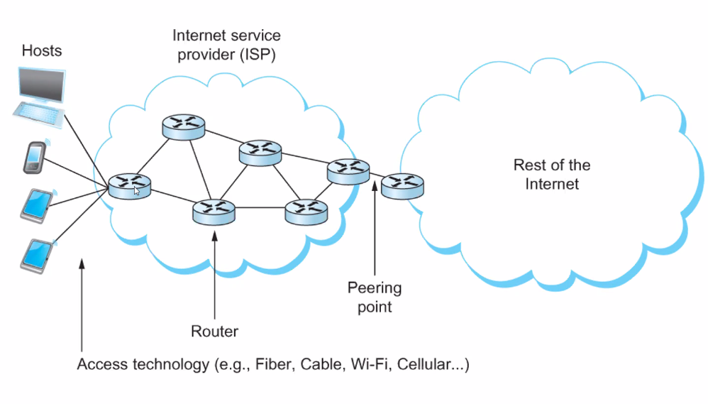
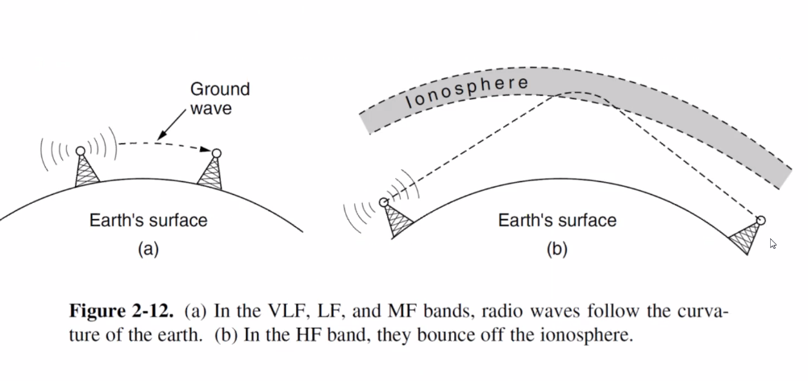
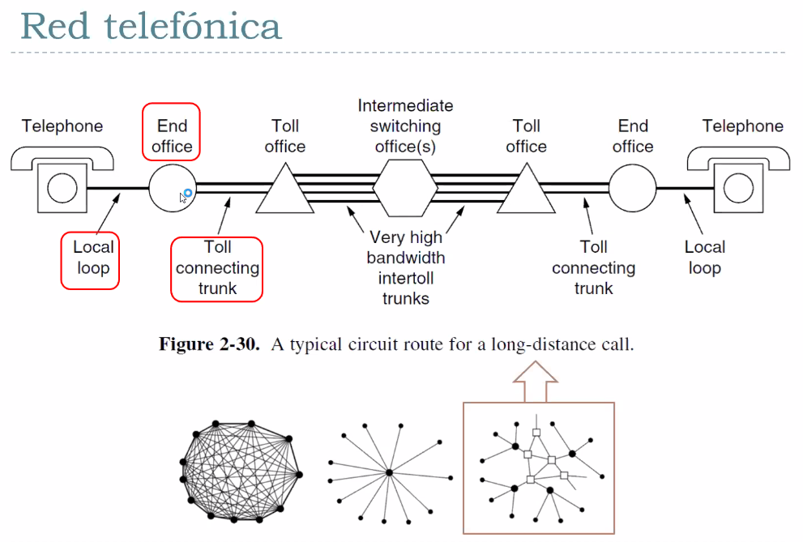
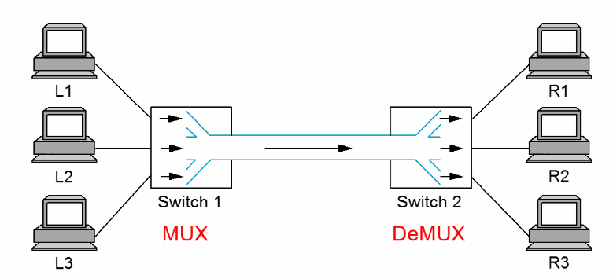
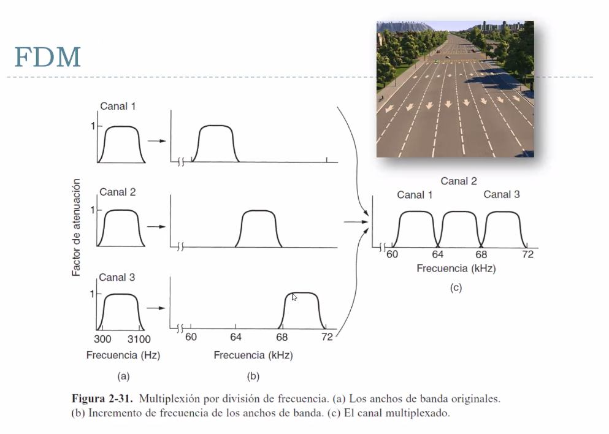
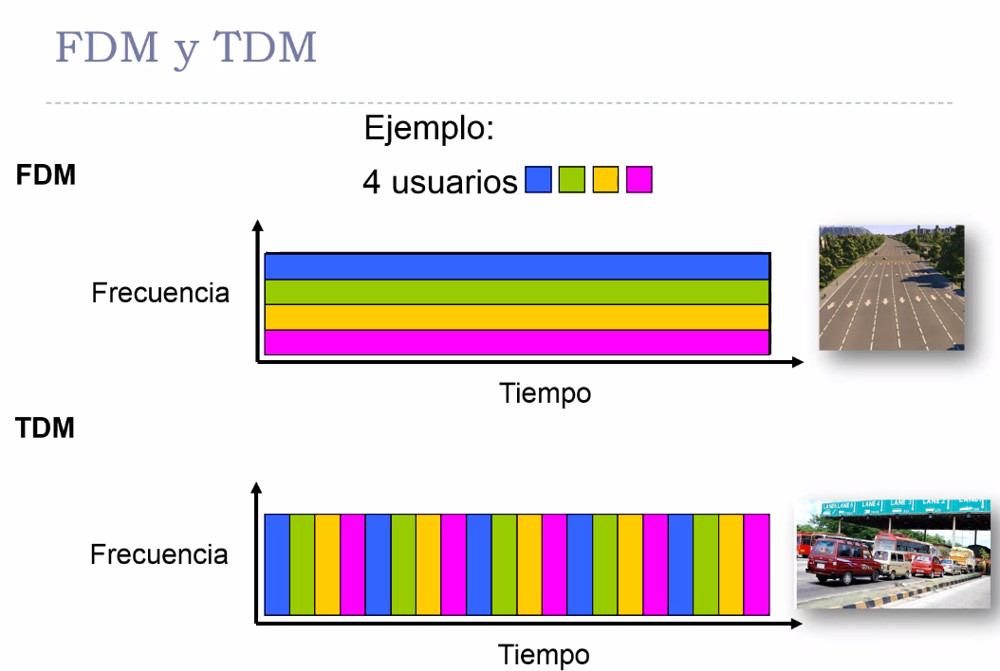
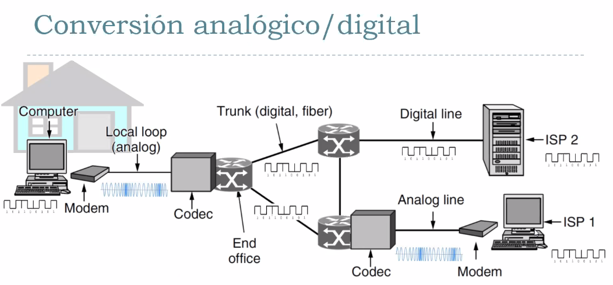
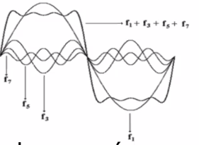
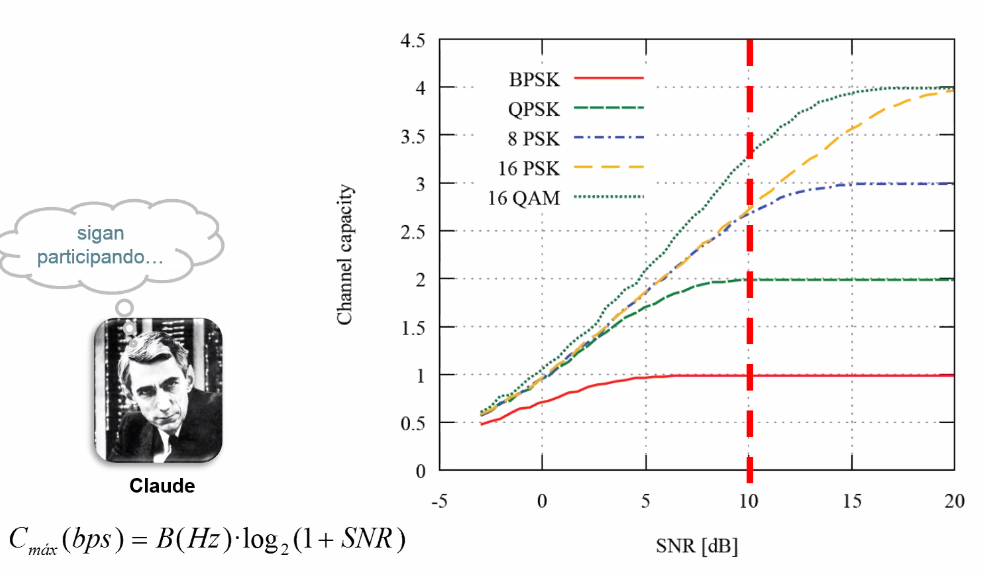

# Clase 2 - Nivel fisico

30/03/21

La capa 1.

- lidiar con las no idealidades de los medios fisicos
- codificar (por los problemas qwue tenia las ondas cuadradas y que el canal
  fisico opera como un filtro) para usar señales que pasen bien, demandando la
  menor cantidad de B (bandwidth) posible.

  Si puedo transmitir lo mismo en menos ancho de banda, voy a poder usar mejor
  el medio.

Agenda

- Medios de transmision guiados y no guiados
- Dominio de la freq
- La red telefonica
- Conversion analogico digital
- Modulacion ("modulacion" digital / portadora analogica)
- Codificacion ("codificacion" digital / portadora digital)
- Capacidad de volumen de un canal

Todo lo que circunda al trabajo con señales, etc. esta centrada al rededor de
luchar contra las no idealidades de los medios fisicos que atentan contra lo
que queremos hacer.

## Medios de transmision

Tenemos una amplia posibilidad de estar atravesando decenas de diversos medios
de transmision, desde mi disp hasta el servidor en la otra punta del mundo

Estudiandolos vamos a entender como modular y codificar info para inyectarla en
ellos.

### Guiados

La onda va confinada (guiada) en un medio y no se esparce libremente por un
ambiente.

- Par trenzado de cobre (telefonia)
- Coaxial

  Hay que ampliar por la atenuacion de los medios fisicos. Se deben amplificar
  cada 0.5 a 1km, hasta 50 en cascada.

  Las centrales (las que deja pasar, las menos atenuadas) tambien se ven
  atenuadas despues de un tiempo.

- Red electrica (power line): Trae la señal por la red eléctrica.
- Fibra optica

  Tienen muy poca atenuación y distorción. Hay peores y mejores, que depende que
  dejan pasar una sola o más longitudes de onda.

  - Monomodo: Deja pasar una sola, es idea porque minimiza muchos efectos de
    dispersion, interferencia, etc.
  - Multimodo

### Sin guia de onda (wireless)

Usan el espectro electromagnetico libre. Cuando uno dice wireless se suele
asociar a WiFi, pero existen mas.

Cada tecnologia tiene diversas propiedades para lidiar contra la interferencia
del mundo fisico real que lo resumimos en "ruido". El mundo es una porqueria que
afecta mi señal. No es lo mismo en una fibra optica que en una radio VHF, o un
coaxil.

- Radio

  

- Microondas
- Ondas infrarojas
- Laser (puede ser visible)

  

- LiFi: Version luminica de WiFi. El regreso de morse hecho luz.

  Emite luz visible (tiene que haber linea de vision, esta pensado para
  ambientes con no muchos obstaculos) que codifican codigo morse.

Los rangos en los que se mueven las diferentes tecnologias

(Low Frequency, Medium, High, Very High, Ultra High, Super High, ...) son las
bandas.

## Red telefónica

Es importante verlo para entender el por qué de muchos conceptos de tecnologías,
nomenclatura, constantes o multiplicadores típicos de los protocolos de hoy en
día. Tienen sus raices en haberse montado originalmente en la red telefónica.

PSTN (public siwtched telephone network): transmitir la voz humana de una forma
mas o menos reconocible (el ancho de banda es limitado, queremos lograr nuestros
objetivos con el menor consumo posible.)

Fue organizado en una jerarquia multinivel altamente redundante, con
componentes. Jerarquica incremental.

- Local loops (pares trenzados y seniales analogicas)
- Troncales (fibra optica o microondas, digital)
- Oficinas de conmutacion: Reciben el trafico agregado, lo concentran y lo
  derivan a alguna

En algun lugar hay una conversion analogica a digital.

Se inspira bastante internet en su diseño

Las rayitas que van creciendo denotan la capacidad agregada de bandwidth.

### Multiplexacion

Se multiplexan varios canales de baja capcidad en otros de alta capcidad, y
luego se demultiplexa. Por consideraciones económicas, se multiplexan varias
conversaciones sobre un único troncal físico.

Como se hace? Dividimos el tiempo o la frecuencia, los dos dominios por
excelencia que manejamos en redes. Y se pueden llegar a combinar ambas.

!! pregunta de final

- **FDM** (Frequency division multiplexing): Subdividimos el espectro de
  frecuencia en anchos de banda acotados, y cada uno es usado todo el tiempo

  

  Hay una zona central 

  > Las FM truchas transmiten con poca potencia para los barrios

  Requiere una circuitaria no trivial, a diferencia de tdm que puede ser
  puramente digital

  Requiere de mucho control para que los usuarios no se metan en las zonas que
  no fueron asignadas.

- **TDM** (Time Division Multiplexing): Round robin por cada tiempo. Como un
  scheduler preemptive

  Es mas facil porque hay alguien que te asigna

Ejemplos

- Radio AM
  - Espectro asignado de aprox 1MHz (500 - 1500kHz). Adentro de ese espectro se
    reservan canales logicos que son las emisoras. Cada una opera en esa porcion
    del espectro, y cada estacion tiene subcanales logicos donde un pedazo (un
    sub-ancho de banda) lo usa para musica y otro avisos comerciales. FDM.

    Esto de usar primero musica y despues avisos comerciales es una forma de
    TDM.

### Mutliplexación por Longitud de Onda (WDM)

Como el local loop produce señales analogicas, es necesario realizar una
conversion AD en los "end office" donde todos los "local loops" individuales se
combinan sobre los troncales.

La WDM (wavelength divison multiplexing) se logra con multiples por una sola
fibra. Es multiplexacion de tipo FDM. Es la encarnacion de FDM en el espectro
visible.

## Taxonomia de las redes

Hay que poner todas estas tenologias y ordenarlas de alguna manera.

Esta es una popular. FDM y TDM conmutan circuitos, no hay mujeres conectando
cables

Conmutacion de paquetes: segmentamos la info en paquetitos y los enviamos por
diferentes avenidas (topologias) que todavia no vimos. En este mundo tambien si
quiero puedo establecer circuitos "virtuales" (a diferencia de los fisicos de la
izq.) estos hacen que en internet, un camino establecido por un receptor y
emisor me presten atencion solo a mi. Se establece un circuito pero es virtual,
que se puede reasignar de manera logica a otro.

## Multiplexacion estadistica (redes de conmutacion de paquetes)

Podemos pensar a los paquetes como autitos, la division es bajo demanda. No se
le asigna una frecuencia a determinados tipos de paquetes (no es fdm), pero
tampoco timeslots controlados (tdm). Esta todo el medio disponible todo el
tiempo pero lo que determina quien usa el canal y quien no es quien llega
primero. Es una **divison del tiempo bajo demanda**.

para que esto exista tiene que existir un componente central, un **buffer** (una
estacion de memoria que se puede llenar y vaciar, y que puede recibir intensidad
de ingreso de informacion como para esperar que se vaya transmitiendo la del
medio que como tiene una velocidad finita tiene que esperar entre cada paquete.)

Si tengo mas velocidad de ingreso que capacidad en el buffer, puedo llegar a
perder informacion. Esta es otra forma de multiplexacion mas.

## Conversion Analogico-Digital (CAD)

> Es necesaria por ejemplo para telefonia, porque el local loop produce señales
> analógicas y hay que transformarlas a digitales porque para ir a la end office
> se combinan sobre los trunks.

- Compu digital, pasamos a analogico mediante el modem
- Pero nuevamente para ir a troncales digitales hay que digitalizar las
  analogicas para sumarme a una red de fibra.
- En el camino capaz que un ISP (al que me quiero conectar) tambien esta
  conectado a la red via un modem via analogica, entonces se va a convertir
  devuelta a analogico y devuelta a digital.
  
La conversion sucede muchas veces, hay que entender que esto sucede. Nos da
mucha flexibilidad, el ISP se puede conectar por analogico o digital sin
importar que esta haciendo el usuario (lo cual seria poco practico.)

### Teorema del muestreo

Las señales analogicas se dividen en multiples frecuencias.

Las señales analogicas se pueden desarrollar con la serie de fourier. Cuando
muestreamos, estamos recuperando info que vimos codificada en ellas. Hay
una señal que me viene emitida y yo tengo que muestrear o mirar a intervalos
regulares en tiempo para recuperar la información.
> Saco fotos y reconstruyo la pelicula

A que frecuencia muestreo? Me estoy perdiendo info o no con la que elegi?

Esta pregunta se la hicieron otros y propusieron el **teorema del muestreo**. El
caso mas critico de muestreo va a ser aquella componente (o armonico) maxima.

Frecuencia de sampling = muestreo = modulacion.

Ejemplos

- Los CD de audio muestrean a 44100 veces por segundo. PUeden reproducir musica
  conteniendo frecuencias hasta 22KHz
- La voz humana con calidad "suficiente para telefonia" (se estimo mediante
  experimentos con seres humanos, que dijeron que era razonablemente
  satisfactorio mantener una conversacion telefonica con un canal cuya riqueza
  frecuencial la mete por un filtro que la pasa de 0 a 4 KHz) que si
  transportamos audio en el rango de 0 a 4 KHz podemos recuperar la señal
  haciendo 8000 muestras por segundo.

  Eso es lo que escuchamos cuando hablamos por teléfono que la otra persona está
  en una lata.

### CAD

Dos etapas

- Muestreamos lo analogico, y ahora que ya lo tengo medido.

  Pulse Amplitud ... (PAM), muestreo la señal al doble {completar}

  Una vez que hago esto ya tengo un error porque no estoy mirando todos los
  valores posibles estoy mirando algunos.

  Si tiene valores por encima del doble de la fmax ya con esta tecnica voy a
  estar cometiendo error.

- La digitalizo

  Cuantifico las muestras aproximadas mediante un numero entero de n bits,
  aparece el error de cuantificacion.

  > es lo que hace un estudio de musica cuando graba a una banda para llevarlos
  > a un medio digital como un mp3 o un cd.

### Canal PCM (Pulse Code Modulation)

El canal PCM es una tecnologia concreta que implementa lo que acabamos de ver

MODEM: Modulador Demodulador
CODECs: Coder-Decoder: transforman señales en digitales y multiplexan

Produce simbolos de 8 bits por muestra, tomando 8K muestras por segundo. Es una
manera de digitalizar el canal telefonico.

Por eso se dice que el "ancho de banda del canal de voz" es de 64Kbps. Porque
son 8 mil muestras por segundo, y cada muestra tiene 8 bits.

Esto es hablando mal y pronto, porque el ancho de banda se mide en Hz, que es
diferente a una taza de datos por unidad de tiempo. En la jerga se usa asi pero
tenemos que saber la diferencia. Es la taza binaria necesaria para transmitir un
canal de voz con una riqueza frecuencial de 4kHz.

> Este numero (64Kbps) tiene una implicancia enorme (a parte de ser potencia de
> 2 y conveniente), proviene del uso de algo ya preestablecido antes de las
> comunicaciones digitales que era el canal de voz tipicamente usado en los
> pares de cobre de la red telefonica.

Como consecuencia, practicamente todos los intervalos de tiempo en el sistema
telefonico son multiplos de 125useg

- Transporte multi canal PCM "Portadora" T1

  Multiplexando varios canales PCM

  

  SI quiero generar un troncal digital multiplexado, obtengo un poco de bits de
  cada casa (que vienen a 8K muestras por segundo), y la idea de cada canal es
  agarrar 8 bits y meterlos en un canal de salida que sale mas rapido, el otro
  canal agarro otros 8 bits, y asi hasta 24. 24 de esto da una taza agregada
  multiplexada de estos canales PCM 1.544 Mbps, que es lo que se conoce como
  "Portadora" T1

  Llegan 24 canales todos a la vez en el tiempo que PCM tendria 1 solo. La
  tecnologia los apila en un solo buffer de info y los envia a una velociad
  mucho mas rapida, y por esto no rebalsa, porque es 24 veces mas rapida que la
  de entrada.

- Como existe T1 existe tambien E1, que es una cuestion de normas y
  regulaciones. E: europa. E1: unidad minima que multiplexa 32 canales PCM. La
  idea es la misma.

Todo hereda del canal de voz humana, y tiene que ver tambien con las propiedades
fisicas del cable de cobre (que no vamos a ver en esta materia.)

## Modulacion

Tengo info que enviar y hay una onda que esta en el medio generada por el emisor
que es como un trencito con vagones, y lo que yo pongo adentro es cosa mia, el
tren tiene especificacioes y puedo llenarlo o no llenarlo.

Tengo una señal que es la **portadora**, y yo le puedo hacer cosas, cambiarle
propiedades, que en el otro extremo alguien tiene que ver estas propiedades y
saber que es lo que cambio (ah mira cambio la amplitud, cambio la frecuencia).
Hay un acuerdo de tecnologia de ambos extremosÑ modulacion y demodulacion, por
eso es de ambos lados.

Le voy a cambiar o sacar esas propiedades.

Lo que yo modulo, yo quiero transmitir una onda que oscila a una frecuencia
audible es mi señal modulante. Y yo la quiero transportar, es *una onda*, quiero
que me la transporte otra onda. Voy a estar modulando de dos formas diferentes,
o cambiando la frecuencia o la amplitud.

{foto}

Esto es una señal analogica, capaz quiero mandar una digital (0s y 1s). Le
cambio la amplitud o la frecuencia a mi portadora (hay partes de frecuencia
altas o bajas) o le cambio la fase (esos son los Ps de la pag 45)

Señal analogica valores infinitos, digital valores discretos.

Modem vs codec

- Modem convierte "traduce" de digital a analogico
- Codec traduce de analogico a digital

La moduladora puede ser analogica y la portadora tambien.

{{copiar}}

### Velociad de modulacion

La velocidad de modulacion es el numero de cambios de senial por unidad de
tiempo, y se expresa en baudios (simbolos / segundo). Es solo una cuestion de nomenclatura.

La velociadad de transmision es la velociadd de mudilacion multiplicados por el
numero de bits de cada simbolo. Expresada en bits/segundo: $V_t = V_m \times N$

#### M. digital P. analogica

La modulacion multinivel da una utilizacion mas eficaz del bandwidth si cada
elemento de la señal transmitida representa mas de un bit.

Si hago cambio de fase voy a estar codificando nuevos simbolos. Si lo desfazo 0
voy a representar 000,

{imagen p49}

### Analogicas en digitales

Se llama digitalizacion y lo hacen los **codecs**

Tecnicas (no es importante que los sepamos de memoria, solo cubrir el especto de
posibilidades de modulacion)

- NRZ: No return to zero

  Usamos una tension negativa para representar un 0 y positiva para representar
  un 1

  para secuencias largas y sin cambios, como por ej. muc
hos 1s consecutivos o
  muchos 1s consecutivos.

- NRZI: Se codifican mediante la ausencia. Soluciona muchos 1s pero no muchos
  0s.
- Manchester (Bifase)
- Manchester Diferencial

{falta mucho de modulacion, no copie nada}

- 256 QAM: combinan cambiar amplitud y fase de una manera particular.

## Capacidad de canal y modulacion

Este grafico habla de propiedades de una gama amplia

Como consideramos las propiedades que tienen los metodos de modulacion? para
ello los ponemos en el marco de la teoria de shannon.

- Eje horizontal: Relacion s  de algun receptor, se el SNR. Me paro ahi, y a
  igualdad de SNR veo que modulacion vale la pena.
- A medida que aumenta el SNR (es mejor, le hago frente al ruido), llega un
  punto que no vale la pena seguir mejorando. Todos tienen un plateou
