# Clase 3 - Nivel de enlace (Capa 2)

06/04/21

Proporcionan servicios de mas alto nivel que no pueden ser provistos por la capa
fisica. Esto es una vista generica de cualqueir capa, darle una funcionalidad de
mas alto nivel que no puede dar la capa inferior.

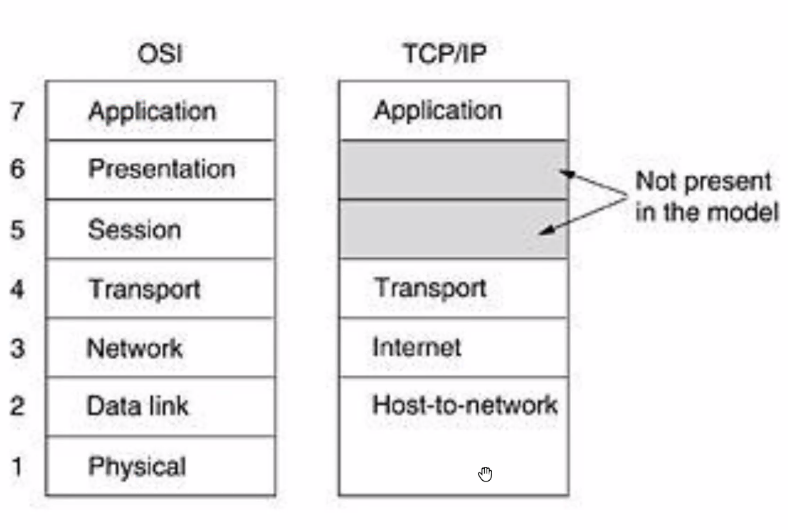

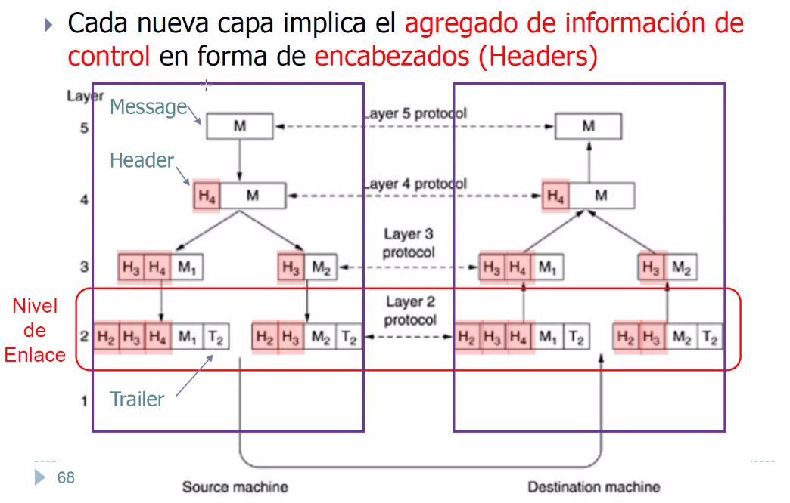

Tipicamente en cada capa se le van agregando headers al mensaje, para hacerle
saber a su capa par o socia del otro extremo.

## Conceptos

Tenemos un caño serial )no hay desordenamiento) pero sujeot a **ruido** y
**fallas**. Lo que se recibe puede no ser lo que se envio (un error de
transmision, algo fallo a nivel fisico).

Objetivos de esta capa: Proveer el servicio a la capa superior

- **Confiabilidad**: Tranquilidad de que una vez de que la capa superior me
  delega la responsabilidad de llevar los mensajes a traves de un medio fisico
  imperfecto, de que eso va a llegar bien eventualmente.

- **Control de errores**: Eso puede implicar detectar y/o corregir que hubo
  algun error.

- **Control de flujo**: Hacer que no se sature mi par del otro extremo.
  Tipicamente se resuelve en la capa 4 de transporte (que corresponde a TCP)

La estrategia principal que tiene es de encapsulamiento o *framing*, encapsular
los bits de mensajes en **frames** (paquetes, tramas, etc. un conjunto, tira
continua acotada de bits) y agregando **informacion de control**.

### Encapsulamiento

Como se separan los frames en un tren de bits?

- Largo fijo
- Largo especificado en el header (variable y especificado)
- Delimitadores de frame (con bit-stuffing) (variable y no especificado). Con
  delimitadores al principio y al final, por ej.

## Tipos de servicio

Que brinda la capa para dar esos objetivos

- Sin conexion y sin reconocimiento

  Los datos se envian sin necesidad de saber si llegan con errores o no

  Es best-effort, mando y buena suerte.

- Sin conexion y con reconocimiento

  Los datos se envian y se asegura la correcta recepcion sin errores mediante
  un ACK (aviso explicito)

- Orientado a conexion

  Le agrega a la anterior mantener un estado (sesion) de la conexion. Ambos
  extremos (emisor y receptor) son concientes de un estado comun y saben en que
  estado esta el otro en una fase de la comunicacion. (abriendo, cerrando,
  establecida, uno quiere cerrar pero el otro todavia no quiere, etc.)

  Lo tipico de aca es TCP

## Deteccion y correccion de errores

Formas de lidiar con eso: **redundancia**

m bits (datos) + r bits (redundancia) = n bits (codeword)

Y con

- d minima de **distancia de hamming** entre todas las codewords de un codigo

  minima cantidad de bits distintos entre todas mis palabras

  > intuitivamente, si me hago un alfabeto muy distintos, la distancia de
  > hamming va a ser alta, pero voy a necesitar palabras mas largas.

- e cantidad de bits erroneos en una transmision dadas

Necesitamos

- e + 1 <= d para poder detectar
- 2e + 1 <= d para poder corregir

## Confiabilidad

Y para la **confiabilidad** (asegurar que algo llego bien): tenemos que poder
hacer retransmiciones.

- Implicitas (luego de un timeout se asume que perdio)
- Explicitas (mensajes de control dicen que requeris que reenvies algo)

## Transmision confiable: Stop & Wait

! Se pregunta mucho en final

Sender y receiver son dos elementos de red, el tiempo va por abajo.

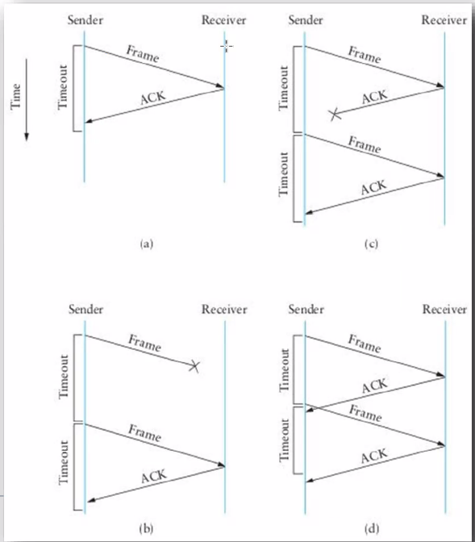

Cada frame tiene que ser reconocido por el receptor, lo que da la confiabilidad.

- a. Fue el frame y vino la confirmacion antes del timeout.
- b. Se pierde el frame, y reenvio
- c. Se pierde el ack y recibo
- d. Envio el frame, el ack vuelve, pero el ack siempre se demora mas que el
  timeout. Este es un frame duplicado, se le llama **reencarnaciones**.

Lo que hay que hacer es que el receptor se de cuenta que le llego el mismo
frame, y la forma mas facil de esto es con identificadores (numeritos) unicos.
Secuenciarlos, numerarlos univocamente.

En stop & wait, se debe poder secuenciar al menos dos frames (con 0 y 1
alcanza).

Existe un tiempo de bloqueo a la espera de las confirmaciones, lo cual no es
ideal.

## Eficiencia de protocolo

Cuanto tiempo estoy **transmitiendo** con respecto al tiempo que estoy
**esperando** las confirmaciones?

T_tx: tiempo que estoy efectivamente transmitiendo
RTT: Round trip time (ida y vuelta), tiempo de ida y vuelta de un frame.

Este es un protocolo, que puede ser evaluada su eficiencia

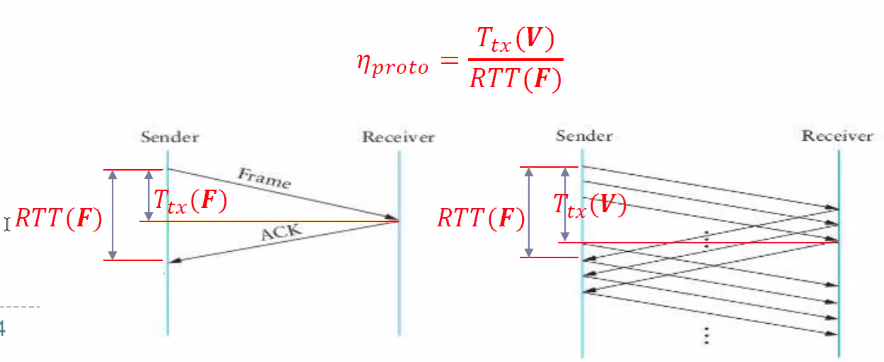

{copiar formulas}

La eficiencia da 0.5, porque la mitad del tiempo estoy esperando sin hacer nada,
mientras nos dejen los teoremas de shanon acercarnos a maximizar el uso del
canal.

Aumentar la eficiencia seria estar la minima cantidad de tiempo sin hacer nada.

La **ventana** es la cantidad de frames que voy a poder enviar sin necesidad de
que me llegue un ACK. Un frame es una ventana de 1. En la segunda imagen, la
ventana es de 3.

## Capacidad de volumen de un canal

La capacidad de volumen es la capacidad de transmision (dada por la tecnologia)
x el delay (que depende de las propiedades del medio fisica, entre ellas el
largo. La distancia de propagacion de una onda)

$$ Cvol = V_{tx} \times Delay$$

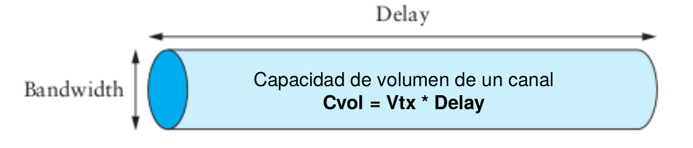

## Transmision confiable: Sliding window

La motivación es mantener lleno el canal.

Voy haciendo avanzar la ventana para ir consumiendo nuevos frames del buffer que
tengo para enviar, sino me quedo estancado en la primer ventana. Para enviar un
nuevo frame,

UltimoFrameEnviado <= UltimoFrameReconocido (ack) + SWS

"Mientras tengas una ventana que abarque una cantidad de frames que cumpla esta
condicion, entonces segui mandando".

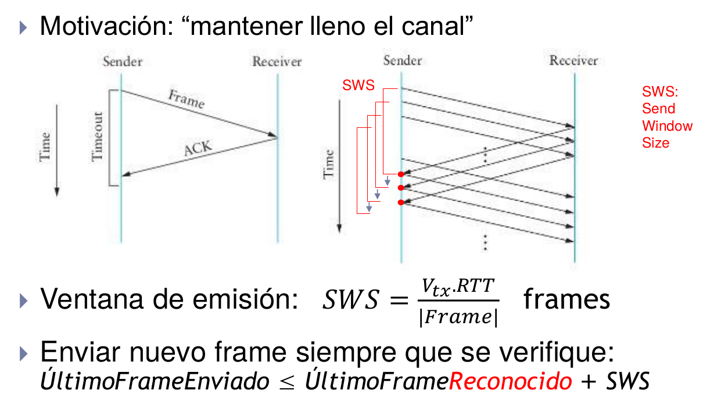

## Tranmision confiable: ACKs selectivos

Cambiar la forma de la que se envian los ACKs

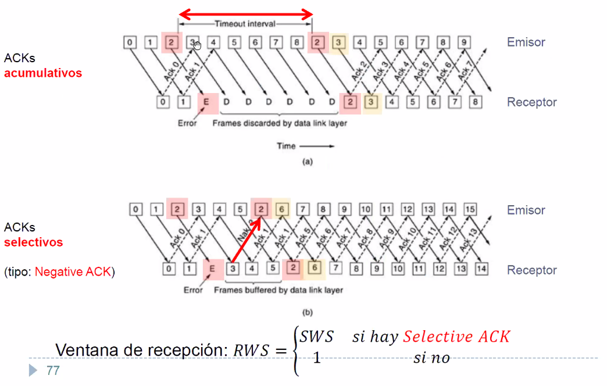

- ACKs **acumulativos** (es la que usamos siempre a menos que se especifique lo
  contrario)

  Esto que te estoy aceptando ahora que tiene un numero, te acepto este y todos
  los anteriores. Hasta aca no hubo ningun error (en el acumulativo).

  La capa 2 del receptor descarta esos porque necesita el 2, y el ultimo que le
  llego bien fue el 1. En vez de decirle que hubo error, le dice que no hubo OK.

  (porque acumula de manera monotona creciente)

- ACKs selectivos (Negative ACK): requiere mas sofisticacion, y cada cosa que se
  le agrega se paga en overhead (latencia de procesamiento).

  Ante un error, bufferea todos los paquetes del medio y envia uno particular,
  el NAK (Negative acknowledge) del paquete que no obtuvo. Para entregar la
  informacion ordenada, el receptor tiene que bufferear los frames de manera no
  ordenada

  > Hay muchos casos en los que quiero usar un algoritmo mas sofisticado pero es
  > mas caro.

## Transmision confiable - resumen

- Tenemos que aumentar la ventana de emision para aprovechar mejor el canal
- El receptor puede bufferear o no, dependiendo del esquema de ACKs
- Ventana de emisión $RWS$ es SWS si hay selective ack y 1 si no.
- Para distinguir reencarnaciones: # frames unívocamente identificables >= SWS +
  RWS

## Delay

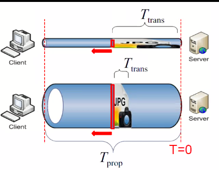

- $T_{prop}$: Retardo de propagacion: Depende **unicamente** del medio fisico,
  es una propiedad fisica. No estoy en control de esto, es un costo que hay que
  pagar si o si (al igual que el ruido)
- $T_{trans}$: Retardo de transmision: Depende del tamaño de la trama (cuanto
  tengo que enviar) y de la velocidad de transmisión (tecnología que estoy
  usando)

  $= tamaño\_frame / V_{tx}$

Se ven mas adelante
- Retardo de encolamiento
  - Depende de la congestion
- Retardo de procesamiento

## Medios compartidos - Protocolos de acceso multiple

**Seguimos en capa 2** pero nos preocupamos de otra cosa

Vimos que se puede compartir un medio de transmision guiado o no guiado mediante
TDM, FDM, WDM, CDMA, etc.

Otras formas: Contencion estadistica. Hay una competencia por acceder a un medio
en el cual no hubo nadie que haya arbitrado sobre el (toma usa este tiempo o
toma usa este rango de frecuencia). La filosofia detras de esto es que lo
queremos es apuntar a la *escalabilidad*, no quiero tener que pre-asignar con un
administrador todo poderoso que conozca a cada usuario, el medio, etc. y tenga
que asignar un cacho o tiempo o frecuencia a un usuario, sino que quiero que se
agarren a las piñas y que pase el que tenga que pasar.

Esta idea hizo que las LAN escalen, crezcan, y lleguen a niveles de redes de
redes, quiero interconectar muchas computadoras que no conozco, a traves de
topologias que no conozco, pero que igual va a andar. Como hacemos para
compartir algo sin tener un orden minimo? Eso es lo que vamos a ver ahora.

Metafora: Muchos nodos comparten un medio de uso exclusivo (como un cable)

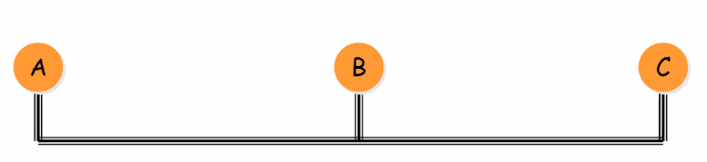

Quieren maximizar el promedio los exitos en los intentos de comunicacion de A, B
y C que no se quienes son. Queremos asegurar la igualdad de oportunidades.

- Protocolos de control (MAC [Medium Access Control] Protocols)

Ejemplos: 802. normas de estandarizacion para capas de red de IEEE

- Ethernet (IEEE 802.3)

  Tiene varias topologias, pero la que mas se usa hoy en dia es

  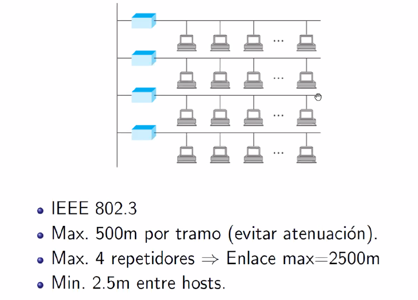

  El frame es

  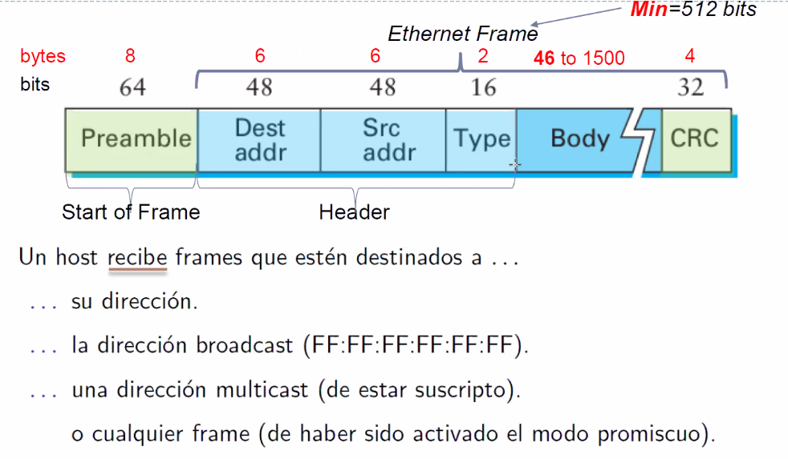

  Es interesante notar que tiene de minimo 512 bits, lo cual nos deja que el
  mensaje no deberia tener menos de 46 bytes, y como maximo 1500 bytes. Pero por
  que un minimo?

  Reciben todos todos los mensajes, pero descartan los que la direccion destino
  no matchea con la suya. Si mandan mensajes de a uno no pasa nada.

- Internet
- Token ring

Si comparten el mismo cable, como hacemos para que no colisionen?

### Mecanismo de acceso: CMSA-CD

carrier sense multiple access: es un protocolo de acceso multiple con una
tecnica particular, carrier sends, con una subtecnica particular: collision
detection (CD). Detecta colisiones y hace algo al respecto

Cuando un host tiene datos para enviar, sensa el medio

- Si esta libre (no ve una onda electromagnetica que este pasando por ahi, que
  otro lo esta usando): inmediatamente transmite.

  > Condicion de carrera?

- Si esta ocupado,
  - 1-persistente: Espera a que se libere y transmite (lo que hace Ethernet IEEE
    802.3)
  - p-persistente: Espera a que se libere y transmite con proba p.
- Half-duplex: la logica de recepcion esta establecida en el sensado para
  detectar colisiones.

#### Colisiones

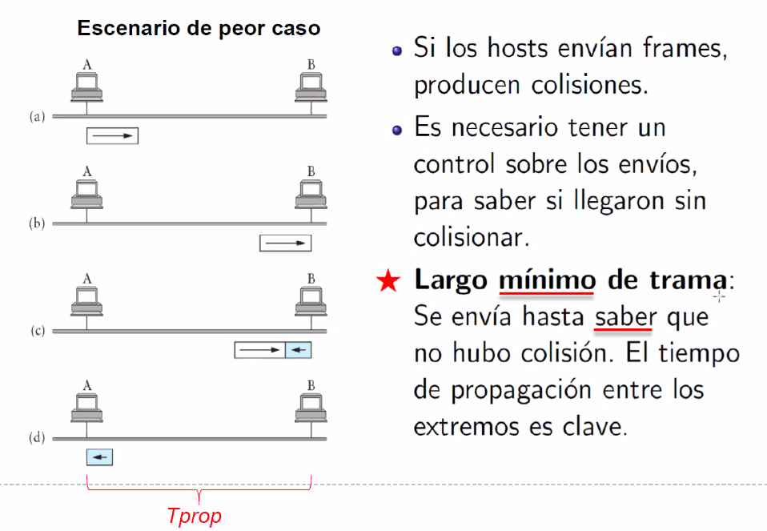

Escenario de peor caso: B quiere transmitir justo antes de que le llegue a B, no
llego a escuchar. Cuando hizo carrier sense vio que estaba libre, pero en
realidad estaba viendo la onda (que se propaga a una velocidad finita, los
tiempos no son instantaneos).

En ese momento, lo que pasa es que las ondas se suman (la tension en un medio
compartido se adiciona, porque no tiene otro lado a donde ir). Se va a producir
una onda que va a tener como señal la suma de las dos.

Si tienen la misma potencia, se duplica, y resulta en algo totalmente inutil,
ruido, la mezcla de ambos mensajes. Esa onda con el doble de potencia llega a A
y B, todos los nodos estan escuchando y transmitiendo a la vez.

Ambos se dan cuenta de que hay el doble de potencia de lo que deberia haber en
la red. Esa es la *collision detection*.

Para que A pueda saber que vino un mensaje desde B y que se solapo con su propio
mensaje enviado antes, lo que tiene que suceder es que el largo de este mensaje
llegue y sea lo suficientemente grande como para llegar hasta B. El largo minimo
de trama esta para que.

Haciendo los calculos de la distancia, tenes que tener un minimo de 512 bits
para enterarte.

Que hago ante una colision? Retransmitir!!! Pero cuando? Lo que implementa
CSMA-CD es exponential backoff

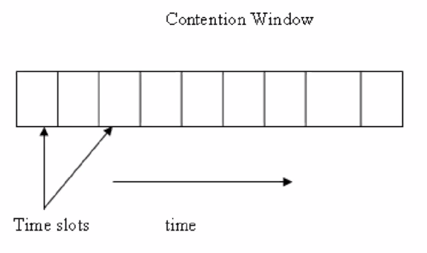

Hacen un backoff exponencial random para no coincidir

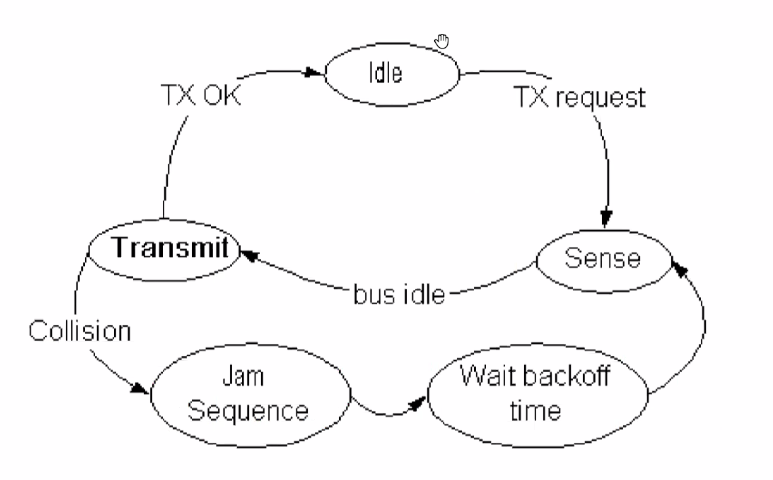

#### Performance

Como es la performance los algoritmos que usan CSMA? Hay varios *flavors*, uno
de ellos es el ALOHA.

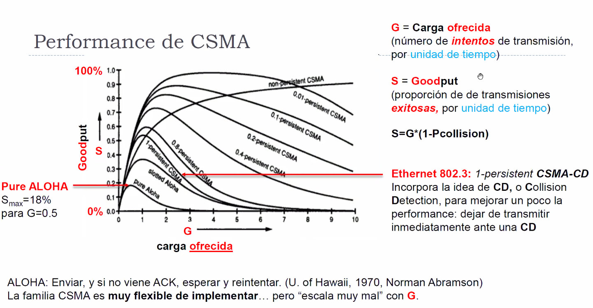

- carga ofrecida: cuanto le inyecto. Lo que soy un usuario, le ofrezco a la red
  el rate de intentos. Intentar transmitir no quiere decir que haya logrado una
  transmision exitosa, puede haber habido colisiones. El que determina como se
  resuelven es el mecanismo de la maquina de estados.

- El goodput es que parte del throughput es bueno, util, que no termino en algo
  malo. Se mide entre 0 y 100%.

Si tengo una red en donde muchos nodos estan mucho tiempo enviando info, sube la
proba de colisiones. Sube entonces la carga ofrecida, y va a bajar el goodput.

Por que no eligio lo obvio, 0.01-persistent CSMA? Casi tengo un goodput del 100%.
Porque estas subutilizando el canal, esperando mucho. Mi capa de arriba en la
arch de red se mata.

CSMA es muy flexible de implementar pero *escala mal* con G.

### 802.2: LLC (Logical Link Control)

Independientemente de lo que haya abajo (ethernet, wifi, etc.), por arriba hay
una capa logica.

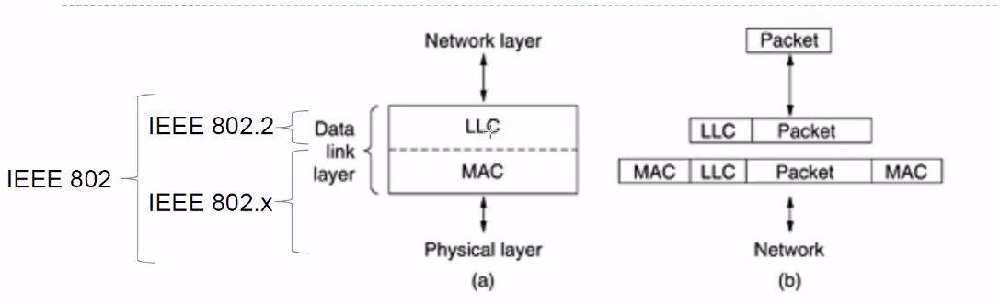

Esta capa es la que ofrece tres tipos de servicios

- Sin conexion y sin ACK (CSMA, no hay un ack explicito, el me llego bien es que
  no hubo una colision)
- Sin conexion y con ACK
- Orientado a conexion
  
### Escalando LAN

Red de area local, LAN

Hay distintas topologias. La que vimos hasta ahora es Hub, todas comparten el
medio y hay colisiones. En las otras hay un bridge que separa a *dominios de
colision*, no puede haber colisiones entre ellas.

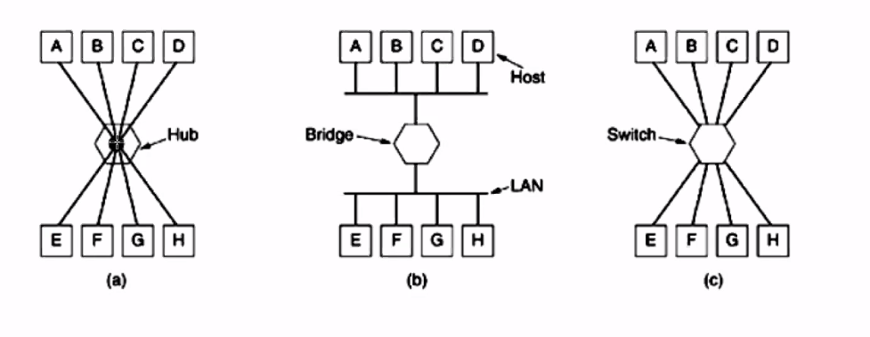

Tienen en comun un **dominio de broadcast**: cuando alguien manda a una dir de
destino con todos 1s, no importa en que topologia este, todos reciben ese
mensaje de todos 1s.

> Adelanto: esos mensajes son para enviar info que todos los nodos en una red
> *tienen* que estar enterados. Vamos a ver mas adelante ciertos mensajes de
> armado automatico de topologias sin ciclos donde todos se tienen que comunicar
> info util.

#### Dominio de colision vs broadcast

!! Pregunta de final

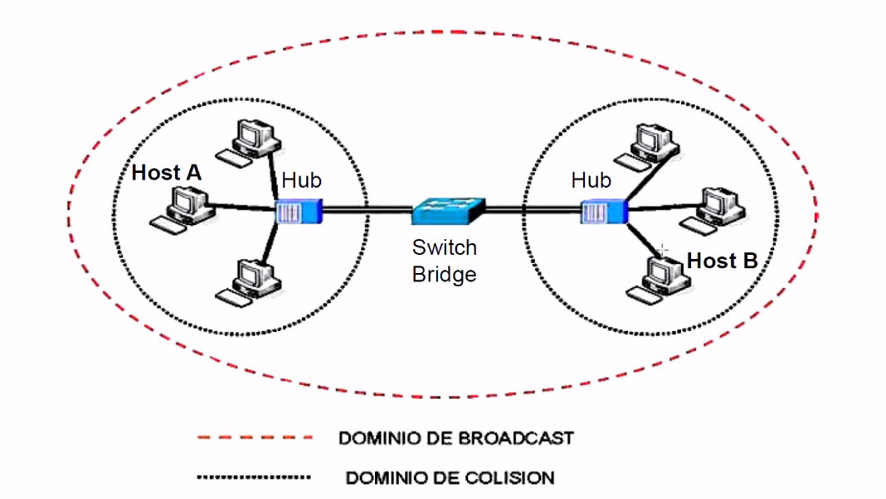

Un solo dominio de colision claramente no escala, si duplico, triplico,
cuadriplico la cantidad de hosts, la carga ofrecida a la red crece y el goodput
termina bajando. Voy a tener mas ruido que info util.

Para evitar esto, lo primero que se hizo fue separar los dominios de colision
entre si con elementos como Switch o Bridge (la def es difusa, despues la vemos,
pero no es importante. Es cultura general). Pero los distinguimos de los
**hub**, que es donde yo enchufo los cables de mi compu y literal comparten un
medio fisico. Comparten el mismo cable via un circuito. Cuando envian una señal
puede colisionar.

En las LAN se conectan por un hub.

> Si tengo una red chiquita un broadcast no pasa nada, pero en una red grande
> puede replicarse en miles de hosts. Y eso es un problema para la
> escalabilidad, como vamos a ver mas adelante

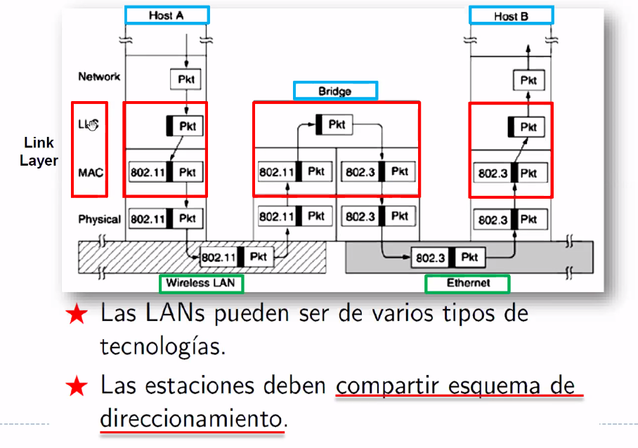

El bridge puede hacer de puente entre tecnologias (tipicamente de un lado tiene
una pata de una tecnologia, y del otro de otra). En este caso pasa de wireless a
cableado.

> La MAC Address, por el nivel MAC (que permite hacer direccionamiento) son 6
> pares de bytes en donde voy a tener la posibilidad de decir que A le quiere
> hablar a B. Hay una en particular que son todos 1s, y esa es la broadcast.

Tienen el mismo dominio de *direccionamiento* o broadcast, que es lo que le da
la identidad a la red.

Para que esto escale solo, y no tenga que configurar dispositivo a dispositivo,
las MAC addresses tienen que ser unicas en el mundo, y es algo que los
fabricantes de placas de red tienen en cuenta.

#### LAN Extendida

Quiero tener una LAN mas grande por diversos motivos,

- Heterogeneidad
- Distancia
- Aislamiento
- Redundancia
- Seguridad: Tener dispositivos que provean servicios que si falla una parte de
  la red esa otra subred tome la responsabilidad de lo que falla, etc.

Y para eso voy a necesitar distintos tipos de multiplexores, que se caracterizan
por la capa o nivel en el que trabajan

- Fisico: Repetidores y hubs
- Enlace: Bridges y switches
- Red: Routers (dir ip), gateways.

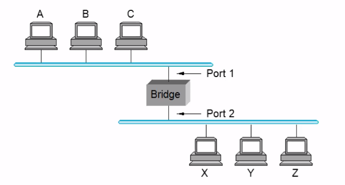

#### Learning bridges

Se aprende la topologia on-demand

No se reenvian paquetes cuando no es necesario, y se mantiene una tabla de
reenvio. Es una optimizaicon, ante la falta de entradas, cuando se quiere
reenviar un frame se aplica flooding: se envia a todos.

Relacionan direcciones (i.e MAC) con interfaz en funcion del trafico en la LAN.
Para la imagen de mas arriba,

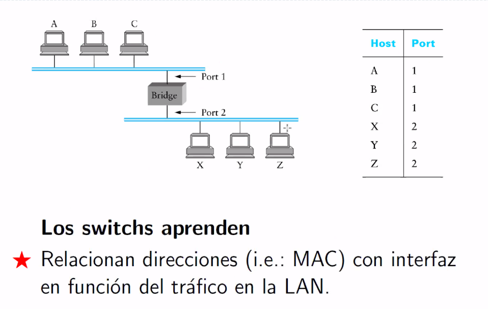

Con esta tecnica sencilla se aislan pedazos de la red, entonces la carga total
de la red es menor. Hay menos colisiones posibles en todos los sub-tramos de la
red. (divide & conquer para minimizar la posibilidad de colisiones)

Esto suena muy lindo pero genera problemas cuando escala tanto que empiezan a
haber ciclos, un paquete pega la vuelta.

##### Problema: Topologias con ciclos

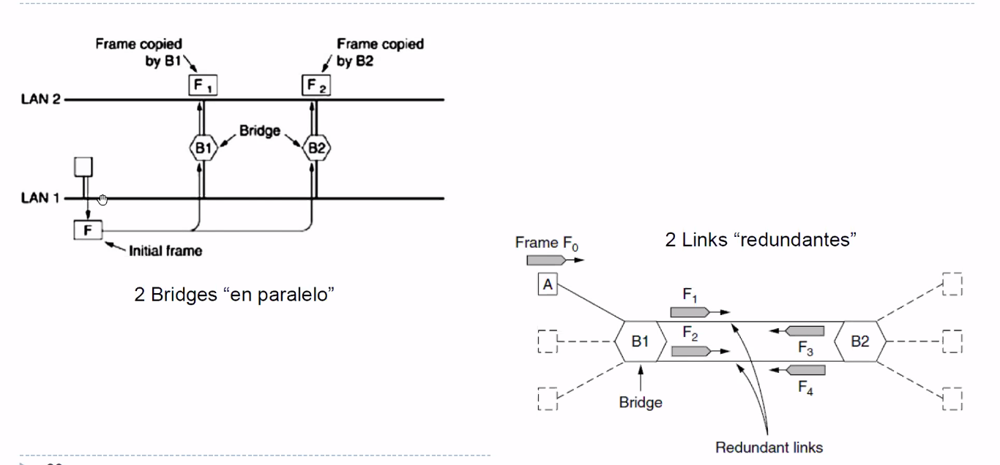

Los bridges implementan eso de la tablita de antes, learning bridges. Si se da
el caso de dos bridges en paralelo

> por que? nadie se da cuenta que pones dos en paralelo? podria querer
> tolerancia a fallas en los bridges, y cuando las LANs en la vida real crecen,
> las topologias de red que crecen de manera poco planificada pueden
> tranquilamente generar este tipo de situaciones de casualidad.

Se alterna el conocimiento de donde esta posicionado un host de manera
artificial. Es bueno que los bridges trabajen asi, porque si relocalizo una
computadora que cambie de que lugar esta. Pero esta forma es artificial y no
deseada, y fue causada por el ciclo.

##### STP: Spanning Tree Protocol

Busca eliminar ciclos de manera logica. Corre en los bridges. Luego de varios
ciclos de intercambios de paquetes hace que se eviten los ciclos.

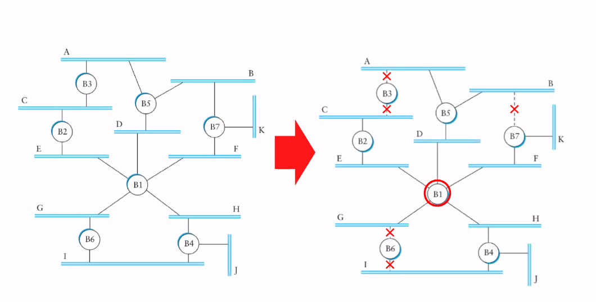

Se usa el de 5 en vez que el de 7 porque tiene id menor.

Tiene que poder adaptarse a cambios de topologia libres

Idea:

- Cada switch envia paquetes (BPDUs (Bridge Protocol Data Units)) a sus vecinos
  propagando info acerca de la topologia de la LAN de manera periodica.
- Es un algoritmo distribuido que tiene que enterarse, se tiene que ir
  construyenbdo una idea de la lan de manera periodica.

Mecanismo: Funciona por aproximaciones sucesivas, va convergiendo

- Se elige un switch root
- Cada switch aprende las distancias al root de el y todos sus vecinos
- Cada switch determina cual es su interfaz
- Cada switch determina cual es su interfaz con **distancia minima del root**,
- Esa es la designada para llegar hasta el root. Las otras se bloquean.

Eso genera un grafo aciclico.

Los BPDUs llevan basicamente esta info: (pero es mas complicado en realidad)

> BPDU = [3, 2, 1] (soy id 3, creo que el root es id 2, y mi dist a el es 1)

- El id del que esta enviando el mensaje
- El id del root segun el que envia el mensaje
- La distancia en saltos desde el que envia el mensaje hasta el root

Se actualiza la info en cada switch si

- Se identifica un BPDU con menor root id
- Se identifica un BPDU con igual root id pero a menor distancia
- El root id y la distancia son las mismas pero el id de switch es menor.

Las interfaces (ports) pueden ser

- Designados
- Bloqueados
- Root

Hay un ejercicio ilustrativo al final, y VLANS que vamos a ver la clase que
viene.

> Ese es el techo de la escalabilidad en LANs, y ahi vamos a la capa 3. Las
> MACs coexisten con otro esquema de direccionamiento, IP (internet protocol)
> Internet es inter-redes. Vamos a querer conectar muchas de estas redes que hoy
> construimos, para armar una red de redes con otro esquema de direccionamiento.
> Con esa capa 3 e internet existe lo que hoy conocemos como internet.
>
> No podria funcionar solo con MACs. No puedo correr un STP en todo el mundo.

> Todas las tecnologias que vimos hoy estan en uso pleno hoy en dia. No son
> protocolos que salieron ayer pero son largamente establecidas.