# Clase 4 - Nivel de red

Avanzamos en los niveles.

El protocolo por excelencia es IP, pero vamos a ver sobre la actividad central,
que es generar los mecanismos para que las computadoras en un nivel de escala
mucho mas grande que las LAN puedan direccionarse y conocerse en forma de
*caminos* que se atraviesan.

Teniamos switches, bridges, SPT, etc. eso tiene un nivel de saturacion porque el
dominio de broadcast no puede manejar tanta escala (por los mensajes de
broadcast).

Los algoritmos que calculan las rutars dinamicamente son los que corren en la
capa de red. SOn los protocolos que generan las tablas de enrutamiento. Para
manejar algo tan complejo, es necesaria mucha tecnologia y etc.

Agenda:

- Intro: ruteo interno y externo
- Algoritmos y protocolos
- **Escalabilidad!**

## Sistemas autonomos

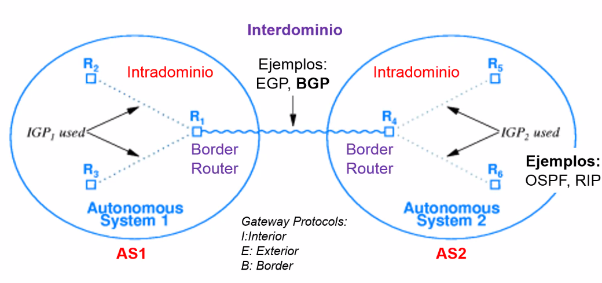

Es la idea central que permite encapsular subpartes de lo que es una red uqe
puede crecer tanto como queremos.

Graficamente, tenemos los *autonomous systems* que estan denotados por los
circulos. Adentro tenemos routers. (R de router). Esto genera categorias: intra
domonio (adentro de cu) y interdominio: entre ambos.

Los protocolos que se desempenan en la frontera: Gateway Protocols

- Interno
- Exterior
- Border

Ocultamiento de informacion: los detalles de lo que pasa en c/u no importa a
cada uno.

Heterogeneidad: ya lo vimos?

Algoritmos: OSPF, RIP.

Internet es una interconexion de muchos AS.

> El broadcast vive en capa 2

Un sistema autonomo puede ser una compania, tiene varias sucursales conectadas
por routers. Puede ser tambien los ISPs, un SA compuesto de varios routers que
llevan la conectividad a muchos usuarios. Una universidad grande como la UBA,
un sistema autonomo donde corre la admin interna de routers porque provee
conectividad a varias facultades.

## Introduccion

### Protocolos de ruteo

Pueden clasificarse en:

- Ruteo interno (miran hacia adentro del SA). **intradominio**, IGP (internal
  gateway protocols)
- Ruteo externo (miran hacia afuera): interdominio, EGP (external gateway
  protocols)

Pensamos en un grafo de sistemas autonomos. En internet existen varios "planos"
de redes,

- **Grafo de routers (IP)**: involucra todos, internos, externos, etc. (lo que
  vemos hoy)
- Grafo de Web Servers (WWW): de las paginas web servidas en internet.

  > si pensamos que las paginas tienen links, esas son las conexiones

- Grafo de Name Servers (DNS)

  La jerarquia de nombres o URLs y su mapeo a direcciones IP son resueltas por
  una red especial a nivel global, y podemos construir otro grafo mas con eso.

Con este criterio se pueden explicar muchas cosas mas, como

- P2P (peer to peer)
- CDN (content distribution network)
- etc.

### Routing vs forwarding

Coexisten pero son diferentes

- forwarding: Re envio. Proceso que selecciona una puerta de salida basada en la
  dir destino y una tabla de ruteo.

  Tengo que reenviar (hacer el trabajo de mirar lo que me viene y enviarlo hacia
  algun lugar) (o forwardear). Generalmente se usa como enrutar o rutear, pero
  es una buso del lenguaje.
  
- El ruteo es el proceso mediante el cual se construyen esas tablas que le dicen
  al que hacen el forwarding por que interfaz fisica lo tienen que enviar. De
  todas las opciones que hay cual elegir de los puertos de sealida que tiene el
  router. *construir esa tabla* es rutear. Se mantiene actualizada para poder
  hacer que el forwarding sea eficiente.

El ruteo es un problema de grafos, optimizacion y algoritmos distribuidos. Hay
que encontrar el camino de menor costo entre dos nodos en tiempos razonables,
usando recursos minimos. La red se ve como un grafo pesado

Tipos de ruteo:

- **Estatico**: Administracion manual, se carga una tabla por personas que
  conocen las interconexiones. Eso no escala.
- **Dinamico**: La configuracion es autonoma y adaptiva, reactivo a fallas, hace
  balance de cargas, puede reaccionar al estado de los enlaces (lento, no es
  accesible, inestable [a veces si a veces no]). Se abre todo un mundo de cuando
  cambiar una ruta y cuando no.

### Ruteo en OSI

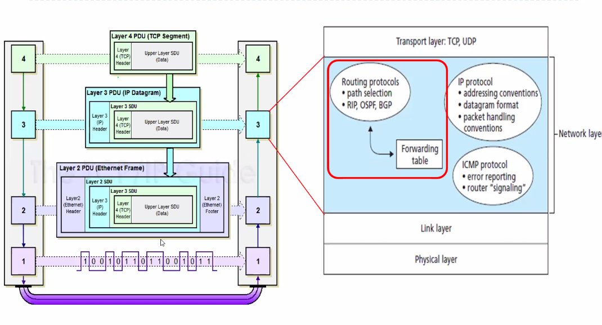

> TCP-IP guide.

Viven los protocolos de ruteo, que son los que arman las tablas de ruteo y
forwarding.

### Routing

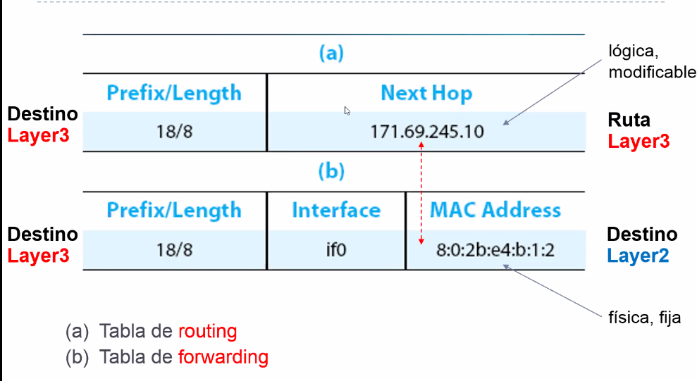

Tenemos *destinos* denotados por alguna direccion IP. El destino es a donde yo
quiero llegar. Entonces en una tabla de ruteo me dice que si quiero llegar a esa
red (denotada por 18/8, lo vemos la clase que viene) el *next hop* de los varios
que tengo para elegir, el proximo salto o nodo al que tengo que ir es una
direccion IP muy especifica que es esa.

La otra tabla te dice *como* voy a llegar a esa direccion IP, si tengo varias
*interfaces* (canales de salida).

> voy a ir por la interface 0 (if0), y esa tiene una mac address en particular,
> ahi conectamos con la capa de abajo 2. Ahi hablo con una computadora fisica.

La decision de por que ruta salgo es una decision de capa 2.

Armar cada capa es una tarea distinta pero coexisten.

### Protocolos de ruteo interno

Seguimos dentro del mismo SA (intradominio). Cuando se sale del sistema
autonomo, pasa a usar otros algoritmos interdominio como EGP u otros.

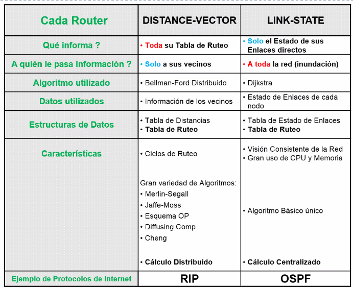

Distance vector:

- Le cuentan toda su tabla de ruteo, pero solo a sus vecinos. (En un grafo cada
  nodo tiene sus vecinos inmediatos, porque al estar en un grafo todos tienen
  algun nivel de vecindad)

Link state:

- Lo que informa cad arouter al exterior para armar el conocimiento global es
  solamente el estado de sus enlaces directos, a toda la red (inundacion).

Protocolos:

- **RIP**
  - algoritmo de vector de distancia
  - cuenta de hops (cuanto saltos tengoq ue hacer)
- **OSPF**
  - algoritmo de estado de enlace
  - tiene algunas sofisticaciones mas (autenticacion, balanceo de carga y QoS)

#### Distance Vector

Queremos armar la tabla de ruteo en capa 3, para que cuando llegue un mensaje
que tiene una dir de destino, se sepa elegir por cual puerto hay que
forwardearlo, de varios posibles. Esas patitas (interfaces) que tiene cada
router se conectan con las patitas de cada router que esta afuera, y eso es un
link, y asi se forma el grafo.

Este algoritmo se corre adentro de cada router, dentro de un sistema autonomo.

Informa **toda** su tabla de ruteo solo a sus vecinos directamente conestados. A
cada nodo del grafo que no soy yo, por donde tengo que ir y a que distancia
estoy.

- Estructura: (destination, cost, next_hop)

Lo hace:

- Periodicamente (varios seg) (por si algun router se cae)
- Cuando su tabla cambia (actualizacion gatillada)

Cada actualizacion que envia es una lista de pares (dest, cost)

Se **modifica** la tabla local en el router si se recibe una **mejor ruta**, ya
sea porque tengo una de menor costo para llegar al mismo lugar, o llego desde el
propio next_hop, que me actualiza desde mi vecino mas cercano cuanto tardo.

Se refrescan las rutas existentes y se borran si hay timeout y no hubo refresh.
(conexion con envio periodico, si asumo qeu cada uno me manda periodicamente y
hace mucho que no escucho nada, borro el entry preventivamente)

Ejemplo 1:

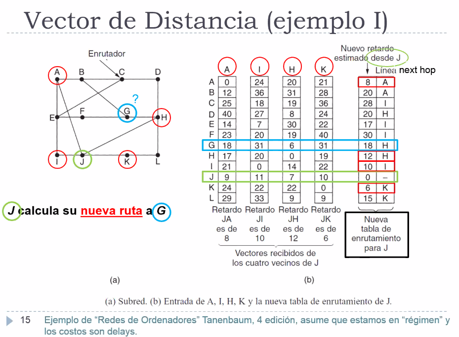

cuando c quiere mandar a alguien, por cual de sus 3 interfaces lo manda?

estamos parados en J.

{copiar ejemplo}

Ejemplo 2:

{copiar ejemplo}

Ejemplo 3:

{copiar ejemplo}

**Convergencia global**: Se sistiene si nada cambia. Pero en internet no pasa
eso.

Tiene algunos problemas posibles (como todo protocolo) que dieron lugar a que
otros sean propuestos. Cuando se cae un enlace...

- Ejemplo 1: Caso feliz, *estable*.

  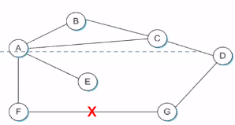

  - F detecta que falla su enlace con G
  - Lo penaliza: en su tabla le pone dist infinito. Lo tiene que comunicar, se
    lo dice a A (toda la tabla solo a mis vecinos)
  - A fija la distancia a G a infinito, poqrue A usa a F para llegar a G
  - A recibe update de C con camino de 2 hops a G
  - A fija distancia a G con 3 y envia actualizacion a F
  - F decide que puede llegar a G en 4 hops via A.

- Ejemplo 2: Conteo a infinito, inestable.

  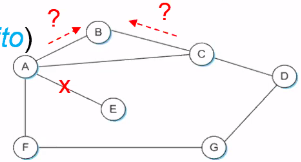

  Es una race condition

  - Link de A a E falla.
  - A comunica a B y C distancia infinito a E. (y F, pero no importa). Pero la
    pregunta es en que momento lo hace, porque periodicamente B y C estan
    comunicando periodicamente que tienen distancia de 2 hasta E.

  - Puede ser que B, dependiendo de que mensaje llega primero, que tome que
    gracias a C puede llegar a E en 3 hops, y se lo comunica a A.
  
  - A decide que puede llegar a E en 4 hops, lo comunica a C
  - C decide que puede llegar a E en 5 hops, se lo comunica a B, y asi hasta el
    infinito.

Hay varias heuristicas para romper los ciclos,

- Fijar 16 como infinito (cuando el costo llega a 16 se asume que no hay ruta)

  No tengas un SA dondo estas corriendo RIP con mas de 16. En cada patita podes
  colgar una lan entera, entonces es raro tener 16.

  EN los diseños de los protocolos estan implicitas las suposiciones de a que
  escala pretende llegar, esta de 16 esta determinada en que es un protocolo
  para **un** sistema autonomo.

- Split horizon: omite enviar informacion de distancia que fue aprendida por el
  nodo al cual se envia el vector

  cuando envio toda la info de mi tabla, No le envio a mi vecino ninguna info
  que aprendi via el. Se parte el horizonte de intercambio de mensajes. Esto
  hace que estos ciclos se rompan, porque no le envio info a mi vecino que
  aprendi de el mismo.

- Split horizon with poison reverse: Notifica entradas aprendidas desde el nodo
  al cual se envia el vector, pero se le pone costo infinito (veneno)

Solo solucionan ciclos que involucran a dos nodos, pero si tengo mas en un
ciclo, no funcionan. Moraleja: hay tecnicas para intentar de romperlo, no
funcionan siempre.

Ademas, la convergencia de este protocolo no es buena en terminos de cantidad de
iteraciones. Esto se soluciona con otro enfoque, los link-state.

##### RIP

Paquete: solo informativo

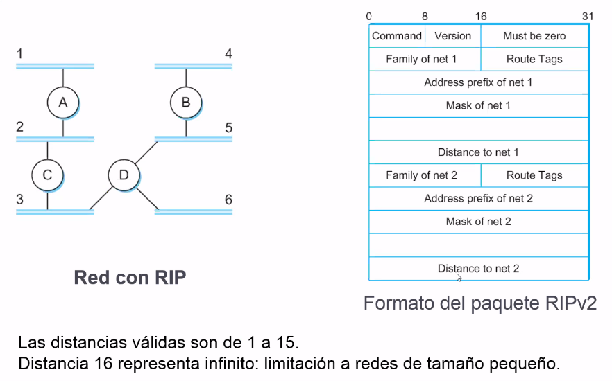

Particularidad de RIP:

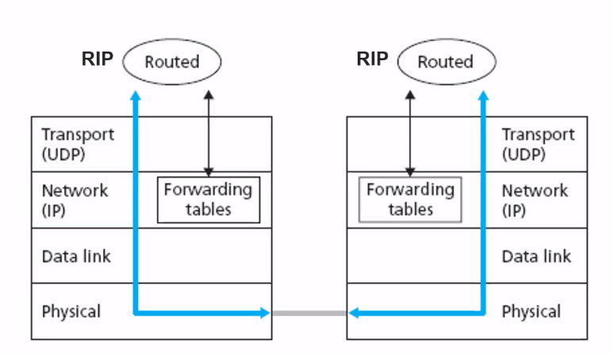

las cosas se implementan para que funcionen y no siempre se sigue al pie de la
letra la teoria. Estamos en capa 3 y se arman las capas de forwarding.

RIP vive en capa 3, es un protocolo de capa 3. Pero no, en realidad en un
sistema operativo (ya sea del router) son un daemon (aplicacion) corriendo en el
sistema operativo. Y para comunicarse con otros routers usa un protocolo de capa
4 (UDP).

Es un protocolo cuya logica ejecuta como una aplicacion, en capa de aplicacion,
pero provee un servicio que se usa/aplica en capa 3.

#### Link state (estado de enlace)

Todos los nodos tienen la misma info.

La topologia de red y los costos son conocidas por todos los nodos

Computo el camino minimo con Dijkstra.

(mando poca info a todos)

Algoritmo:

- Descubrir vecinos y conocer sus direcciones de red
- Medir costos para cada uno
- Consturir uin paquete que indique todo lo que aprendi
- Mandarlo a los demas routers
- Calcular la ruta mas corta de todos los nodos (usar lo que el resto del mundo
  me cuenta de ellos)

Estrategia

- Enviar a todos los nodos info sobre sus enlaces directamente conectados
- Se floodea la red on info

Paquete de estado de enlace (Link state packet, LSP)
- ID (secuencia) del router que creo el LSP

{habia un par mas de cosas, diapo 33}

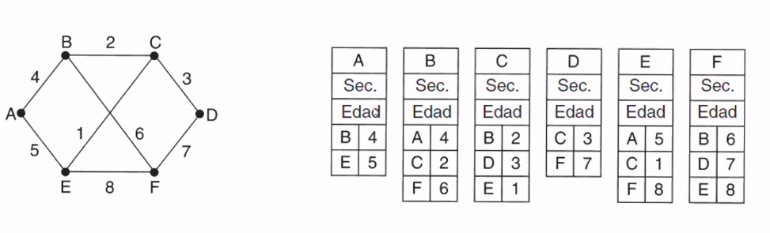

Es una inundacion **confiable** porque los LSP vuelven con ACK (a nivel capa de
enlace).

> El criterio de ACK existe en todas las capas (2, 3, 4) hay apps que usen la
> red, y que envian ack.

Cad arouter

- **Almacena** el LSP mas reciente de cada nodo
  - Decrementa el TTL De cada LSP almacenao, y descarta cuando TTL = 0
  - LSP ACK
- Reenvia LSP a todos excepto quien se lo mando a el
- Genera un nuevo LSP periodicamente
  - Incrementa el numero de secuencia
- Inicia el numero de secuencia en 0 cuando se reinicia.

En la practica, el calculo de la tabla se va a armando a medida llegan los
paquetes. {esta en en una diapo mas adelante pero no lo dio}

Se manejan dos listas de entradas: tentativas y confirmadas. Cada una tiene
entries `(dest, cost, next_hop)`.

Ejemplo:

Se incorpora D a la red

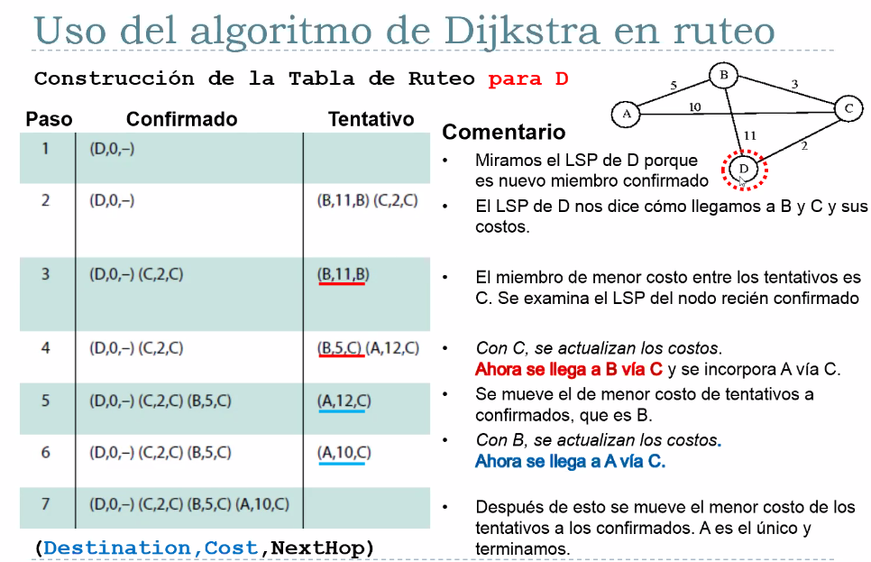

##### OSPF (Open Shortest Path First)

Open porque es de codigo abieto.

Utiliza un algoritmo de es t ado de enlaces.

El anuncio OSPF lleva un entry por cada router vecino.

Hace anuncios distribuidos a todos los nodos dentro de un AS (mediante
flooding). Tranportados por mensajes OSPF directamente sobre IP.

> Inundacion es parecido a broadcast, hay un dominio al cual quiero hacerle
> conocer cosas, pero es un sistema distribuido, entonces tengo que ver una
> forma de inundar o enviarle a todos. Es como un broadcast de capa 3

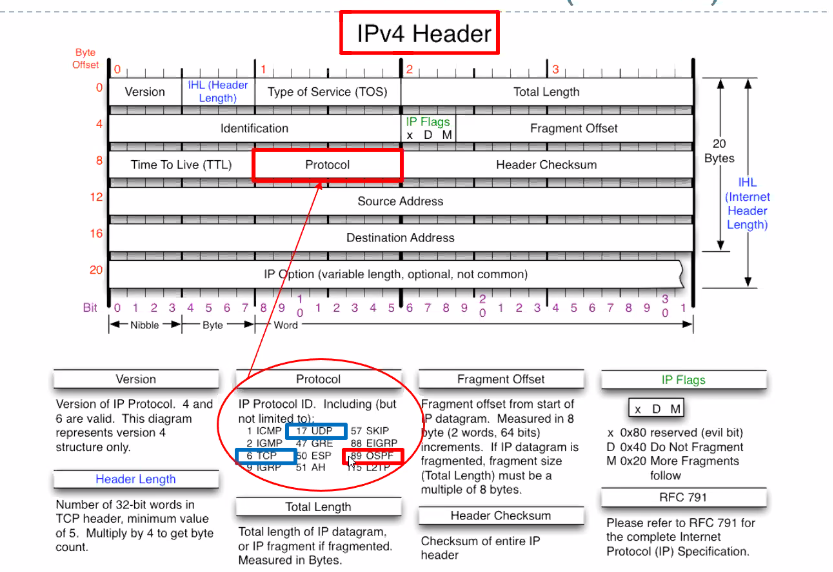

Es el protocolo codigo 89

##### OSPF jerarquico

Zoom en una SA

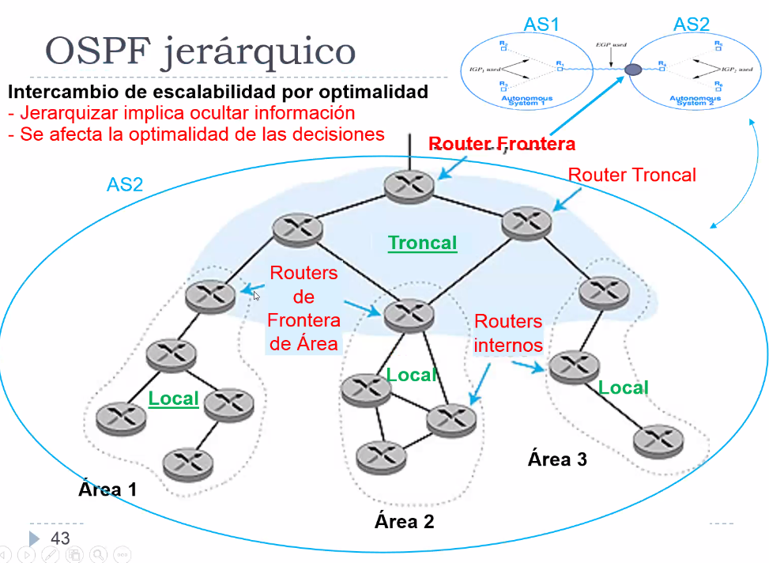

Hay areas, local y troncal. Los routers de frontera de area son como un escape
hacia otro grafo, el troncal. Adentro de un sistema autonomo a su vez hay
jerarquias, implementadas por OSPF pero jerarquico. Otra desagregacion mas pero
en categorias.

Intercambio de escalabilidad por optimalidad (sacrificando)

- Jerarquizar implica ocultar la informacion
- Se afecta la optimalidad de las decisiones

Dos niveles: area local y area troncal.

- Los anuncios de estado de enlace son solo en area local

{mas detalle en diapo 44}

No es necesario que sea jerarquico, un SA puede tener 1 sola area con OSPF plano
y chau.

#### Comparacion

{copiar}

- En vector de distancia cada nodo transmite 

### Ruteo interdominio

(egp no se usa mas, ahora BGP)

Salir de sistemas autonomos y pasar de uno a otro.

Idea clave: Autonomia: que no importe para estos protocolos interdominio lo que
pasa adentro de un sistema autonomo. Lo que pasa ahi se oculta a otros SAs. Lo
unico que interesa es como pegar el saltito de uno a otro si es que alguien del
SA1 quiere llegar a una IP que esta en el SA2.

#### EGP

EGP: Exterior Gateway Protocol: fue diseñado para tener una internet como arbol,
pero ahora hay ciclos. Se preocupaba solo de alcanzar nodos y no optimizar rutas
(BGP optimiza). Hay varios mensajes de protocolo

- Adquisicion de vecinos: un router requiere que otro sea su par, e intercambian
  info de alcance (para ir a tal red, por donde voy?)

- Alcance de vecinos: los routers periodicamente mandan mensajes HELLO y
  respuestas ACK para ver si siguen sienod alcanzables.

- Actualizacion de rutas: los nodos pares intercambian periodicamente sus tablas
  de ruteo (vector de distancia)

#### BGP (Border Gateway Protocol)

Es el protocolo por excelencia que se usa, y con el vino el concepto de
organizar internet en sistemas autonomos. Cada uno de los que interconecta BGP
esta bajo el control de una unica *entidad administrativa*: un sistema autonomo,
a diferencia de una LAN (que escala sin administradores que no asignen cosas,
por eso tenemos dominios de colision y de broadcast, total STP arma todo) en
este nivel (a nivel internet: red de redes) *si* se necesita alguien que
administre lo que esta pasando adentro de un SA. Hay alguien que es el
responsable de ver todos los dias que OSPF este andando bien, los
administradores de red.

Cada lan puede vivir como quiera, pero cuando tengo que garantizar la
alcanzabilidad entre mis routers de mi SA Y de todo internet hacia mi SA tengo
que tener alguien que este monitoreando. Necesito una entidad administrativa.

Es otra forma mas de agregar jerarquicamente info de enrutamiento para poder
alcanzar gran escala (o mundial).

Con esta ultima jerarquia, el problema de ruteo se divide en adentro y afuera.
BGP es interdominio y cada SA se encarga de intradominio.

BGP resuelve evitar que diferentes SA necesiten compartir info de alcanzabilidad
entre ellos. Eso lo hace sabiendo que rangos de direcciones tiene c/u y por
cuales rutas se puede llegar de uno a otro.

No requiere jerarquia de arbol, y hay varios tipos de AS

- Stub AS
- Multihomed AS
- Transit AS

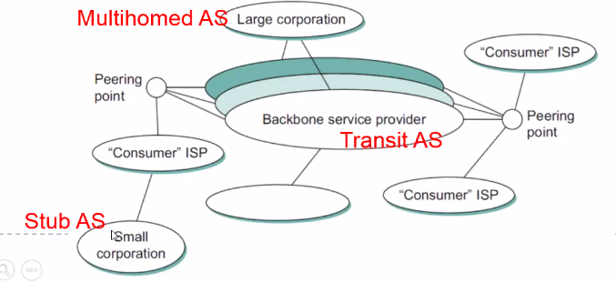

Todos ellos hablan entre si BGP.

{copiar lo que era portavoz}

Ejemplo:

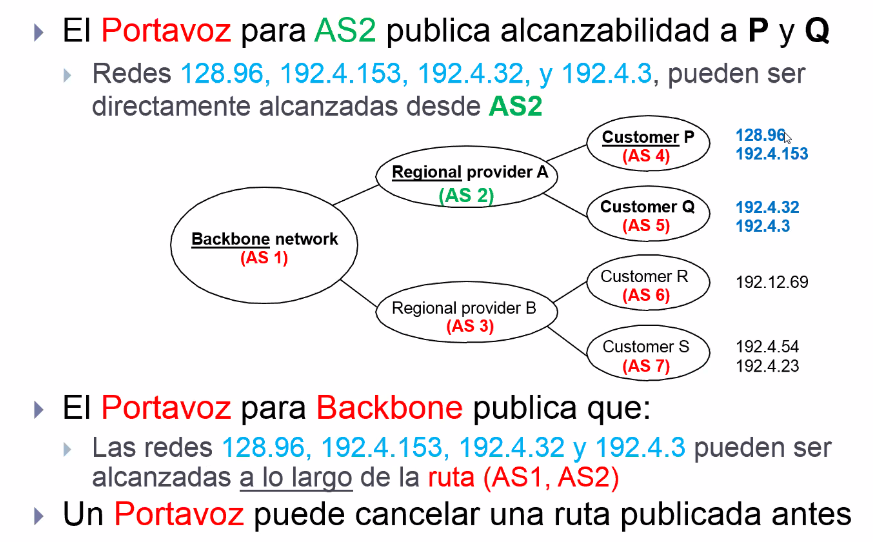

#### NAP (Network Access Points)

> Hay muchos acronimos pero la idea no es acordarselos.

Son los routers que terminan actuando de frontera (tambien se conocen como IX,
Internet eXchanges). Que son componentes fundamentales de internet.

A traves de los NAPs, se intercambia trafico entre las redes de diferentes
entidades. Estos son los puntos neuralgicos de la red. Se construyen en todo el
mundo bajo distintos esquemas institucionales, topologicos y operacionales.

La mayoria tiene los mismos objetivos: eficientizar el ruteo en internet,
mejorando la calidad de servicio y minimizando los coertes.

En argentina, hay una camara (CABASE: Camara Argentina de Internet). Cada pais
tiene su camara. Todos los NAPs siguen un modelo cooperativo y son todos
miembros de esta camara, de la cual son socios.

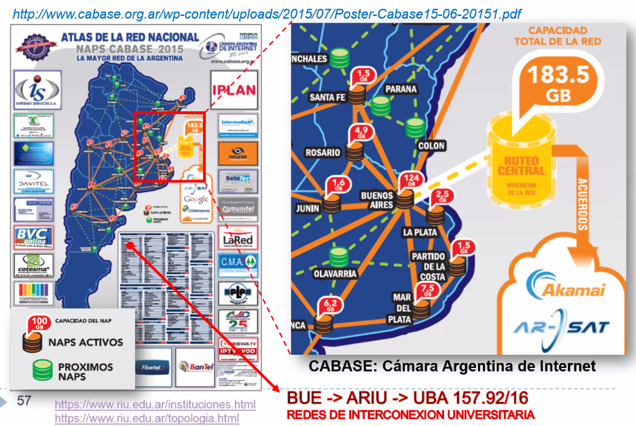

---

> La capa 3 se encargo de asegurar que el paquete va a llegar a donde lo
> queremos mandar. Despues la capa 4, va a asumir que cuenta con que la capa 3
> hace que tenga que llegar.
> Por ej. si yo mando una carta la dejo en el correo (capa 3) y este se encarga
> de que llegue, no me importa como.