# Nivel de red - Intro a IP

Seguimos en el nivel de red, ahora vamos a ver IP.

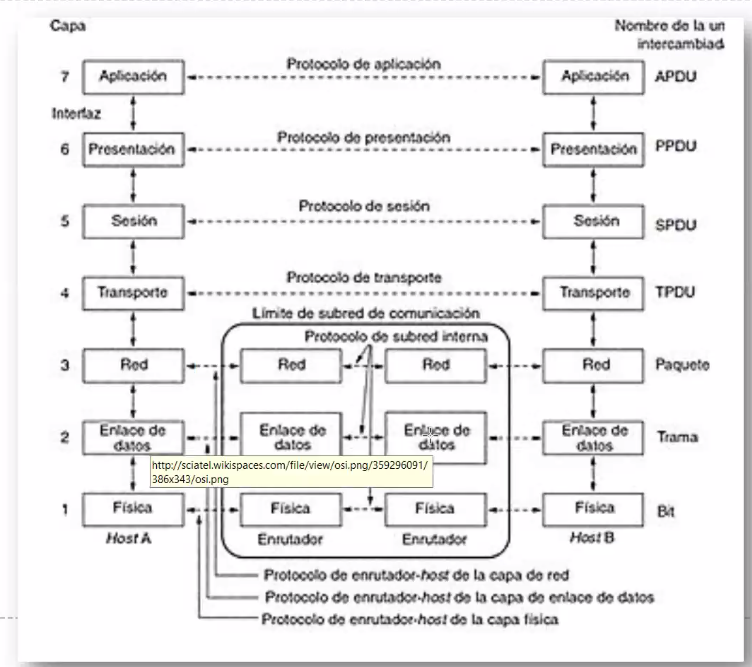

Capa 2: punto a punto. Conecta el punto A con el punto inmediato siguiente

Capa 3: tiene una nocion mas topologica, macro del sistema en general.

Agenda:

- Circuitos virtuales vs datagramas
- Datagramas
- Intro IP.

## Switch

Switches y bridges eran elementos con puertos de entrada y salida. Las tech que
maneja en ellos puede diferir. Entra por un lado y sale por el otro.

> Por ej. uno mismo puede tener fibra, ETH y wifi.

Hacia donde lo tengo que mandar? Implica el armado de estructuras de datos que
permiten razonar sobre el concepto ruta.

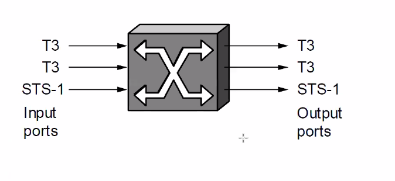

- Su trabajo es lograr que la mayor cantidad de paquetes que entren vayan a la
  salida *apropiada*.
  - Envian paquetes, frames, celdas de un **puerto de entrada** a un **puerto de
    salida** (switching o forwarding)
  - El puerto de salida se selecciona usando una direccion que trae el header
    del paquete, frame o celda.

Segun el tipo de switch

- Para distribuir paquetes, algunos usan circuitos virtuales y otros conmutacion
  de paquetes.
- Pueden conmutar paquetes de long variable o fija.

Hay switches con *capacidad capa 3*, que conocen de IPs a parte de MACs.

- Routing: armar las tablas de ruteo
- Forwarding: Una vez que tengo las tablas lo mando al puerto que corresponde.

## Conmutacion de paquetes

Los paquetes se manejan tipicamente en capa 3. Paradigmas:

(marcos dentro de los cuales se arman protocolos)

- Sin conexion: datagramas

  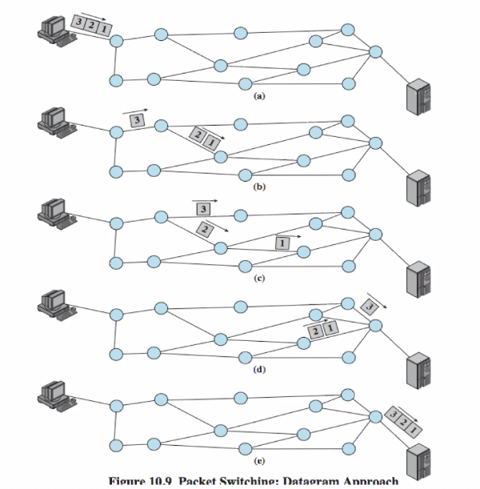

  Cada paquete puede ir por cualquier capa.

  Pueden venir desordenados.

- Orientado a conexion: Circuitos virtuales

  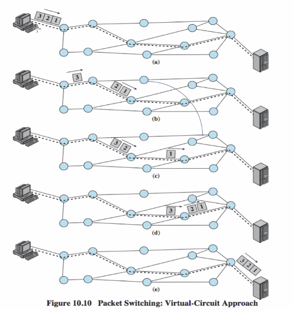

  Establece un camino que es seguido sistematicamente por todos los paquetes.

  Vienen ordenados.

- Source routing

### Conmutacion de circ vs de paquetes

La performance punta a punta depende de varios retardos

- Tiempo de procesamiento (en cada nodo)
- Tiempo de transmision (desde cada nodo)
- Tiempo de propagacion (en cada enlace fisico)

Otras caracteristicas:

- Overhead: Los nodos imponen esto porque tienen que calcular cosas para hacer
  el forwarding.
- Quiero que funcionen de manera transparente en la red: forward / filter /
  flood.

### Temporizacion de eventos

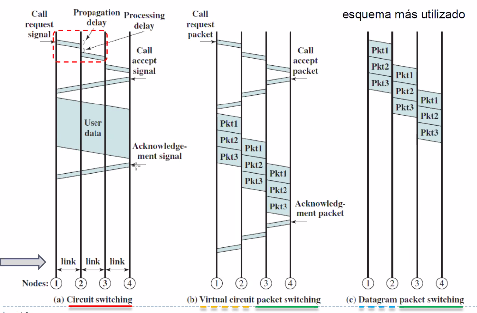

- a. Tiene un handshake
- Conmutacion sin conexion (datagramas): c. No hay fase inicial, los paquetes se
  van enviando y toman algun camino (1 2 3 4).

- b. Es un mix de los dos, es un circuito virtual. En vez de que los paquetes
  vayan y que alguien ojala la reciba, primero veo si hay alguien del otro lado,
  luego establezco un camino que sigo, y luego lo cierro.

Internet en la gran mayoria de los casos usa el c, pero hay otras en donde es
mas util el b.

### Conmutacion sin conexion (datagramas)

No existe una fase para establecer una conexion.

Cada paquete se envia independientemente.

Analogia: Sistema postal.

Lo pongo en un buzon y asumo que va a llegar.

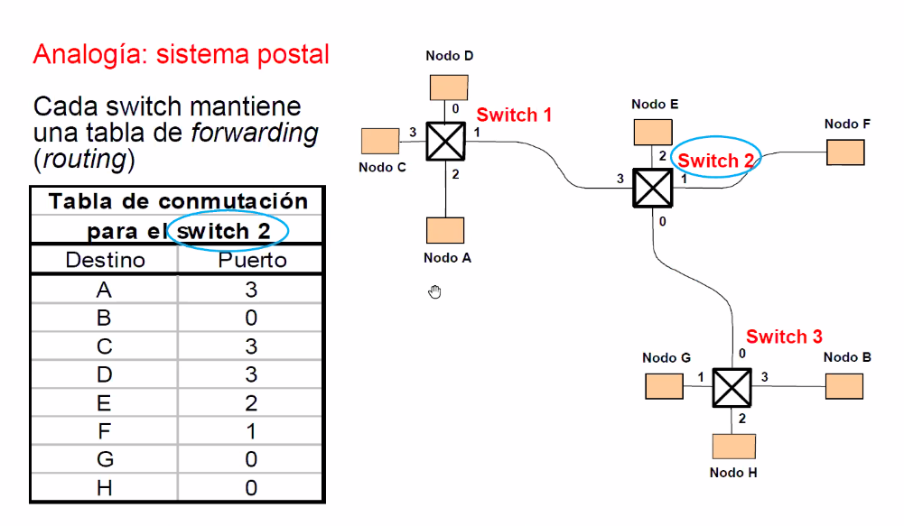

Hay caminos espontaneamente establecidos de A a F.

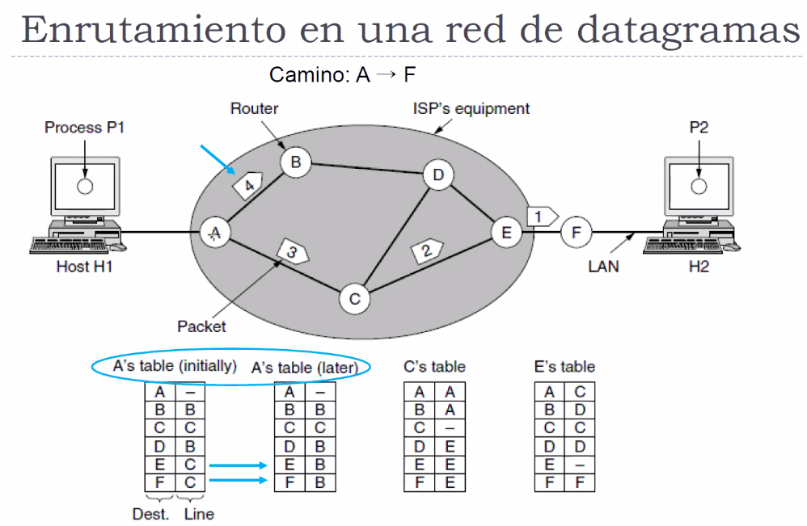

#### Modelo de Datagrama

{copiar}

### Conmutacion orientada a conexion (o circuito virtual)

Se requiere una **fase inicial** para establecer una conexion y otra de
**finalizacion** de la conexion.

Los paquetes que se transmiten despues de establecer la conexion usan siempre el
mismo circuito.

> Si voy a estar siempre conectandome a servers que van cambiando todo el
> tiempo, no me conviene, es muy caro el establecimiento y finalizacion. Sino
> tal vez conviene. Depende, es una decision de diseño.

Analogia: llamada telefonica

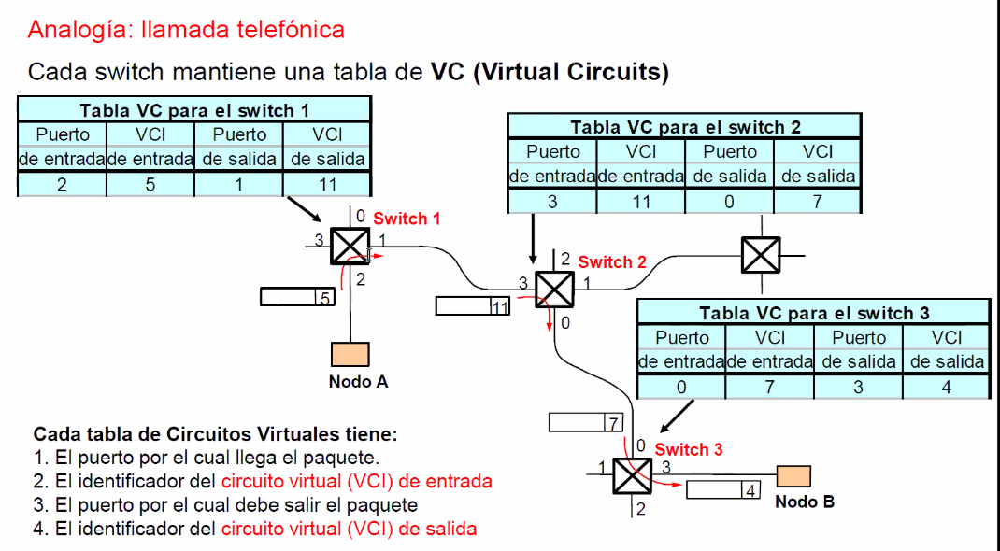

El handshake que pide que se establezca y quede establecido hasta que se haga el
release o de de baja se usa para que sean dinamicos los circuitos. Se guardan en
las tablas.

Problema: poco tolerable a fallas. La capacidad de reaccion a las fallas es
malas, se tiene que re-armar el circuito virtual (se tienen que enterar todos
los switches, etc.)

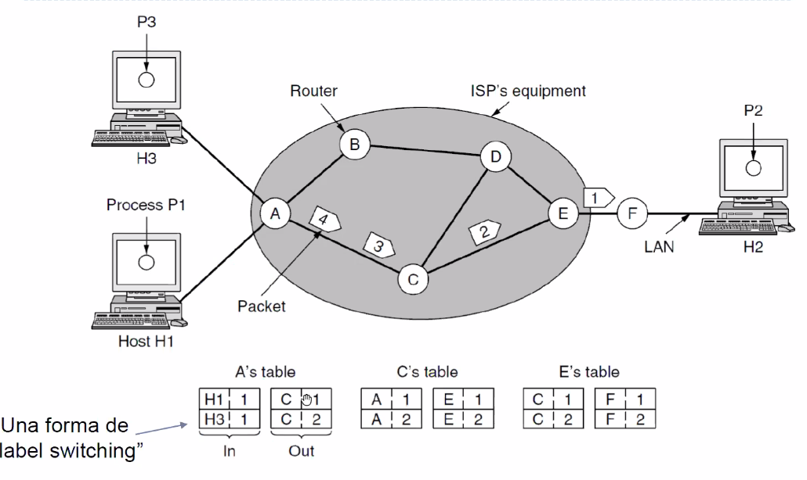

#### Tipos de conexiones virtuales

- Conexion **permanente** (PVC)
  - Definida por el admin de la red
  - Costoso
- Conexion **por solicitud** o conmutado (SVC):
  - Cuando un nodo quiere enviar datos a otro, envia un mensaje de solicitud de
   red
  - Cada switch que la va recibiendo (tienen que soportar circuitos virtuales)
    va devolviendole al anterior el perto

    {completar}

#### Finalizacion de la conexion

{leer p21}

#### Modelo de circuito virtual

- Overhead de transmision pequeño
- Overhead de recuperacion ante errores grande

### Datagrama vs circ virtual

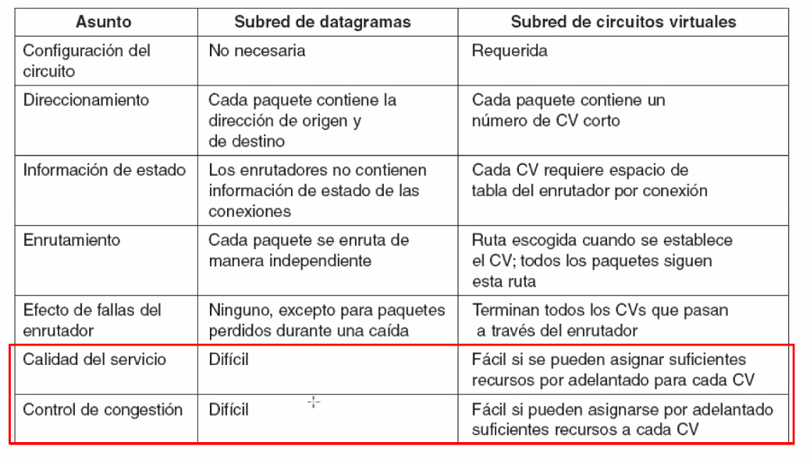

### Conmutacion source routing

Toda la info sobre la topologia de lar ed que es necesaria para conmutar los
paquetes es porporcionada por el nodo origen

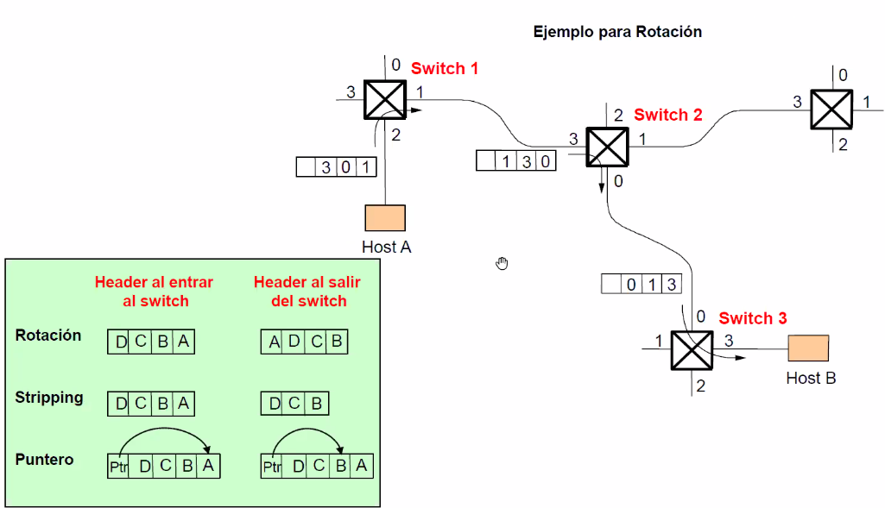

Se puede usar en redes no orientadas a conexion (datagramas) o redes orientadas
a conexion (circ virtuales)

Por ej:

- IP que es no orientado a conn, incluye una opcion para usar source routing.
- En redes de circuitos virtuales

## Internetworking

Internetworking: enviar paquetes en una red de redes, grafos de grafos. Basasdo
en un modelo de servicio best effort: IP (Internet protocol)

Se basa en el modelo TCP/IP de capa 3.

- Modelo de servicio best effort
- Header IP
- Fragmentacion
- Direccionamiento global ()
- Forwarding

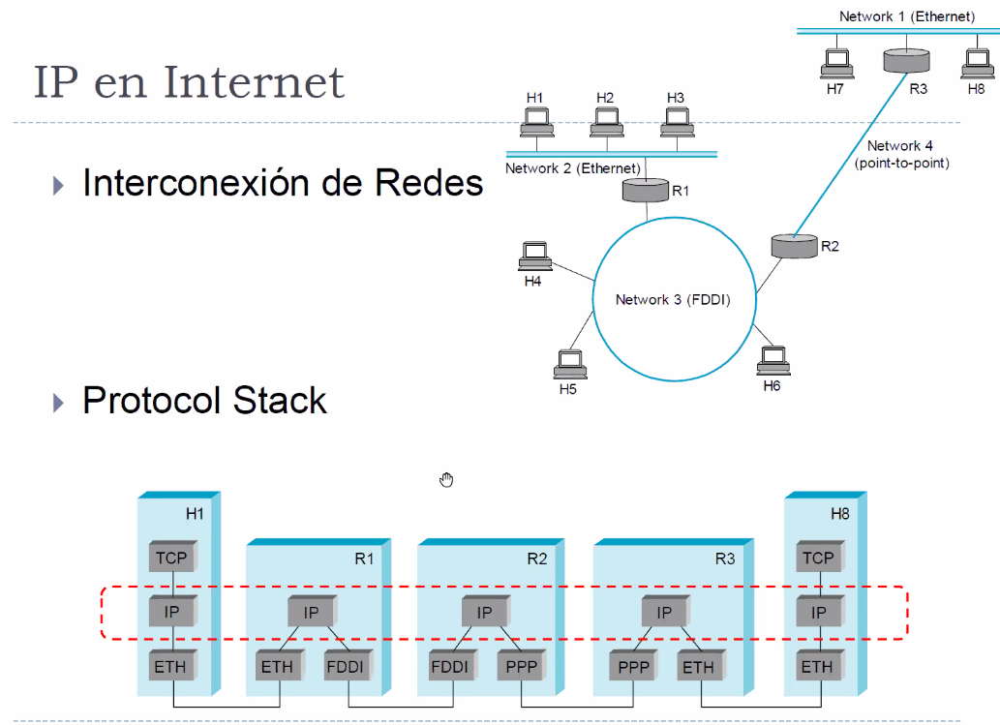

Topologia:

- 4 redes.
  - La 2 es ethernet con 3 nodos
  - La 3 es FDDI (de anillo, tipicamente fibra optica)

  Todas conectadas por un grafo de routers.

Protocol stack:

Cada router tiene "patas" ethernet, FDDI, etc. Pero la capa superior o
direccionamiento tiene muy poca idea de la tecnologia que hay abajo, obedece un
esquema de direccionamiento.

Vamos a ver IP, pero si no fuera IP podria haber cualquier otro que cumpla con
los paradigmas. Tiene que ser agnostico de la tecnologia de capa de enlace para
abajo. La capa 3 se encarga de hacer llegar las cosas.

### IP en internet

#### Modelo de servicio

- Connectionless (datagram-based)
- Best effort (unreliable service). No es confiable. Los paquetes pueden:
  - Perderse
  - Llegar en desorden
  - Tener duplicados entregados
  - No tener una cota de tiempo para la entrega

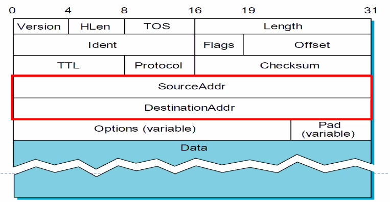

#### Header IPv4

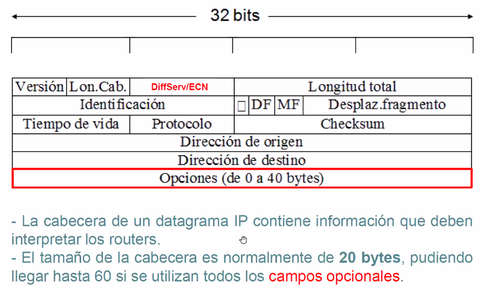

{campos p.33}

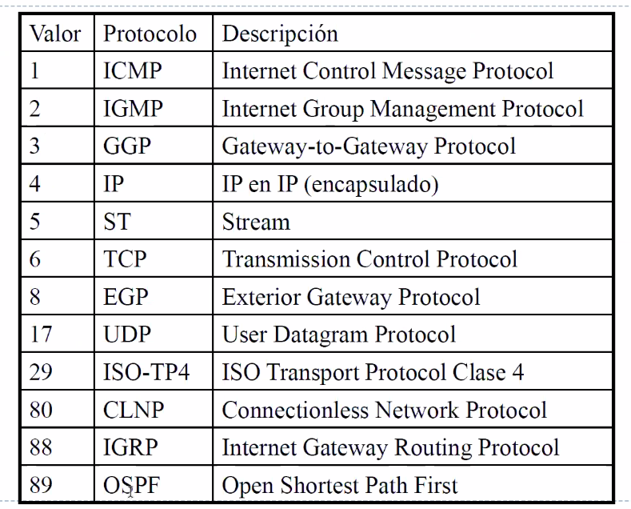

- Hay una long maxima

IP transporta OSPF.

#### Fragmentacion en IP

Cada tecnologia tiene en su nivel de enlace un MTU (max. transmission unit)

> Ej: eth 1500bytes, FDDI 4500bytes

IP se tiene que adaptar de manera flexible a esta tecnologia subyacente. Para
esto hace **fragmentacion** de paquetes en fragmentos. Si un router recibe un
datagrama cuyo tamaño es menor al MTU de la red al que lo tiene que mandar, lo
tiene que fragmentar.

Estos fragmentos son tambien paquetes IPs, son autocontenidos. Tienen una
indicacion que dicen que son un fragmento.

La unidad basica de fragmentacion es 8 bytes, y toda red tiene que aceptar un
MTU de al menos 68 bytes.

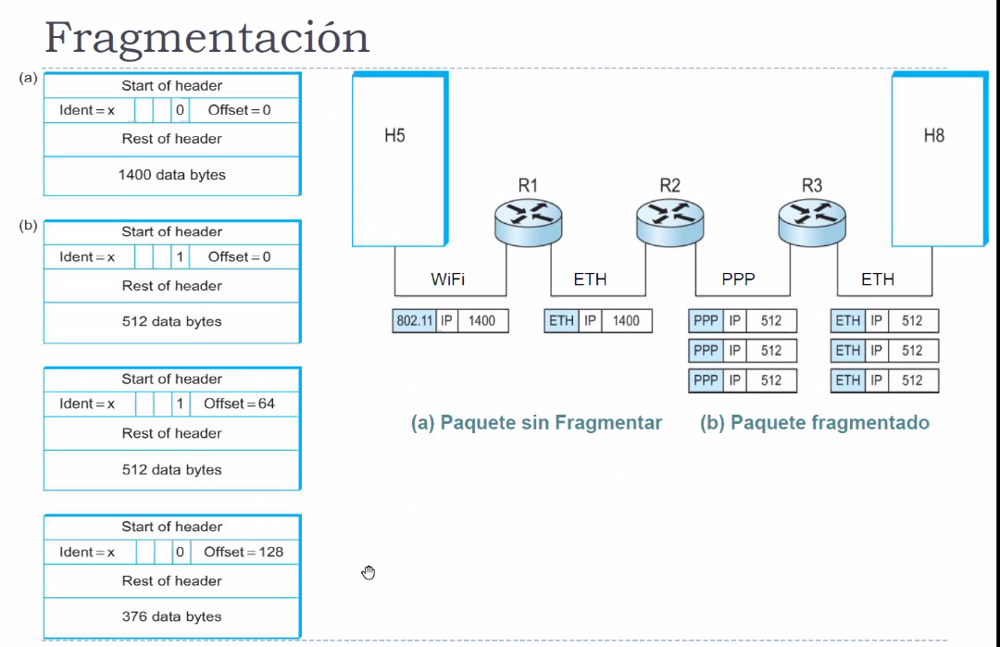

Los routers no suelen re-ensamblar paquetes.

#### Direccionamiento global

Props:

- Globalmente unica
- Jerarquica: red + host
- 32 bits
- Classfull: clases A, B, C
- Problemas de escalabilidad: Hoy no hay clases, sino que directamente decis los
  rangos. Esto da lugar a otra denominacion, cyder.

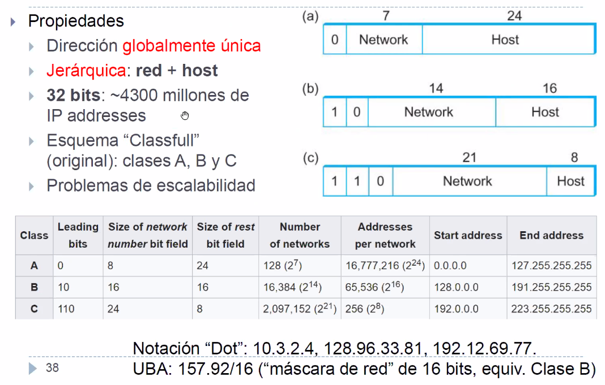

La / es segun el *rest* bit field. Es una mascara porque enmascaro segun la red.

El router tiene la direccion publica, y despues suele armar una red *interna*
con IPs que no necesariamente son publicas y unicas. Se arman subredes locales
privadas.

RFCs: documentos que rigen la forma de asignar cosas, como se comportan los
protocolos etc. Documentos de estandares (request for comments).

> RFC1918: Redes privadas
> https://tools.ietf.org/html/rfc1918

Espacios privados:

- 10.0.0.0 - 10.255.255.255 (10/8 prefix)
- 172.16.0.0 - 172.31.255.255 (172.16/12 prefix)
- 192.168.0.0 - 192.168.255.255 (192.168/16)

#### IP Forwarding

Ahora usamos routers en vez de switches, porque estamos en capa 3.

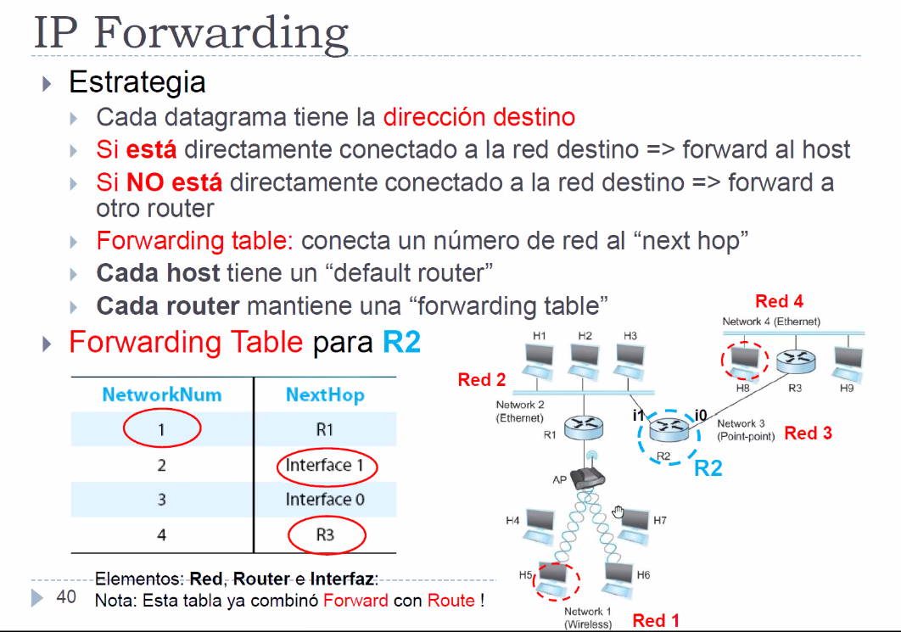

En cada pata del router puede haber una subred distinta.