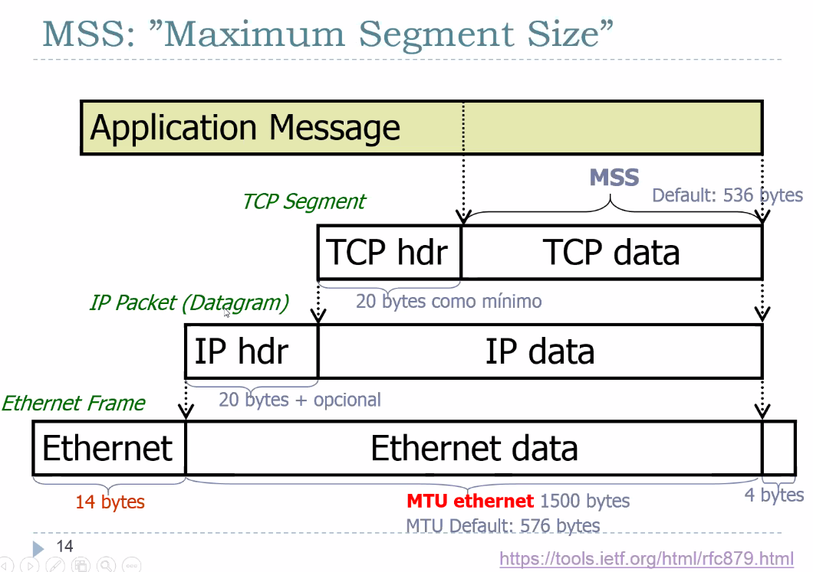
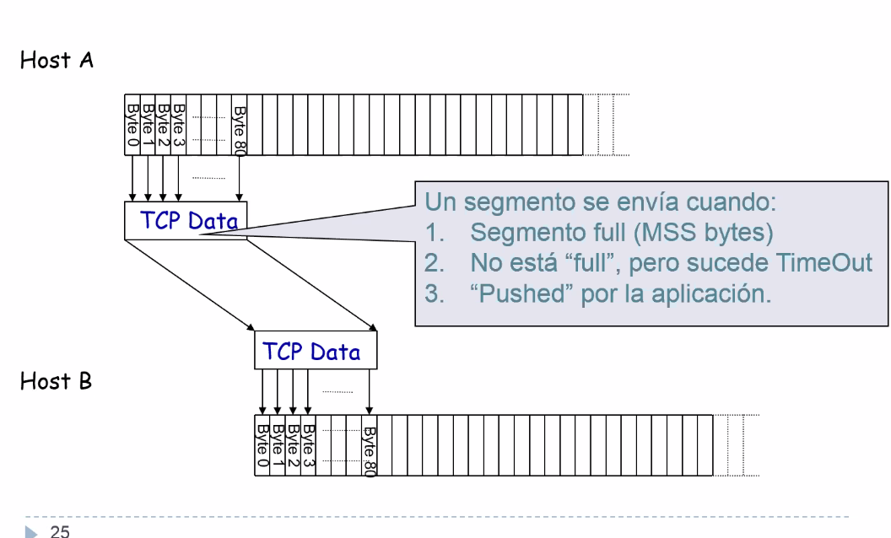
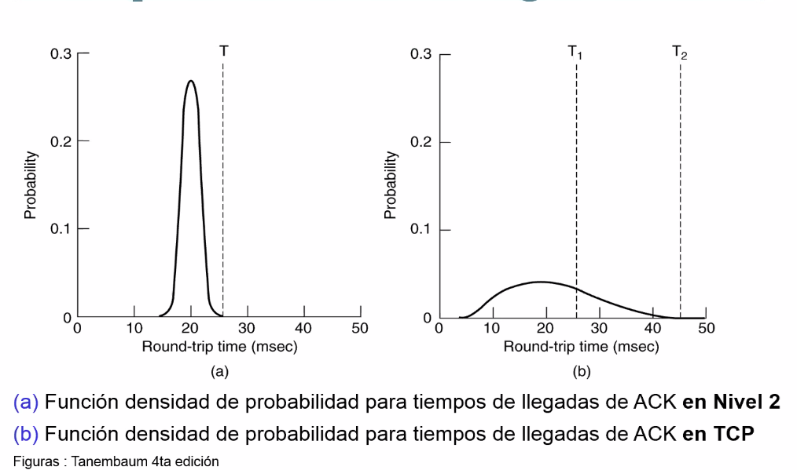

# Clase 6 - Nivel de transporte

Vamos a ver el protocolo TCP.

Con la capa 3 nos quedamos tranquilos con "como llegar" de un lado del mundo al
otro. Pero tiene una serie de suposiciones que hace que sea bastante poco
confiable, incierto, si termina llegando.

Lo que no puedo resolver en una capa entonces, le pido a la capa superior que se
encargue.

Una capa le brinda un servicio a su inferior y le pide un servicio a su
superior.

La estrella de la noche es TCP (Transmission Control Protocol). Uno de sus
creadores es Vinton Cerf.

Cada tecnología que vamos viendo y sus particularidades cumplen un rol
importante, pero hay algunos que se destacan, como TCP e IP.

## Agenda

- Nivel de Transporte
- El protocolo TCP
  - Connection setup
  - Segmentos
  - Numeros de secuencia
  - Sliding window
  - Control de lfujo
- UDP
- TCP - dinamicas especiales
  - Timeouts y retransmisiones
  - Maquina de estados finitos
  - Ineficiencia por envio de segmentos pequeños y que el receptor les pida
  - Uso de ancho de banda
  - Sockets.

## Repaso - Modelos de capas

Protocolos end to end

Hasta ahora, uno siempre le estaba hablando al nodo siguiente, *directly
connected*. Pero ahora con TCP no, le hablo directo al destino. En el nivel 4 la
entidad que sigue no es el next-hop, sino el otro end. "peer layer"
communication.

La capa 4 no le puede hablar a los nodos intermedios, le habla a su par en el
otro extremo.

> Recordar que OSI es el modelo mas formal, no es lo que se implementa pero
> sirve de guia.

A la vuelta, se puede *demultiplexar* en puertos TCP o UDP que permite que vayas
a varias aplicaciones. Desde el host 1 le mando a varias apps que esten
escuchando en puertos diferentes, pero todos viven en el mismo host con la misma
IP.

## Enlace de datos vs tranporte

Datos es link layer, una maquina a su next-hop

En un servicio de **transporte**

- Potencialmente conecta muchas maquinas diferentes
  - Requiere establecimiento de conexion explicitos
- Potencialmente lidia con RTTs muy distintos, porque está toda la red en el medio
  - Requiere mecanismos adaptivos para timeouts.
- Potencialmente enfrenta **largos retardos en la red**. Porque las rutas que
  puede seguir un paquetes pueden ser cambiantes, largas, a través de todo inet.
  Tiene que estar preparados para que lleguen ACKs de paquetes muy antiguos, o
  que lleguen paquetes muy retrasados. Hay que tolerarlo de alguna manera.

  Y en IP pueden llegar en desorden.
- Potencialmente existen diferentes capacidades de recepción en el destino. Me
  conecto por una ruta cualquiera a un server con mucha capacidad de buffering.
- Puede tener rutas super congestionadas y otras que no, y puede cambiar en el
  tiempo.

Todas estas cosas típicamente no se lidian a nivel de enlace (y si se hacen, es
a mucho menor escala)

## Maquina de estados

Modelo generico

Esta es la version generica. Despues la vamos a ver instanciada en TCP.

Es una técnica de diseño de protocolos en sis. dist. sobre una red

## Protocolos End to end en subredes de datagramas

Los protocolos end to end se montan sobre la capa 3 que es best effort

- descarta mensajes
- desordena mensajes
- puede duplicar mensajes
- limita los mensajes a algun tamaño finito
- entrega mensajes despues de un tiempo arbitrariamente largo

Servivios comunes end to end ofrecidos o deseados. Todo lo contrario

- garantía de entrega de mensajes (confiabilidad)
- Entrega ordenada
- Entrega unívoca (no duplica)
- Soporte para mensajes arbitrariamente largo
- Soporte de synchro
- Permite al receptor de datos controlar el flujo de datos del transmisor

    El receptor le marca el paso al transmisor para que se adecúe a su capacidad
    de recepción.

- Demultiplexar (tiene que ver con lo de la figura de antes, puede haber
  diferentes aplicaciones escuchando en diferentes **ports** para cada IP. La
  dupla IP Port forma un **socket**)

## TCP

### Generalidades

- Orientado a conexion. Proceso de establecimiento en el que dos entidades se
  ponen de acuerdo. Los dos extremos tienen que creer ambos que están en el
  mismo estado.

- FLujo de bytes continuo
  - App escribe bytes
  - TCP envia *segmentos*
  - App del otro lado lee bytes
- Full duplex (dos flujos de bytes)
  - Tengo tanto un canal de ida como uno de vuelta, y un canal no espera al
    otro. Puede enviar cuando quiera.
  - **Control de flujo**: evita que el Tx inunde al Rx
  - **Control de congestion**: evita que Tx sobrecargue a la red

> !! Muy importante entender bien estos temas. Tema de final

### MSS

El maximum segment size de TCP tiene un default (que aparece en el RFC) que es
536 bytes. Surje de tener 576 bytes por default en la capa fisica

### Caracteristicas

- TCP es orientado a conexion
  - Manejo de conexion
    - 3 way handshake para el establecimiento (setup)
    - 2-2 o 4-way handshake para la **liberacion**
  - TCP provee un servicio de stream de bytes
- TCP es **confiable** (establece una "conexion logica entre sockets")
  - ACKs
  - Checksums
  - Numeros de secuencia para detectar perdidas o desordenamientos
  - Datos perdidos o corruptos se retransmiten despues de un timeout (que hay
    que calcular)
  - Datos desordenados se pueden reordenar
  - Implementa control de flujo y de congestion.

Muchas cosas ya las vimos en la capa 2. Pero si ya los conozco, por que lo hago
otra vez mas?

- IP podria romper algo en el medio.
- Y toda la confiabilidad que garantizan son de hop en hop, y lo que estamos
  implementando ahora es host a host.
- Las cadenas se rompen por sus eslabones mas debiles. Esta bien que IP provea
  checksums entre hops, pero si alguno de los routers lo tiene mal implementado,
  yo como capa 4 me tengo que asegurar que no haya habido un problema en esa
  cadena y que se haya roto por el eslabon mas debil.

  Por eso pongo otro.

Obviamente se reusan ideas y conceptos

### Segmento

Cada conexion se identifica por una 4-upla que estan en el header

    SrcPort SrcIPAddr, DstPort DstIpAddr

Establecen univocamente la conexion.

Ventana deslizante + control de flujo

    Acknowledgement, SequenceNum, AdvertisedWindow

Flags

    SYN, FIN, RESET, PUSH, URG, ACK

Checksum

    Pseudo header (IP) + TCP Header + TCP Data

> Los puertos son como enchufes

- Header
  - {faltan otras}
  - Dest port y source port
  - Numero de reconocimiento o ACK: indica el siguiente byte que espera el
    receptor. La llegada de un byte indica que todos los bytes hasta ese momento
    esta OK (a diferencia de los selectivos que dicen que tal esta OK, o los NACK
    que dicen que tal esta mal)
  - Campo de longitud de header (porque no siempre tiene el mismo)
- Flags
  - URG: 1 si el campo puntero a urgente esta en uso
  - ACK: 1 para indicar que el numero de
  - PSH: todos los datos que tiene en su buffer de recepcion los tiene que
    inmediatamente enviar a la app, no los tiene que mantener.

    No queremos que tcp le mande de a poquito bytes que van llegando, para eso
    tiene un buffer, y lo envia una vez que se llena el buffer. Pero podria
    haber situaciones particulares de urgencia en las que necesito asegurarme
    desde el emisor que el receptor entendio todo lo mas rapido posible.

  - RST: para resetear una conexion que se hizo confusa. Se apaga y prende
    devuelta.
  - SYN: usado para **establecer** conexiones. Se usa para control de flujo,
    limita lo que puedo enviar.
  - FIN: usado para **liberar** conexiones
  - {habia otros}

### Stream de bytes

Que se simula usando segmentos

### Establecimiento y liberacion de conexion

Esa es una posible forma de terminar la conexion, y en el RFC 793 se muestran
mas posibilidades.

### Sliding window

- politica de retransmision go back n
  - Cuando hay un timeout por algun problema, se reenvía la ventana completa.
- Window size advertised por el receptor (server)
  - usualmente 4kb a 8kb durante la fase de conn set up
  - puede ir mutando a lo largo de la conn

> Hasta ahora estamos viendo control de flujo. Cuando le agreguemos control de
> congestion, no alcanza solamente con lo que pide el receptor, puede cambiar de
> tamaño por la posible congestin de la red. TCP le presta atencion a lo que le
> pide el receptor final pero tambien a lo que infiera que esta pasando respecto
> de la congestion en toda la red en el medio.
>
> Esto se ve en otra clase.

El emisor bufferea lo que envia tambien porque tal vez tenes que reenviar lo que
no tuvo ACK. Basta con que me llegue un ACK con un numero de secuencia n para
que de ahi para atras todo llego OK.

El receptor manda ack por cada paquete IP que le llega. Y dice hasta tal byte
todo OK.

### Control de flujo

El maxSendBuffer y MaxReceiveBuffer son variables que le imponen un maximo a
estos buffer, para que la ventana no crezca todo lo que quiera.

Concepto del control de **flujo** Con el mecanismo este de pasar advertised
window, se soluciona el problema de que ni el receptor ni el transmisor saben el
tamaño del buffer del otro.

> ! Lo que le interesa que nos llevemos es que son dos entidades separadas, no
> se envian toda la info detallada del estado de cada uno, pero aun asi se ponen
> de acuerdo para no saturarse entre si.

La app no tiene ni idea de lo que le pasa al buffer de recepcion del otro lado
del mundo. Si yo diesño algo que hace que tenga que tener en cuenta exactamente
como está el buffer sería muy engorroso, y entonces esto le releva la
responsabilidad a las capas superiores.

#### Advertised Window Management

Por lo general los buffers son memoria de la placa de red, y se reserva para
cada conexion TCP, no me puedo dar el lujo de tener buffers grandes.

El huequito que queda ahí no es por desorden o algo así, sino que es un buffer
circular.

Siempre que no se supere el max send buffer, la app puede seguir escribiendo. El
emisor podria bloquearla porque no llegan ACKs

### Números de secuencia

Es una técnica de control de flujo.

### Maquina de estados finitos

"TCP State machine"

> En general está bueno modelar estas cosas con estos diagramas formales. SI
> podes representar toda la complejidad de un problema en un diagrama que no es
> un spaghetti de flechas habla de su robustez.

Es no ambiguo.

En ing2 hay cosas de verificacion

Estados:

- Closed
- Listen
- {hay mas}

#### Administracion de conexiones

{mas info}

#### Sockets

#### Establecimiento y liberacion

Hay dos numeraciones que van en paralelo, cada uno tiene la suya.

#### Ciclos

Todo se basa en armar un ciclo y eso arma del ciclo de vida de una conexion

## UDP

Servicio **sin conexion**.

UDP apunta mas o menos a un socket y tira paquetes. La aplicacion se tiene que
encargar de lidiar con la no confiabilidad.

### Multiplexacion mediante puertos

Lo unico que hace UDP como protocolo de capa de transporte es multiplexar
mediante puertos.

Esto tambien lo puede hacer TCP, pero UDP no hace mas que esto.

### Header

RTP: real time porotocol. Usa informacion de timestamps, el timing (tiempo entre
la llegada de un pkg y otro) afecta a la calidad de lo que estoy esperando como
usuario de la app. Que se escuche o vea bien.

Van *sobre* UDP, y se encarga RTP de su magia.

## TCP - Tecnicas o mecanismos de retransmision

tecnicas o mecanismos de tcp para lidiar que cuando no le llega por un tiempo
una rta de su extremo receptor tiene que decidir algo y retransmitir, y lo tiene
que hacer en un contexto de mucha incertidumbre.

### Retransmision Adaptiva

Un emisor no dialoga directamente con los routers que estan en elm edio de la
red, ningun router sabe que existe y yo no se cuales estan ahi.

Hay apps como `traceroute` que me deja trackear la ruta del origen al destino, y
me va devolviendo una ruta de los routers por los que paso, para aquellos
routers que esten configurados para devolver eso.

Pero TCP no esta hablando con el router n-esimo, pero tiene que hacerse una idea
de como andan para tomar decisiones. Entre ellas estimar el RTT.

Estimo un RTT de las mediciones

Retransmission timeout: detectar que tengo que retransmitir y cuando.

Queremos un valor adaptativo de timeout que se adapte al estado de la red.

#### TCP Timer Management

Dist de proba en donde tenemos escenarios

(figura a) La densidad de proba esta en 20ms en una red local y hay poca variabilidad,
puedo estimar tranquilamente un timeout, y lo puedo hacer con bastante
seguridad.

(figura b) Vs algo como tcp en donde puedo tener algo con muchisima
variabilidad, y donde pongo el timeout? Es mucho mas incierto, mucha mas
standard deviation.

#### Algoritmos

- Retransmision adaptativa (algoritmo original)

De ahi surje una historia de algoritmos que lidian con esto. Vamos a ver
formulitas para bajar a tierra los conceptos (que es lo interesante)

{diapo 56}

A lo actual le asigna un peso, y a mi memoria le asigno otro peso.

Es un filtro pasabajos (alpha + beta = 1). Pasa la baja frecuencia.

Es bueno en promedio pero reacciona mal a las novedades. Le va a tomar bastante
aprenderlo porque el peso que tienen las novedades es muy bajo.

Estime un RTT, ahora? Tengo que determinar el RTO (retransmission timeout). Eso
es 2 por lo que estime antes

- Algoritmo Karn/Partridge [KP87]

> El mundo de los protocolos es conservador, rehacio a los cambios, porque ya
> hay muchos battle tested que andan y nadie los quiere cambiar.

- Algoritmo de Jacobson/Karels [JK88]

{quedaron un par de diapos que no vimos}

El resto de los algoritmos son refinamientos, muchos basados en experiencia,
para no retransmitir al pedo o esperar mucho para retransmitir. TCP tiene que
hacer un buen trabajo en este aspecto.

> ! Es importante saber que es un tema importante mas que saber de memoria la
> formulita.