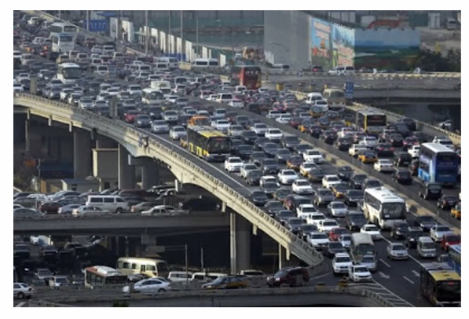
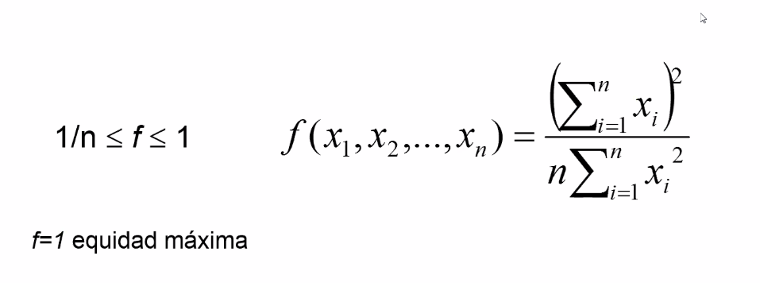
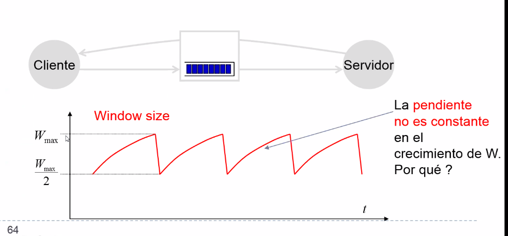

# Clase 7 - Congestión

Encolamiento y saturación en buffers de la red

Agenda

- Intro: Multiplexacion estadistica, buffers y congestion
- Definiciones de congestion
- Soluciones

!! Es un tema bastante presente en los finales. Tema importante.

## Multiplexación estadística

Carga del 90%, capacidad del link de salida está usada al 90% de su capacidad
por la sumatoria del throughput de llegada de las tres fuentes, y en el medio
está el buffer.

La multiplexación es estadística, es una consecuencia de las características
estadísticas de como son los canales de entrada.

## Naturaleza de internet

Es una red con recursos finitos compartidos.

Ejemplo

## Administración de buffers

Para que no sucedan los colapsos.

Al tener una etapa intermedia de encolamiento, no importa si la demanda excede
el ancho de banda de la salida, porque se bufferean. Pero es mas lento porque
pasan por ahi en vez de ir directo.

Buffer overflow: Sobrecarga, se descartan los paquetes. Si usamos un protocolo
con confiabilidad, genera retransmisiones

## Congestión

Cuando el estado de sobrecarga es **sostenida** en una red, donde

- La demanda de recursos (enlaces y buffers) se encuentra al límite o excede la
  cap. de los mismos
- La consecuencia es perceptible en terminos de QoS degradada.

> La *lentitud* de la red podria ser el tiempo extra que se paga por el
> buffering (hay que esperar a que pasen los de adelante). Pero eso es una
> degradación. Si es *sostenido*, y llega a niveles de colapso, ahí estamos en
> situación de congestion

Soluciones:

- Overprovisioning (sobredimensionamiento). No tiene sentido en internet porque
  es un negocio
- Diseño cuidadoso, ingenieria mucho mas detallada. No tiene sentido en
  internet.
- Control proactivo/preventivo: Evitar la congestion
  - Decrementar la carga (pedirle a los usuarios que aguanten un poco)
    - Pero como convencemos a un usuario que no conocemos que use menos la red?
    - Ancho de banda asignado por proveedores a empresas
    - Premiar el "uso parejo" y castigar el "uso excesivo"

### Perspectivas

- Operador de red:
  - Es mucho mas tecnico
- Un usuario

## Buffers

Todo esto pasa por los buffers, si se saturan en capacidad. Si muchos buffers de
la red entran en la misma situación tenemos congestión

### Teoría de colas

#### Sistema M/M/1

M/M/1: Proceso de entrada / proceso de salida / servidores

Notacion de kendall

Un sistema m/m/1 quiere decir que hay una tasa de entrada y salida Markovianas.

Markoviano: sin memoria, no hay correlacion estadistica entre momentos en el
tiempo. El hecho de que en una ventana de tiempo haya venido cierta cantidad no
tiene que ver con lo que vino antes.

En un proceso de poisson, el tiempo que pasa entre un evento y otro tiene
distribucion exponencial. Y el tiempo entre paquete (que es lo que provee un
servidor, cuanto tiempo me lleva en promedio procesar) es mu, y hay lambda
paquetes por segundo. Ambos son sin memoria.

Si eso vale, un monton de analisis se hacen muy faciles, y sino se complica
mucho.

rho = intensidad del sistema. 1 es el maximo posible que puede proveer sin
desbordarse. Rho > 1 es cuando se desborda el sistema

Si se cumplen las condiciones, salen formulas como estas

- N = cantidad de paquetes en promedio
- E(N): cuanto espero ver en promedio si elijo un momento al azar
- T = cuanto tiempo (segundos) va a estar ahi esperando salir en promedio. Un
  paquete que llega en promedio va a tener que estar T unidades de tiempo en la
  cola, y después esperando a ser servido.

> Irreal porque el trafico en inet no es markoviano, pero muchos estudios usan
> esto como aproximación. Esto nos lo cuenta para que sepamos las herramientas
> anaĺiticas que hay atrás del estudio de congestión

##### Delay promedio

La evolucion del tiempo de espera tiene forma exponencial, en la cual hay una
fase en la cual podria pensar que es lineal, pero se entra en una zona en la
cual crece mucho con poca diferencia de incremento de la carga. Hay una *zona
critica* en la cual no puedo seguir pensando que si aumento rho la misma
cantidad voy a tener la misma degradación en el tiempo. Por otro aldo,
generalmente en rangos temprales suficientemnente bajos, una persona no juzga
distinto como anda una aplicación. Que demore 2 o 3 segundos es lo mismo. Pero
entre 5 y 15 segundos si, se nota. Y pasa de 5 a 15 en un período corto de
incremento de rho

Moraleja: Los buffers se saturan de forma exponencial, que hace que de repente
pasen cosas como colapsos de congestion.

#### Sistema M/M/m

Con m = 1, 2, 3, 9, 16

Tengo mucha plata, le pongo mas cores, servers, etc.

Se refleja en esta flia de curvas. En el eje x hay un tiempo normalizado, T/s,
la espera en la cola, porque T es en todo el sistema incluyendo el servidor (la
forma de las colas es lo misma)

Si pongo mas procesadores, a mas carga aumento linealmente el tiempo. Pero
siempre inevitablemente sigue siendo exponencial.

## Control de congestion

Informalmente: Demasiadas fuentes usando una **red compartida** enviando
*demasiados* datos demasiado rapido como para poder ofrecer una buena QoS

Sintomas tipicos

- Packet loss: Se saturan los routers

    > No se menciona antes, porque la teoria suponia que la cola era infinita.
    > Para considerarlo habria que hacer M/M/1/k donde k seria el limite.

- Retardos crecientes

Control de flujo: Era el control que le hace la via sencilla al receptor, le
avisa que tiene su buffer limitado y le recomienda el advertise window y asi. El
control de congestion de los buffers que pueden estar en cualquiera de los
buffers del camino es un problema totalmente distinto.

### Consideraciones sobre los nodos

A menos que digamos lo contrario, vamos a asumir que los buffers son de tipo
"Drop Tail", con un scheduling FIFO (First in first out). Salen en el mismo
orden que entran, y drop tail quiere decir uqe se descartan cuando llega un
nuevo paquete y no tiene espacio para ingresar. Esa es la politica de manejo de
buffers.

Esto puede producir sync global cuando los paquetes descartados provienen de
distintas conexiones no sync entre si (lo cual es casi siempre).

las fuentes no estan sincronizadas, pero si el buffer empieza a hacer drop tail
sistematicamente, las fuentes que no se ocnocen se sync entre si, todas van a
tener un timeout y van a querer re-transmitir.

Si tengo un router saturado y muchas fuentes ven que se les estan cayendo y
todas retransmiten a la vez, no puede ser bueno.

En TCP no hacen backoff, sino que predomina el sliding window con el timeout.

### Control de congesrtion vs control de flujo

Congestion control

- Debe poder evaluar la capacidad de una subred completa para transportar un
  supuesto trafico agregado
- La congestion es un efecto global, involucra a todos los hosts y routers
  compartiendo una subred

Flow control

- Es punto a punto

!! Importante para final, ver después

### Métricas para detectar

Depende del mecanismo que se implemente se usan una o varias del 

### Políticas que influyen

{repasar despues}

### Causas de la congestion

- Inundo con trafico destinado a una misma linea de salida, el buffer se llena
  => tail drop. Mas memoriamente no necesariamente resuelve el problema, hay
  peor QoS porque se hace mas larga la espera. Si tenemos routers con memoria
  enorme, si tengo que pasar por 10 routers, probablemente la cantidad de tiempo
  que esté esperando lleve a una situación inadmisible, con un tiempo de
  respuesta altísimo. No voy a tener pérdida pero va a ser alto, no
  necesariamente resuelve el problema. Incluso puedo incurrir en timeouts.

- Procesadores lentos o problemas con el software de ruteo
- Bottlenecks
- Congstion tiende a realimentarse y empeorar
  - En el limite se puede alcanzar un colapso de congestion.
  - El goodput tiende a 0

### Consideraciones

En el **control de congestio** hacemos el esfuerzo para prevenir o responder a
esta sobrecarga, porque llevan a perdidas *no controladas* de paquetes. Vamos a
tener perdidas *controladas*, que permitan controlar la congestion, para que no
se vaya al colapso.

Dos cosas que uno puede hacer

- Pre asignar recursos (ancho de banda, espacio en buffers de switches y
  buffers) que lleva a la **subutilización**

- Liberar recursos, controlar la congestión solo cuando ocurre. Limpio los
  buffers. Pero **a quien perjudico?** a quien le tiro los paquetes a la basura?

A lo que se aspira es permitir el uso de los recursos de la red de forma
"equitativa", se quiere socializar los efectos entre todos los usuarios en vez.
**Internet es comunista**

{{foto}}

### Criterios de evaluacion

- La red sea utilizada **eficientemente** (no dejar cosas por las dudas) y al mismo
  tiempo en forma equitativa.

  Que cuando hay espacio lo usen, y cuando no hay que la reestriccion de acceso
  sea distribuida por igual

  Buen indicador, potencia = throughput / delay

  

- **Equidad**, los recursos sean compartidos equitativamente "en las buenas y en
  las malas", cuando hay de sobra (buffers vacios) que entren todos los que
  tengan que entrar, pero cuando estan cerca de la saturación ser equitativo con
  las penalidades que le ponemos al ingreso.

  Indicador de equidad de Jain

  

### Performance en funcion de la carga

- A medida que la **carga ofrecida** aumenta, el throughput aumenta linealmente
  por un tiempo. Cuando se llega al limite Drop tail : perdida de paquetse

{aca hay mas cosas}

### Congestion y QoS (Calidad de servicio)

Si las redes nunca se congestionasen, seria facil dar buen QoS, pero no es
conveniente hacerlo. Para hacer control de congestion hay que tener una serie de
ecanismos que permitan dar un trato diferenciado a diferente trafico, que
permita dar un SLA: service level agreement. Es un contrato de calidad de
servicio.

Los SLA suelen ser estaticos y se definen al momento del contrato con el ISP
(internet service provider)

### Resumiendo

{aca hay cosas, medio que ya lo dijimos}

## Parte 2

Agenda

- Control de congestion, taxonomia lazo cerrado abierto
- RED (random early detection): una forma de implementarlo
- FRED
- Politicas de trafico

La combinación de control de congestión y RED 

### Teoria de control

Hay un objetivo y un error (diuf entre lo que quiero y percibo por medio de
*sensores*). Senso algo, entiendo el error, y en base a eso actuo sobre el
sistema que estoy controlando.

En particular de *lazo cerrado* (hay tambien de lazo abierto)

! tipica pregunta: dibujar un sistema de control de congestion dibujando la
topologia como si fuera de lazo cerrado.

#### Taxonomia

- Lazo abierto: en redes de conmutacion de circuitos
- Lazo cerrado
  - Realimentacion implicita: **end to end congestion control**, es la que implementa TCP
  - Realimentacion explicita: **network-aware congestion control**

Congestion control: reactivo vs congestion **avoidance**: preventivo (o
proactivo, se adelanta a que exista el problema.)

#### Implicito vs explicito

- Implicito: descarta paquetes cuando se aproxima a la congestion. La fuente (el
  emisor) infiere la congestion de forma implicita (timeouts, acks duplicados,
  etc.). Nadie le manda un mensaje al emisor diciendo "che estoy congestionado",
  sino que produce que no lleguen acks.

  E.g: TCP end to end congestion control

  > Como todo en internet, es importante que sea relativamente simple

- Explicit feedback congestin control: Se basa principalmente en estategias de
  *packet marking*. Un componente de la red provee indicaciones explicitas de
  la congestion a las fuentes.

  Ese mas complicado de implementar, hay que adaptar los nodos de la red para
  que cooperen.

  Por que no se usa de manera basta y amplia? Porque una cadena se corta por su
  eslabón más debil. En un contexto de internet en los que nadie conoce a nadie
  (routers y hosts), usar esto implica aceptar que todos los eslabones de la
  cadena aplican este packet marking. Con que uno no lo haga ya se cae todo el
  sistema y deja de andar.

### RED (Random early detection)

Esto se hace en los nodos intermedios de la red de forma implicita.

Tiene por objetivo **evitar la congestion** manteniendo el tamaño medio de las
colas en niveles "relativamente" bajos. Es un metodo **implicito** de congestion
**avoidance**.

Tiene que haber un socio (tcp) reaccionando a las señales implicitas de los
routers

Active queue management (AQM). A veces se le llama AQM-RED

Produce la notif implicita de la inminencia de la congestion, descarta el
paquete (en tcp hay timeouts).

Descarte aleatoriamente temprano {continuar}

{ver esto, diapo 50}

Antiintuitivo: descarto paquetes cuando tengo lugar para encolarlos.

1. Los descarto con una proba, no siempre
2. Uno podria pensar que para que tengo un buffer tan grande (100 paquetes) si
   pongo un max threshold de 90 y por encima de 90 descarto siempre, entre 90 y
   100 esos 10 espacios de memoria no los uso nunca? Estoy tirando memoria?

   No! Porque lo que se compara contra los umbrales es la version suavizada, el
   promedio y aprox. fluida. Si entra una rafaga tan grande que la red no puede
   hacer su descarte preventivo y llena el buffer, se aplicará drop tail.

#### Ajustes

burstiness = rafagosidad.

{ver esta diapo 52}

hay mucha oportunidad de fine tuning para diferentes naturalezas de trafico

### Control de congestion en TCP

Como es que RED produce una reacción en los hosts? Esto era la cooperación entre
dos partes, los routers y TCP. TCP vive en capa 4, en los end hosts solamente.

Idea basica: Por cada RTT, manipula la ventana

- Si se recibe un ACK: W = W + 1/W (**additive increase**)

  Mi paquete llego al destino y este me mando el ACK. Incremento un poquito la
  ventana.

- Si se pierde un ACK: W = W/2 (**multiplicative decrease**)

  En el caso de que se pierda un ack (timeout), o que llegue mas de uno
  duplicado (algun criterio que me diga que el ack no vino). Implicitamente
  suponemos que es por un problema de congestion (podria no serlo). Pero
  sabiendo que en todos los routers opera RED.

Esta es la manera de lograr la equitatividad, no depende de si mando mucho o
poco.

El crecimiento de la pendiente no es constante, porque vas agregando 1/w.

> la ventana era la cantidad de paquetes seguidos que mandabas sin esperar ack

## Performance de TCP

Comportamiento "macroscopico" de TCP.

Con todo este quilombo, como calculo sin conocer todos los detalles de todo (que
no lo se) de una forma razonable la performance de tcp? Una metrica, con la
ventana, en promedio cual es el throughput?

Si tcp/ip es el modelo que domina, que tan bueno es? A cuanto voy a poder
transmitir con tcp?

Expresion para el *staedy state throughput* en func de

- RTT: Nos resume mucha info, calcula macroscopicamente toda la bola de routers
  que esta dando vuelta y de aca lo vemos como un RTT, desde que envio en pkg
  hasta que me llega el ack.

- Probabilidad p de perdida de paquetes. Tiene la capacidad de decir que tan
  congestionada esta la red como un todo. Es como el RTT en el sentido de que
  hay muchas cosas en el camino y yo simplemente lo mido.

  De 100 paquetes que mando, cuantos en promedio llegan y cuantos se pierden?
  Eso es una probabilidad.

Y podemos sacar una metrica consistente para esta idea del throughput promedio
de tcp/ip dados estos parámetros? Es lo que hizo Mathis y co-autores.

!! Ancho de banda al throughput, casi un pecado mortal en esta materia, puso 2
en una pregunta. Muy fundamental. ancho de banda: diferencia entre frecuencias o
algo asi, revisar

Suposiciones

> Matthis hizo muchas suposiciones pero hizo las correctas.

- Cada paquete se descarta con proba p
- RTT estable
- Suficiente ancho de banda BW en el enlace
- Señal de congestion periodica (1/p paquets Ok seguidos por 1 descartado)

En el eje x, hay unidades de RTT, no segundos. Con eso, las curvas panzeadas se
transforman en rectas

Un ciclo se da cada vez que se pierde un nuevo paquete.

{analisis de un ciclo en pagina 69}

Formula de mathis:

SIntetiza

- Perdida
- RTT
- Throughput

Son las cosas fundamentales que controlan la vida de tcp. Le amravilla a rodri
que el mecanismo de notif implicito, ventana cerrada, etc. funcione tan bien en
un sistema con millones de usuarios y routers, y no solo eso sino que se pueden
obtener criterios de diseño tan sinteticos y robustos como los que vemos.