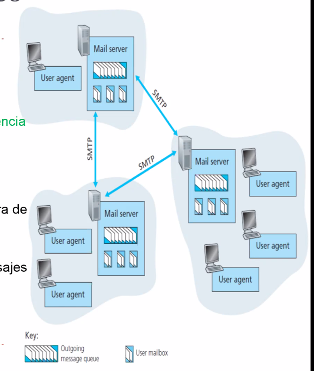
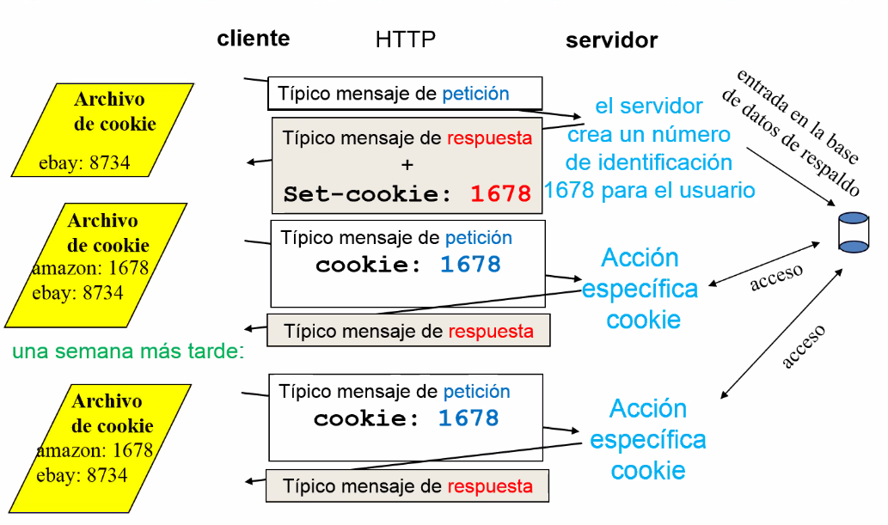

# Capa de aplicacion

A partir de capa 4 los paquets le llegan al end host, y seguimos con esa idea
*end to end*. Le estamos hablando a el (o los!) nodos que estan en el otro
extremo, pero no al next-hop.


Las ultimas 3 capas en el modelo practico (TCP IP) colapsa en solo aplicacion.

Objetivos

- Aspectos conceptuales de protocolos para aplicaciones de red
  - Modelos de servicio de la capa de transporte
  - Paradigma cliente servidor
- Protocolos a nivel de aplicacion
  - DNS
  - SMPT / POP3 / IMAP (mail)
  - HTTP (web)

## Aplicaciones y protocolos

Aplicacion: comunicacion + procesos distribuidos


Hay distintos niveles de tipo de conectividad, pero en el nivel más alto hay
*aplicaciones* que ejecutan y se comunican entre sí en un esquema end to end
(end host a end host por ejemplo).

Este es aún otro grafo en internet de aplicaciones que están hablando entre sí.
En todos los nodos hay un procoso (aplicacion) que tiene interfaz hacia un
usuario y usa la red.

Protocolos de capa de app: Son una parte de la aplicacion sin la cual no podria
funcionar, pero ella tiene que hacer cosas locales y tener interaccion con el
usr (que no hace el protocolo)

- Definicion de mensajes intercambiados entre aplicaciones
  - Uso de **acciones** ejecutadas por **procesos** en los hosts
  - Uso de **servicios** de comunicación
    - Proporcionados por protocolos de capas inferiores (TCP, UDP)

## Aplicaciones de red: Tenologia

Proceso: Programas que se ejecutan en un host

- En un mismo host, dos procesos se comunican con IPC (definido por el SO)
- En diferentes hosts, se comunican entre si con protocolos de capa de
  aplicacion.

**Agentes** de usuario: hace de interfaz entre el proceso y el usuario por
encima, y por debajo al servicio provisto para el por parte de la red. Hace de
nexo. Implementa interfaces de usuario y protocolos a nivel de aplicación.

- Web: navegador
- Correo electronico: lector de correo, web/app local
- Transmision de audio / video: Reproductor multimedia

## Características de los protocolos de aplicación

Tipos de mensajes intercambiados son típicamente petición y respuesta

- Sintaxis definida, como si fuera un paquete
- Semántica en los campos, que significa cada uno
- Reglas que determinan cuando y como los procesos envian y responde. Usualmente
  se pueden representar como FSM.

Los protocolos suelen ser de dominio público (definidos en RFC), pero también
hay privados.

## Paradigma cliente-servidor


Entre dos nodos se pueden cambiar los roles, generalmente se asocia a que el
cliente "marca el ritmo", y el servidor sirve a muchos clientes potenciales.

## Procesos que se comunican a través de la red

Su puerta de acceso a capa 4 son los sockets, que eran un par `(ip, port)`. Un
nodo tiene una IP pero puede tener muchos puertos, en donde muchos procesos
(distitnas apps) van a estar escuchando o escribiendo en esos sockets.


El socket es análogo a una puerta

- El proceso emisor envia el mensaje por su puerta
- Asume la existencia de una infra de trasporte al otro lado de la puerta que
  transporta el mnensaje hasta un socket en el proceso receptor

Las APIs suelen ser:

- Elegir el protocolo de transporte (TCP, UDP). No seria raro que una app use
  ambos, por ej. Zoom debe tener procesos para compartir pantalla, el video,
  etc.

- Fijar algunos parametros (opciones) de operación. Para los diferentes flavors
  del protocolo. Cuando instancias el objeto de la conexion TCP decidis estas
  cosas.

### Direccionamiento

No alcanza solo con la IP, puedo tener muchos procesos escuchando a muchas
aplicaciones en internet, y por eso tenemos los pares IP-port.

- Server HTTP: Puerto 80 (convención)
- Servidor de correo: Puerto 25 (convención)

## Servicios de transporte

- Perdida de datos

  Ciertas apps pueden tolerar perdidas, pero por ej. transferencia de archivos
  requiere un 100% de transferencia confiable.

- Temporización

  La sensación de instantaneidad es un requerimiento en algunos lugares, por ej.
  en juegos. En estos casos se implementan retardos artificiales no perceptibles
  que eliminan el *jitter* (diferencia entre los consecutivos delays que voy
  teniendo).

- Ancho de banda

Hay otras como el mail que solo le interesa no perder datos.


## Aplicaciones


## DNS (Domain Name System)

Lo que modifica las direcciones de internet en IPs y viceversa.

Organiza la máquina en dominios y resuelve los **nombres de los hosts**
(dc.uba.ar) en **direcciones IP** (157.92.27.128)

Un proceso de aplicacion invoca un procedimiento de biblioteca llamado
*resolvedor*, y le pasa el nombre como parámetro.

- El resolvedor envía un paquete UDP a un servidor DNS local, que después busca
  el nombre y devuelve la dirección IP al resolvedor, que entonces se lo
  devuelve al solicitante.

- Una vez que obtuve la IP, la app puede establecer una conexión TCP con el destino.

### Namespaces


Internet organiza su espacio de nombres en 200 dominios de nivel superior
(top-level domain), y se dividen en subdominios, que a su vez se subdividen y
etc.

Los nombres a alto nivel les dice rodrigo URl pero en realidad son FQDN (fully
qualified domain name) que se traducen a IPs por los DNS. Estos nombres son
administrados por la ICANN

### Zones


Hay agrupamientos de subdominios. la responsabilidad de responder IPs de esos
dominios van a estar centralizadas en alguno, no es que hay una para todos.

### Registros DNS

La paso rapida. Lo que hay en los servers (que son parte de una base de datos
distribuida). Hay una red de DNSs que tienen registros DNS en un archivito de
texto plano.

- Nombre del dominio
- Tiempo de vida (hay que darle dinamismo porque puede cambiar)
- Clase
- Pares tipo: valor
  - SOA: Yo soy la fuente primaria de informacion sobre una zona de DNS. Al ser
    una fuente primaria tiene la info autoritativa que tiene la potestad o
    autoridad de decir algo sobre esa zona. Depsues esa info se replica a un
    monton de lugares y va a quedar cacheada. Pero entidad autoritativa
    responsable de una zona hay una sola.
  - A: Direccion de un host
  - MX: intercambio de correo. Obtienen la IP del mail server de esa
    institución.
  - NS
  - Y más

### Tipos de consulta

Hay dos, iterativa y recursiva


> Qué DNS usar? El DNS en el caso hogareneo nos lo provee nuestro ISP. Hay un
> protocolo, DHCP, que nos da la IP y nos sugiere el DNS a usar. Pero en un labo
> de una universidad, DHCP probablemente da el de la UTI (unidad de tecnología
> de información) que tiene un nodo en exactas

- Tengo un cliente que quiere bajarse una página web
- Si el local name server no sabe, puedo ir a un root name server (hay pocos en
  el mundo)
- Este capaz dice que es un .edu, y te deriva al de .edu pasandote la IP
- Y el de .edu conoce el de princeton y te lo manda,
- Princeton conoce al departamento cs, y te manda a preguntarle
- Y este si sabe a donde está la IP declarada como la máquina (el server
  puntual) que se llama penguins.


En este caso fueron todas autoritativas, pero el local responde una de la cual
no es autoridad. Y va a tener un tiempo de vida porque podria tener una foto
vieja de algo que cambió

Recursiva:


Cada uno le delega la consulta al proximo

## SMTP

Simple Mail Transfer Protocol. RFC 2821



3 componentes principales

- Agentes de usuario
  - Lector del correo. Outlook, thunderbird, (todavia no gmail via web, eso es
    cambiar de agente, ahora seria el navegador)
- Mail servers
- Protocolo que hace que interactuen entre si varios servidores de mail, cada
  uno que provee el servidor de mail.

Cada dominio tiene su servidor de mail asociado.

### Servidor de correo (mail server)

Tiene un buzon con los mensajes de entrada del usuario, una cola de mensajes de
salida, e implementa SMTP para interactuar con los otros servidores. Dependiendo
de quien inicia una conver y quien da la rta, se considera a uno cliente y a
otro servidor o al revpes.

### Correo electronico

- Usa TCP con el puerto 25
- Transferencia directa entre servidores
- Fases
  - Acuerdo (saludo)
  - Transfrencia de mensajes
  - Cierre
- Interaccion comando / respuesta
  - Comandos ASCII
  - {algo mas}

### Ejemplo


### MIME

Multipurpose Internet Mail Extensions

Extensiones para mandar más que solo texto. Este estándar


### Transferencia y entrega

SMTP vs POP3, tienen pros y contras.


Con SMTP yo voy y veo en otro servidor si hay. Otra alternativa es sacarlo de
ese lugar y traerlo a mí máquina local. Eso es lo que hace POP3


> En email no hay uno solo, hay dos

IMAP es lo que está por detrás de SMTP

SMTP: RFC2821, IMAP: RFC2060

## HTTP

La web y http

Jerga

- Una página web consta de objetos
- Un objeto puede ser un archivo HTML, una imagen JPEG, un applet java, un
  archivo de audio, etc.
- Una página web esta formada por un archivo HTML base, que incluye diversos
  objetos refernciados.
- Cada objeto es direccionable por una URL (Unified Resource Locator), por ej.

  ```text
     hostname     |    nombre de ruta
  www.escuela.edu/departamento/imagen.gif
  ```

  El hostname se traduce a una IP gracias a DNS.

  > Cuando consumimos una pagina, cada una de las imagenes que vemos tiene una
  > URL.

Intro


Puede usar http 1.0 y 1.1 (mas nueva)

HTTP usa TCP,

- El cliente crea un socket hacia un socket destino, ipserver:80
- El servidor acepta la conexion, pasa por todos los esquemas de triple
  handshake y eso
- Cuando la conexion esta establecida manda todos los mensajes HTTP que quiera
  (de la capa aplicacion), y ahi hay un lado cliente y servidor http.
- Cuando termina, la conexion TCP se cierra.

HTTP en su version estandar es stateless, el servidor no nos recuerda, es como
que siempre somos nuevos usuarios (excepto que usemos *cookies*).

### Mensajes

#### Request


Tipos de mensajes

- HTTP/1.0
  - GET
  - POST
  - HEAD: a veces interesa traer cosas del recurso pero no el recurso en si.

    > Por ej. si quiero ver el tamaño de un archivo, no hace falta que me lo
    > traiga todo, o la last modified date.

- HTTP/1.1
  - {mas}

#### Response


Codigos de respuesta,

- 200 OK
- 301 Moved Permantently
  - 
- 400 Bad Request
- 404 Not Found
- 505 HTTP Version Not Supported

### Probar


### Modelo de tiempo de respuesta

RTT: Tiempo necesario para enviar un paquete pequeño desde el cliente hasta el
servidor y despues de vuelta al cliente.

### Conexiones HTTP

Hay dos tipos

- No persistentes: se envia 1 objeto a lo sumo con una conexion TCP. Hago una
  conexion y me traigo solo un objeto.
  
  HTTP/1.0 usa http no persistentes

- Persistentes: Se pueden enviar multiples objetos con una sola conexion tcp.

  HTTP/1.1 usa persistentes por defecto.

{ejemplos para cada una en las diapos}

Y hay dos flavors, con y sin entubamiento. Las que tienen entubamiento son
secuenciales y las que son sin pide todo de forma concurrente (pero tiene que
recibir de forma desordenada las respuestas).

### Autorización

Que cualquier desconocido no pueda bajarse contenidos, sino a alguien que le
quiero permitir acceso.


Las credenciales de autorización son típicamente nombre y contraseña.

- Sin estado: En cada pedido tengo que autenticarme, en cada peticion tengo que
  mandar la autorizacion.

  Van en los headers de cada petición.

  Si no hay auth en el header lo rechaza y devuelve 401

### Cookies

Para evitar redundancia las veces que pedis lo mismo, para solventar el hecho de
que http es stateless



Lo que se pretende es que en el canal http tanto el cliente como el servidor
tengan una forma de acordarse cosdas que pasaron antes para aliviar la cantidad
de info que tengo que enviar, o que se acuerde de preferencias del usuario en el
uso del sitio, y cosas asi.

> Esto es propenso a ataques, porque se pueden inyectar virus o código malicioso
> que se ejecuta en el browser. Hay toda una cuestión de confidencialidad o
> seguridad, y por eso hace poco muchos sitios te tienen que pedir el
> consentimiento.

hay un poco más de componentes