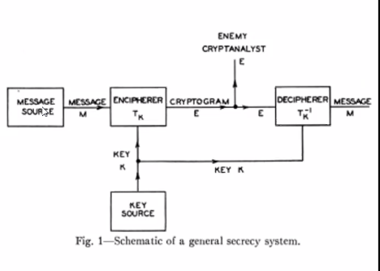
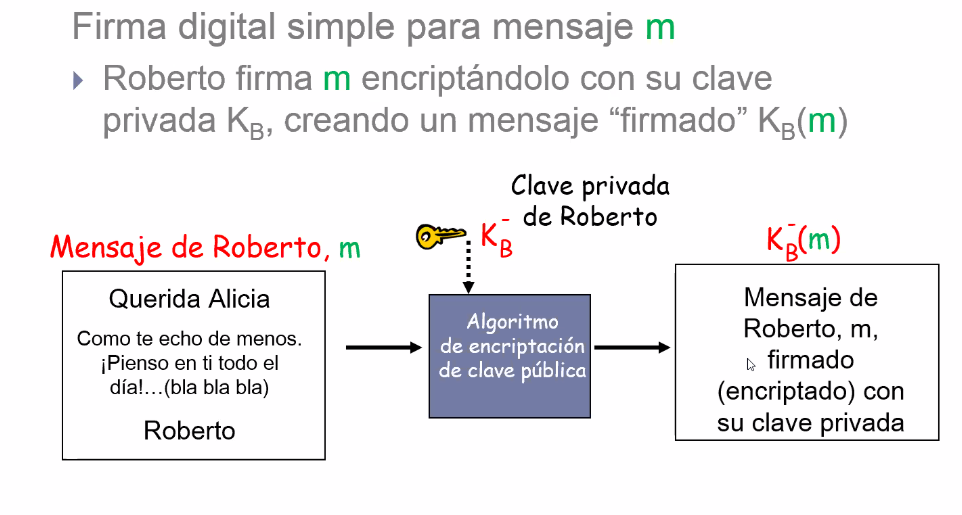
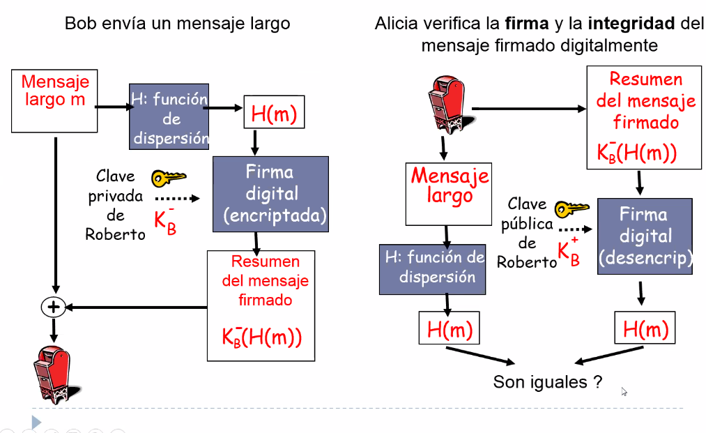

# Clase 9 - Seguridad en redes

## Fundamentos

Es trasversal a todas las capas de red. Es un área enorme que se puede llevar a
tanta profundidad como uno quiera.

> Optativa de seguridad de Rodo Baader

### Teoría de la criptografia

Otra vez shannon. No solo escribio una teoria para la información, sino que
también una teoría matemática para la criptografía

Es el que hizo el trabajo fundacional.



Criptograma: Lo que el enemigo criptoanalista quiere romper la clave secreta con
la cual yo codifique (o cifre) para llevarselo.

## Agenda

- Marco de trabajo
- Intro a criptografia
- Algoritmos simetricos y de clave publica
- Firma digital, integridad
- Autenticacion
- Ataques de red

## Marco de Trabajo

### Conceptos

Para cada una hay un ataque que lo rompe.

- **Confidencialidad**: Los mensajes que enviamos solo deben ser entendidos por
  las
  partes especificadas en la comunicacion.

  No importa si otra persona tiene el mensaje, la idea es que solo lo pueda
  *entender* en su formulacion inicial los que estan en una punta y otra.

- **Integridad**: Pide que los mensajes no puedan ser modificados durante su
  transmision.

  Si tengo confiencialidad, nadie mas entiende el mensaje que sale y llega. Pero
  si no tengo integridad, puede ser que reciba otro mensaje.

  - Originalidad: El mensaje no es una copia original repetida
  - Temporalidad: El mensaje no fue demorado maliciosamente

    > En algunas aplicaciones, la temporizacion puede ser importante. Por ej. un
    > mensaje que diga de tomar una acción con un vencimiento, entonces si se
    > demora, el contenido es el mismo pero la intención no.

- **Autenticacion**: Ninguna parte pueda asumir en forma no autorizada la
  identidad de otro. Si creo que me estoy comunicando con alguien, puede ser que
  no sea quien dice ser.

- **Autorizacion** (control de acceso): Garantizar que ciertos mensajes sean
  recibidos solo por aquellas personas que están autorizadas para verlo.

- **Disponibilidad**: Todo usuario potencial tiene oportunidad de ser
  considerado y eventualmente admitido (ataque DoS)
- **No Repudiacion**: Ninguna de las partes puede negar haber participado en una
  transaccion de mensajes.

  Una vez que recibo un mensaje de alguien, no puede argumentar que en realidad
  nunca lo envio. Esto podria ser un problema con trasferencias bancarias por
  ej.
  
Ante cada tecnologia de seginf, debemos preguntarnos: cual subconjunto de
propiedades provee?

### Protocolos y capas

Hay diferentes protocolos que lo hacen a diferentes niveles (capas).


Implementan tecnologias propias de cada capa para resolver potenciales
problememas distintos en cada capa.


Hay otras estrategias que se basan en 3ras partes, incorporando agentes
intermedios proveedores de seguridad (lo vemos mas adelante)

#### IPSec (AH y ESP)


En un contexto que implementa IPSec, seguridad para capa de red, surje una trama
diferente. El nuevo header IP transporta el protocolo ESP (Encapsulating
security payload) que itene un header y un trailer

## Criptografia

Quiere decir literalmente escritura oculta, de forma tal de que solo el
destinatario lo entienda.

### Definiciones

Queremos cambiar el mensaje original de forma tal que solo lo entienda el
intended receptor

- Cifrado: Es una transformación caracter or caracter, o bit por bit, sin
  importar la esctructura linguística del mensaje.

- Codigo: Reemplaza una palabra con otra palabra o simbolo.

### Conceptos

Los mensajes que queremos encriptar se denominan texto plano o *plaintext*

Son tomados como **entrada** y son transformados por una **funcion** (algoritmo)
parametrizada por una **clave**. La salida del proceso de encripción (cifrado)
es conocida como *ciphertext* o texto encriptado, y constituye los datos a
transmitir.

Se asume que un *intruso* (pasivo) puede escuchar y copiar el ciphertext
completo del canal de comunicación.

Y la técnica de dado un ciphertext calcular el mensaje origina lse llama
criptoanálisis. Las técnicas de crear ciphers (criptografia) y de decifrarlos
(criptoanálisis) forman la *criptografía*

### Metodos basicos de cifrado

#### Sustitucion

Cifrado de cesar: roto el alfabeto una cantidad fija.


Cada letra se mapea con otra cualquiera, y tengo 26! llaves posibles. (la llave
seria la forma de desencriptar, la que me permite *abrir* la encriptacion para
pasar del cifrado al plaintext).

Problema

- Hay una propiedad estadistica de los lenguajes naturales, que es que por su
  concepcion y estructura los simbolos (letras del alfabeto) no son
  equiprobables.

  Todos los lenguajes modernos estan bien estudiados, por ej. el histograma de
  letras del abecedario en el ingles.

  Si bien uno como intruso no sabe a que letra original del codigo cada letra,
  si hago el histograma de frecuencia de aparición de esas letras, mapeandolo
  con el conocido del idioma que se trate puede empezar a detectar cosas y poco
  a poco reconstruir palabras.

La maquina enigma hace una sustitucion polialfabetica. En cesar hay un unico
alfabeto modificado, en el cual hago el mapeo entre una letra del alfabeto
original y una del modificado. En cambio enigma elegia un nuevo alfabeto para
cada letra del mensaje.

#### Transposición

Reordenar las letras y transmitirlo tal cual. En el caso anterior se mantiene el
orden. La idea central es elegir una palabra que no tenga letras repetidas como
clave secreta


> La realidad es que los sistemas modernos de cripto usan combinaciones
> sofisticadas e ingeniosas que se terminan reduciendo a sustituciones y
> transposiciones.

### Principio de Kerckhoff

> Todos los **algoritmos** deben ser **publicos**, solo las claves deben ser
> secretas.

La *seguridad por desconocimiento* nunca funciona.

### Longitud de la clave, factor de trabajo

La longitud define varias cosas, como el **factor de trabajo**, que nos dice el
esfuerzo computacional requerido del criptoanalista para romper esa clave. Crece
exponencialmente con el tamaño de la clase.

El secreto se logra con un algoritm orobusto y una clave suficientemente larga
para que el **tiempo sea impráctico**. Esto es importante porque está cambiando
todo el tiempo, ya que el tiempo depende de la capacidad de cómputo

Y cuanto es suficiente para el tamaño de clave?

- 64 bits es un chiste
- 128/256 bits uso comercial rutinario, pero el pentagono lo puede romper
- >= 256 bits para sistemas criticos (como defensa militar).

### One time pads

Rellenos de una sola vez. Idea propuesta por shannon.

Un one time pad (o relleno de una sola vez). Un cifrado inviolable

- Elegir un **randon bit string** como clave
- Usar bit XOR para encriptar y desencriptar
- Inmune a todos los ataques actuales y futuros sin importar cuanto potencia
  computacional tenga el intruso. Resultado de shannon

Problema: Como distribuir y proteger la clave? Es poco practico.


> Pregunta

### Cifrado de bloque iterativo

Se toman bloques de n bits de texto plano como entrada y se los transforma
usando la clave en un bloque de n bits de texto cifrado


#### DES (Data Encryption Standard)

Se basa en cifrado de bloques
Orientado a bits, no caracteres

{mas caracteristicas en las diapos}

En desuso porque se puede hacer ataques de fuerza bruta. La evolución es AES.


#### 3DES

Es mas robusto y todavia se usa en varios lugares. Es basicamente 3 etapas de
DES.


Esencia: En definitiva es un juego de combinaciones de cosas elementales, rotar,
aplicar funciones con una clave que desordene. Una bastante sofisticada ya que
sea reversible y si me pongo con una compu actual a probar con fuerza bruta sea
impractico romperla, voy a tardar demasiado tiempo.

## Criptografia simetrica


Usan la misma clave para cifrar y desencriptar. El problema es que la tienen que
conocer ambos, y si bien se la pueden llevar uno a otro es poco practico.

## Modelo de encriptacion


## Criptografia asimetrica

- La de clave simetrica es un quilombo compartir la clave, no escala
- Criptografia de clave publica
  - RSA (Rivest Shamir Adleman)
  - Emisor y receptor **no comparten** una clave secreta
  - Comparten una clave de encriptación pública conocida **por todos**.
  - Y una clave de desencriptación privada conocida **solo por el receptor**.


Las claves publica y privada deben ser lo suficientemente diferentes como para
que la segunda no pueda calcularse a partir de la primera.


Requisitos

- Facil de cifrar o descifrar dada la clave adecuada
- Y debe ser inviable computacionalmente derivar la clave privada a partir de la
  publica o un contenido encriptado.

### Autenticación


Le da la propiedad de que el unico que puede transmitirlo es el que posee la
clave privada. Se encripta con la privada y se desencripta con la publica

### RSA

Se basa en propiedades matematicas de los numeros primos. Factorizar numeros
primos muy grandes es muy costoso computacionalmente.

Y por eso no son derivables la una de la otra, pero es la inversa, por eso viene
en pares.

Elegir claves
- Elegir dos numeros primos grandes p y q (por ej. de 1024 bits cada uno)
- Calcular n = pxq y z = (p-1) * (q - 1)
- Elegir e pequeño menor a n que no tenga factores comunes con z (primos
  relativos)
- Encontrar d tal que e.d-1 sea divisible por z (e.d mod z = 1)
- La clave publica es (n, e) y la privada es (n, d)

Encriptacion y desencriptacoin

- Tenemos un patron de bits o plaintext m. Para obtener el ciphertext c, calculamos

  c = m^e mod n (el resto cuando m^e se divide por n)

- Para desencriptar el cipertext c, vale

  m = c^d mod n

n es conocido, esta en la clave publica, pero d lo conoce solo el receptor
(privada)


Propiedades importantes

- Vale

```
m = (m^e mod n)^d mod n
     |-------|
         c
```

- Reciprocidad: Aplicar clave publica seguido por clave privada es lo mismo que
  al reves.

  {completar con lo de las diapos}

### Firma digital con criptografia asimetrica


Antes de usar la publica de bob, usa su privada, entonces lo que le llega a bob
es un mensaje que el va a desencriptar con su privada, pero luego de eso hace
otro paso mas, que es usar la publica de alice. No solo fue segura la
transmision en terminos de confidencialidad, sino que ademas ahora bob esta
seguro de que el emisor fue alice porque lo firmó.

Esto me da la propiedad de no repudiación

Y para solo firmar, el primer paso de lo anterior. Es una pieza de info digital firmada.



### Message digest (resumen del mensaje)

Encriptar con claves publicas es computacionalmente caro, en particular para
mensajes largos. La idea que se propuso detras del digest es llevarlo a una
longitud fija y fácil de computar (hacerlo más barato). Ahí entran en juego las
funciones de hash (H) o de dispersión. Obtener un resumen o digest de tamaño
fijo H(M)

> ejemplo: md5, para que cuando transmitis un archivo grande por internet te
> fijas el hash de lo recibido si dan iguales, y ahi es porque no hubo errores
> en el camino. Y la idea es que es muy improbable (pero no imposible) que dos
> fuentes distintas m produzcan el mismo H(m)

Dado el resumen del mensaje x, es computacionalmente inviable hallar un m tal
que x = H(m)

> Todas estas cosas so ntecnicas como ladrillitos que despues se van combinando
> de diferentes maneras.

Esto es solo una *vagancia* para que sea mas efiente.

### Firma digital: Hash y message digst



- El mensaje se manda, pero en vez de firmarlo con la privada lo resumo antes.
  Lo que firmo es H(m). Lo que obtengo es el resumen firmado.

- Todo esto se transmite, por ej. con clave publica o asimetrica, quisas usando
  RSA

- Del otro lado se desencripta el mensaje, se aplica al mensaje el hash (igual
  que hizo teóricamente el emisor) y desencripto con la clave pública de bob
  pero no al mensaje largo, al resumen. Y ahí esquivé el problema de aplciarle
  la clave al mensaje largo.

### Algoritmos para funcion hash

- MD5 (RFC 1321)
  - Calcula un resumen del mensaje de 128 bits en un proceso de 4 pasos.
  - Cadena x arbitraria de 128-bit, parece dificil construir un mensaje m cuya
    dispersión md5 sea igual a x.
  - Colisiones encontradas pero se suele usar para verificar descargas. Es más
    para verificación que para algo mas crítico como una firma.
- SHA-1
  - Resumen de 160 bits
- SHA-2
  - {Completar}

### Firma digital con RSA y SHA-1


## Autenticación

Es para que ambos extremos esten tranquilos de que esten hablando con quien
estan hablando. Esto de que apliquen claves de cada lado esta bueno, pero es
costoso porque cada mensaje que se quiera enviar tiene que pasar por todo ese
proceso. Una opción entonces es que se pongan de acuerdo con quienes son, y que
de ahí en más se use una sola clave (la de sesión) que se usa durante el tiempo
que dure la sesión.


Hay diferentes tippos de protocolos, como *challenge-response*, en donde se usa
K_AB una clave compartida entre A y B.

> No escala? ojo, tal vez si es una relacion comercial con pocos clientes que va
> a tener mucho intercambio durante mucho tiempo, tal vez tiene sentido tener
> este tipo de claves.

1. A quiere presentarse ante B, se presenta como A,
2. Lo primero que hace es desconfiar de que sea A, entonces le hace un
   *challenge*, le envia un numero aleatorio
3. Si es quien dice ser, puede encriptar el numero aleatorio y mandarselo
4. A la vez A también desconfía (porque en el medio podría haber estado trudy el
   intruder) y le manda otro challenge.
5. Cuando ambos quedan en un estado de confianza mutua, pueden intercambiar K_S
   ya establecida esta autenticación o confianza mútua.

> Duda: Usar asimetrica en vez de simetrica para los challenge

### Ataque por sesiones

Trudy puede atacar y saber cosas de B.

### Reglas de diseño

- El participante que inicia la tranmisión debe probar su identidad en forma
  previa al participante al receptor

- Ambos participantes deben usar claves diferentes para la verificación de
  identidades, aún cuando esto signifique tener dos claves compartidas, un K_AB
  y K_AB'.

- Elegir los challenges de conjuntos diferentes, por ej. el que inicia de
  numeros pares y quien contesta los impares.

- Resistir ataque que involucran sesiones paralelas, en la que la info obtenida
  se use en una sesión diferente.

### KDC

Key distribution center, distribucion de claves confiables.


Es la sofisitación mas robusta y avanzada en esto. Involucrar a una entidad de
confianza, como Verizon y otras que certifican que nuestros certificados, claves
son válidas. 

El diálogo para el proceso de autenticación se hace con esa entidad intermedia.

- A habla con esa entidad y la entidad habla con B.
- A selecciona una clave de sesión K_S y no se lo dice a B, se lo dice a la
  entidad. Al KDC. Trudy no tiene nada que hacer porque no conoce la privada de
  A.
- El KDC le avisa a B que alguien quiere hablar con el.
- Para la vuelta es la misma idea, hasta que quedan hablando entre ellos
  tranquilos porque usan el K_S.

## Ataques en red

{definiciones que no dio y estan en la teo}

Sopn definiciones genericas, no se evalúan.
